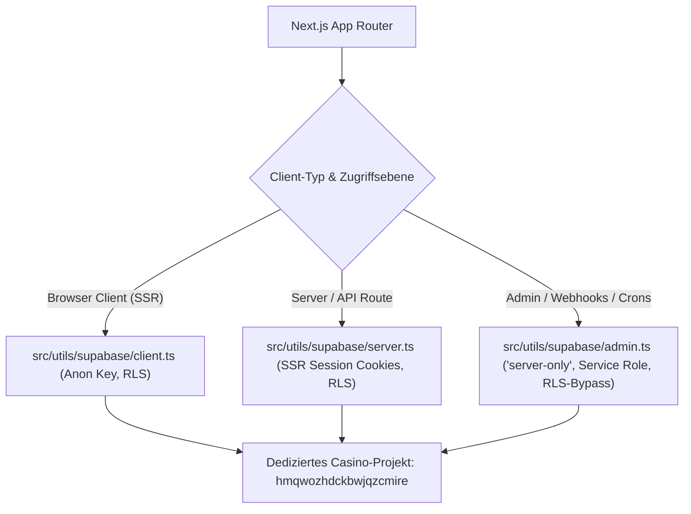

# 01 — Supabase & Datenbank-Architektur-Kontext

> **Zweck:** Kanonische Spezifikation der Datenbank-Architektur, Projektgrenzen, Client-Hierarchie (`src/utils/supabase/`), Tabellenstrukturen und atomaren RPC-Schnittstellen für das dedizierte Casino-Projekt.
> **Migrations- & Rollout-SOP:** [`xx_sop/05_database_supabase.md`](../xx_sop/05_database_supabase.md).
> **Sicherheits- & Wallet-Invarianten:** [`xx_sop/09_security_wallet_invariants.md`](../xx_sop/09_security_wallet_invariants.md).
> **Live-Status Master-Quelle:** [`worldmap/00_WORLDMAP_STATUS.md`](../worldmap/00_WORLDMAP_STATUS.md).
> **Qualitätsmaßstab:** [`xx_sop/12_workflow_dokument_qualitaet.md`](../xx_sop/12_workflow_dokument_qualitaet.md).

---

## 1 — Projektgrenzen & Quellhierarchie



### Verbindliche Projekt-Parameter:
* **Aktive Projekt-ID:** `hmqwozhdckbwjqzcmire` (konfiguriert in `.env.local` und `supabase/.temp/project-ref`).
* **Kein Tabellen-Präfix:** Im dedizierten Casino-Projekt heißen Tabellen regulär `profiles`, `transactions`, `bets`, `game_rounds` (kein `casino_`-Präfix).
* **Master-DB Abgrenzung:** Die alte Master-DB ist **kein** Casino-Produktivsystem. Sollte historischer Zugriff nötig sein, dürfen dort ausschließlich `casino_*`-Tabellen isoliert angesprochen werden.
* **Secret-Isolation:** `SUPABASE_SERVICE_ROLE_KEY` existiert ausschließlich in `.env.local` bzw. Vercel Server-Secrets und darf niemals in Client-Bundles oder Dokumenten stehen.

---

## 2 — Die 3 Supabase-Clients (`src/utils/supabase/`)

| Client-Datei | Instanziierung | Umgebung | Berechtigung & Grenzen |
| :--- | :--- | :--- | :--- |
| `src/utils/supabase/client.ts` | `createBrowserClient` | Browser (Client) | Verwendet `NEXT_PUBLIC_SUPABASE_ANON_KEY`. Row Level Security (RLS) ist aktiv. Unterstützt WebAuthn/Passkeys. **0 % Wallet-Mutation.** |
| `src/utils/supabase/server.ts` | `createServerClient` | Server Components & API-Routen | Cookie-gebundene SSR-Session. Liest und aktualisiert JWT-Tokens automatisch pro Request. |
| `src/utils/supabase/admin.ts` | `createClient` (`'server-only'`) | Webhooks, Cron-Jobs, Admin-Tasks | Verwendet `SUPABASE_SERVICE_ROLE_KEY`. Bypasst RLS vollständig. Nutzt expliziten WebSocket-Transport für Node-Kompatibilität. |

---

## 3 — Kanonisches Datenbankschema & Tabellen-Inventar

Das Datenbankschema basiert auf 53 Migrationen (`001_users.sql` bis `051_achievement_visibility.sql`):

### 3.1 Finanzen, Ledger & Benutzer
| Tabelle | Primärschlüssel | RLS-Policy | Zweck |
| :--- | :--- | :--- | :--- |
| `profiles` | `id` (`auth.users.id`) | Read: Own / Write: Own (non-financial) | Benutzerprofil, Username, Avatar, anonyme Session-Verknüpfung. |
| `wallets` | `user_id` | Read: Own / Write: **RPC-Only** | Kontostand (`balance`), `xp`, `level`, `vip_tier`, VIP-Punkte. |
| `transactions` | `id` (UUID) | Read: Own / Write: **RPC-Only** | Unveränderliches Hauptbuch (Ledger) aller Einzahlungen, Einsätze und Gewinne (`requestId` Idempotenz). |
| `bets` | `id` (UUID) | Read: Own / Write: **RPC-Only** | Einzelwetten aller Spiele (Spieltyp, Einsatz, Payout, Multiplikator, Status). |
| `game_rounds` | `id` (UUID) | Read: Own / Write: **RPC-Only** | Rundenbasierte Spiele (Blackjack, Multiplayer Crash) mit versioniertem Status. |

### 3.2 Gamification, Marketing & Social
| Tabelle | Primärschlüssel | RLS-Policy | Zweck |
| :--- | :--- | :--- | :--- |
| `promo_codes` | `id` | Read: Public (aktiv) / Admin: Full | Kampagnen-Gutscheine, Ablaufdaten, Maximal-Einlösungen. |
| `promo_redemptions` | `id` | Read: Own / Write: **RPC-Only** | Einlösungs-Ledger (verhindert Mehrfachnutzung). |
| `user_notifications` | `id` | Read: Own / Write: Own (read_at) | In-App Benachrichtigungen für Level-Ups, Jackpots und System-News. |
| `tournaments` / `daily_race` | `id` | Read: Public / Write: Service Role | Tägliche Umsatz-Turniere, Ranglisten und Preispools. |
| `telegram_subscribers` | `user_id` | Read: Own / Write: Service Role | Koppelung von Casino-Konto mit Telegram Chat-ID. |
| `progressive_jackpot_pool`| `id` | Read: Public / Write: **RPC-Only** | Globaler Live-Jackpot-Poolstand und Beitragshistorie. |

### 3.3 Provably Fair, KI & Risiko
| Tabelle | Primärschlüssel | RLS-Policy | Zweck |
| :--- | :--- | :--- | :--- |
| `seeds` | `user_id` | Read: Own (`server_seed_hash`) | Provably-Fair Server-Seed-Hashes, Client-Seeds und Nonces. |
| `guide_knowledge` | `id` | Read: Service Role (pgvector) | Vektor-Indexierte KI-Wissensdokumente (`text-embedding-3-small`). |
| `risk_events` | `id` | Read: Admin / Write: Service Role | Heuristische Anomalie-Erfassung und Betrugs-Signale. |

---

## 4 — Atomare Finanz-RPC-Schnittstellen (Migration 007)

Sämtliche Saldenmutationen erfolgen über gespeicherte PostgreSQL-Prozeduren mit festem `search_path = public` und Transaktions-Locks:

```sql
-- 1. Standard-Sofortwette (Dice, Slots, Roulette)
SELECT * FROM public.settle_standard_bet(
  p_user_id      := 'UUID',
  p_game_type    := 'DICE',
  p_bet_amount   := 100,
  p_payout       := 200,
  p_request_id   := 'UUIDv4'
);

-- 2. Rundenstart (Blackjack, Multiplayer Crash)
SELECT * FROM public.start_game_round(...);

-- 3. Rundenabschluss & Gewinnauszahlung
SELECT * FROM public.settle_game_round(...);
```

* **Transaktions-Sperre:** Jede Finanz-RPC erzwingt `PERFORM pg_advisory_xact_lock(hashtext(p_user_id::text));`.
* **Legacy-Verbot:** Aufrufe der alten `place_bet()`-Kette sind im gesamten Codebaum verboten.
* **Migrationsreview (Pilot):** [`migration-security-guard`](../.claude/agents/06_migration_security_guard.md) prüft geänderte Dateien unter `supabase/migrations/` read-only auf feste `search_path`-Konfiguration, breite Ausführungsrechte und RLS-/Finanzinvarianten. Trigger, Status `PASS` / `FINDING` / `BLOCKED` und Grenzen stehen in [`xx_sop/05_database_supabase.md`](../xx_sop/05_database_supabase.md); der Agent ist kein Ersatz für Tests, Rollout oder Jan-Freigaben.

---

## 5 — Test- & Validierungsbefehle

```powershell
# 1. Lokale vs. Remote-Migrationsprüfung
npm run supabase:migrations

# 2. Schema-Drift-Prüfung (muss leer sein)
npm run supabase:diff

# 3. TypeScript Typgenerierung ausführen
npm run supabase:types

# 4. Datenbank- & Finanz-Integrationstests prüfen
npm test -- src/lib/casino/__tests__/vault-integration.test.ts
```

---

## 6 — Risiko- & Freigabeklassifizierung (K-Level)

| Datenbank-Aktion | K-Level | Freigabe-Voraussetzung |
| :--- | :---: | :--- |
| **Migrations- & Schema-Status abfragen** | **K1** | Frei ausführbar. |
| **Typgenerierung `database.types.ts` ausführen** | **K2** | Lokale Verifikation. |
| **Neue SQL-Migrationsdatei lokal anlegen** | **K3** | Standard-Review im Task-Scope. |
| **`npx supabase db push` (Remote-Migration anwenden)** | **K4** | **Explizite Jan-Freigabe zwingend erforderlich.** |
| **`supabase db reset` oder DDL mit DROP TABLE** | **K5** | **Explizite Bestätigung mit K5-Blockade.** |

---

## 7 — Didaktischer Mehrwert & Lerneffekt für Jan

1. **Warum drei getrennte Supabase-Clients?**
   - `client.ts` läuft im Browser und darf niemals Service-Role-Secrets enthalten.
   - `server.ts` nutzt Next.js Cookies für dynamisches SSR ohne Session-Verlust.
   - `admin.ts` ist mit `import 'server-only'` abgesichert, um ein versehentliches Bundling in den Client strukturell unmöglich zu machen.
2. **Warum atomare RPCs statt ORM-Updates (`update({ balance })`)?**
   Wenn der Server `wallet.balance = wallet.balance + 100` via JavaScript berechnet und per REST-Update speichert, überschreiben zwei gleichzeitige Anfragen den Kontostand (Lost Update). Die PostgreSQL-RPC sperrt die Zeile atomar, prüft den Saldo und führt Insert + Update in einer einzigen Transaktion aus.
3. **Warum feste `search_path = public`-Deklaration in RPCs?**
   Verhindert SQL-Search-Path-Hijacking-Angriffe, bei denen bösartige Nutzer Prozeduren mit eigenem Schema unterschieben können.

---

## 8 — Bekannte offene Probleme & Ist-Diskrepanzen

> **Stand:** 2026-08-23 · Wird bei Behebung aktualisiert.

- **1. Doppelte Migrationsnummern im Repo:**
  `049_crash_room_realtime_authorization.sql` / `049_custom_access_token_hook.sql` sowie `050_crash_multiplayer_game_type.sql` / `050_user_notifications.sql`. Nicht eigenmächtig umbenennen, da Remote-Versionsabgleiche daran hängen.
- **2. `supabase/consolidated-setup.sql` veraltet:**
  Deckt nur Migrationen `001`–`007` ab (historischer Stand vor Einführung der Supabase CLI).
- **3. Fehlende `./seed.sql` in `supabase/config.toml`:**
  `supabase db reset` lädt aktuell keine Testdaten.

---

## 9 — Verwandte Artefakte

| Bedarf | Datei |
| :--- | :--- |
| **Database & Supabase SOP** | [`xx_sop/05_database_supabase.md`](../xx_sop/05_database_supabase.md) |
| **Sicherheits- & Wallet-Invarianten** | [`xx_sop/09_security_wallet_invariants.md`](../xx_sop/09_security_wallet_invariants.md) |
| **API Backend Kontext** | [`xx_docs/08_api_backend_context.md`](08_api_backend_context.md) |
| **Agenten-Erstellung und Qualitätsgates** | [`xx_sop/13_workflow_agent_creation.md`](../xx_sop/13_workflow_agent_creation.md) |
| **Dokument-Qualitäts-Rubrik** | [`xx_sop/12_workflow_dokument_qualitaet.md`](../xx_sop/12_workflow_dokument_qualitaet.md) |

---