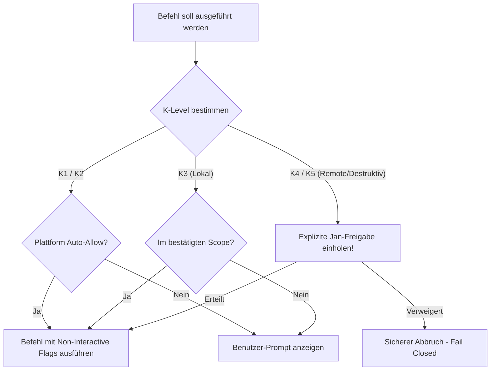

# 03 — Execution-Umgebungen & K-Level-Referenz

> **Zweck:** Plattformübergreifende Referenz für Tool-Execution, Berechtigungsstufen (K1–K5), Non-Interactive Flags und Sicherheitsgrenzen für alle KI-Agenten (Antigravity, Claude Code, ChatGPT, Ollama).
> **Workflow Execution & Selbstprüfung:** [`xx_sop/02_workflow_jan_execution.md`](../xx_sop/02_workflow_jan_execution.md).
> **Command-Referenz:** [`xx_docs/02_command_reference.md`](02_command_reference.md).
> **Qualitätsmaßstab:** [`xx_sop/12_workflow_dokument_qualitaet.md`](../xx_sop/12_workflow_dokument_qualitaet.md).

---

## 1 — Die 5 Ausführungsklassen (K-Level-System)

Das gesamte Repository unterliegt einer strikten 5-stufigen Risikoklassifizierung für Terminal-, Script- und API-Aktionen:

| Klasse | Risiko-Niveau | Typische Befehle & Aktionen | Standard-Berechtigung | Freigabe-Voraussetzung |
| :--- | :--- | :--- | :--- | :--- |
| **K1** | **Read-Only / Analyse** | `git status`, `git diff`, `git log`, Dateisuche, Read-APIs | **Auto-Allow** (Frei ausführbar) | Keine (Read-only). |
| **K2** | **Prüfen & Verifizieren** | `npm test`, `npm run typecheck`, `npm run lint`, `npm run build` | **Auto-Allow** (Frei ausführbar) | Keine, solange keine Dateien mutiert werden. |
| **K3** | **Lokale Mutation** | Code-Formatierung, Datei-Edits, temporäre Testskripte | **Task-Scope** (Im bestätigten Scope) | Auftrag von Jan liegt vor. |
| **K4** | **Externe / Remote-Änderung** | `supabase db push`, PR-Merge, Vercel-Deploy, Secrets-Update | **Jan-Freigabe Zwingend** | Explizite schriftliche Freigabe im Chat. |
| **K5** | **Destruktiv / Live** | `supabase db reset`, `git push --force`, `rm -rf`, Live-Mutationen | **K5-Blockade** | Explizite Bestätigung mit Sicherheitsnachweis. |

---

## 2 — Plattform-Spezifika & Agenten-Verhalten

### 2.1 Google Antigravity IDE
* **Auto-Allow Policy:** K1 und K2-Befehle (`npm test`, `typecheck`, `lint`, `build`, `git status`) sind in der IDE auf Auto-Allow geschaltet.
* **Non-Interactive Execution:** Befehle immer mit `--yes`, `-y` oder `CI=true` aufrufen, um interaktive CLI-Hangs zu verhindern.
* **Keine variablen Pfade an ESLint:** Niemals `npx eslint file.tsx` aufrufen, sondern stets den kanonischen Befehl `npm run lint`.

### 2.2 Claude Code CLI
* Lokale Tool-Berechtigungsrichtlinien beachten; keine Annahmen über GUI-Dialoge treffen.
* `PAGER=cat` oder `--no-pager` für Git-Befehle nutzen, um Terminal-Blockaden zu vermeiden.

### 2.3 ChatGPT / OpenAI Codex / Ollama
* Reine Sandbox-Umgebungen; keine persistenten Remote-Berechtigungen behaupten.
* Bei unklarer Autorisierung stets die restriktivere Regel anwenden (Fail-Closed).

---

## 3 — Konkrete Befehls-Matrix nach K-Level

| Befehl | K-Level | Zweck & Verhalten |
| :--- | :---: | :--- |
| `git status --short` | **K1** | Schnelle Arbeitsbaum-Prüfung |
| `git diff --stat` | **K1** | Geänderte Zeilen und Dateien einsehen |
| `npm run test` / `npx vitest run` | **K2** | Ausführen aller Vitest-Suiten |
| `npm run typecheck` | **K2** | TypeScript Kompilierungsprüfung ohne Emit |
| `npm run lint` | **K2** | ESLint-Gesamtprüfung über das Projekt |
| `npm run build` | **K2** | Next.js Produktions-Build-Validierung |
| `npm install <pkg>` | **K3** | Dependency hinzufügen (nur nach Abstimmung) |
| `npx supabase db push` | **K4** | Remote-Migration auf Staging/Production anwenden |
| `npx supabase db reset` | **K5** | **Destruktiv!** Löscht und initialisiert lokale DB neu |

---

## 4 — Risiko- & Freigabeklassifizierung (K-Level)

| Ausführungs-Aktion | K-Level | Freigabe-Voraussetzung |
| :--- | :---: | :--- |
| **Lokale Befehle K1/K2 ausführen** | **K1/K2** | Automatisch erlaubt. |
| **Erstellen/Löschen temporärer Testdateien** | **K3** | Frei im bestätigten Aufgaben-Scope. |
| **Ausführen externer Remote-Kommandos (Supabase/Vercel)** | **K4** | **Explizite Jan-Freigabe zwingend erforderlich.** |
| **Ausführen destruktiver DB-Resets oder Force-Pushes** | **K5** | **Explizite Jan-Freigabe mit Sicherheitswarnung.** |

---

## 5 — Didaktischer Mehrwert & Lerneffekt für Jan

1. **Warum standardisierte K-Level?**
   Verhindert fatale Fehlbedienungen durch autonome KI-Agenten. Durch die klare Grenze zwischen K1/K2 (völlig gefahrlos) und K4/K5 (Gefahr von Datenverlust oder Live-Störungen) behält Jan die volle Kontrolle über kritische Infrastruktur.
2. **Warum Pager-Unterdrückung (`PAGER=cat`)?**
   Befehle wie `git log` öffnen standardmäßig interaktive Pager (`less`), die auf Tastatureingaben ('q') warten. In CI- und Agenten-Umgebungen führt dies zu Timeouts und Prozess-Hangs.
3. **Warum keine variablen Dateipfade an den Linter?**
   Wenn Agenten `npx eslint src/file1.tsx` ausführen, entstehen unzählige unterschiedliche Befehlssignaturen, die manuelle Freigaben erfordern. Der globale Aufruf `npm run lint` greift auf das feste Auto-Allow-Muster zu.

---

## 6 — Bekannte offene Probleme & Ist-Diskrepanzen

> **Stand:** 2026-08-23 · Wird bei Behebung aktualisiert.

- **1. Plattform-Divergenz bei Auto-Allow:**
  Antigravity unterstützt JSON-basierte Tool-Policies; Claude Code nutzt CLI-Flags (`--dangerously-skip-permissions`). Die Regeln in dieser Datei bilden den kleinsten gemeinsamen Sicherheitsnenner.
- **2. Historische Dokumentations-Lücke:**
  Frühere Versionen enthielten keine konkreten Befehlsbeispiele je K-Level. Diese Datei schließt diese Lücke vollständig.

---

## 7 — Verwandte Artefakte

| Bedarf | Datei |
| :--- | :--- |
| **Execution Workflow & Selbstprüfung** | [`xx_sop/02_workflow_jan_execution.md`](../xx_sop/02_workflow_jan_execution.md) |
| **Command-Inventar** | [`xx_docs/02_command_reference.md`](02_command_reference.md) |
| **Kanonischer Startkontext** | [`CLAUDE.md`](../CLAUDE.md) · [`AGENTS.md`](../AGENTS.md) |
| **Dokument-Qualitäts-Rubrik** | [`xx_sop/12_workflow_dokument_qualitaet.md`](../xx_sop/12_workflow_dokument_qualitaet.md) |
