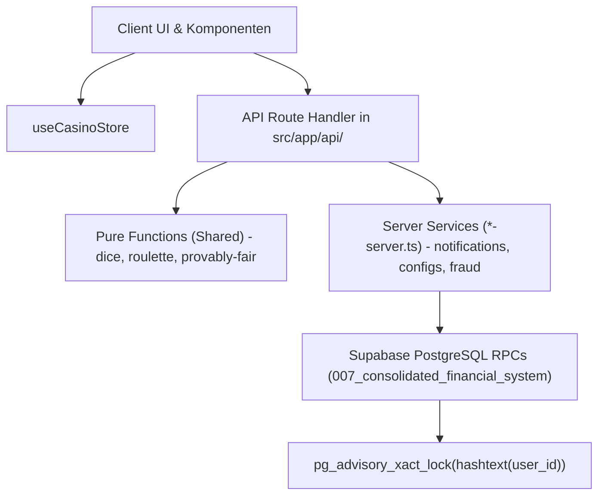

# 05 — Service-Layer & Casino-Geschäftslogik-Kontext

> **Zweck:** Kanonische Modulkarte und Architektur-Referenz für alle Geschäftsregeln, Quotenberechnungen, Provably-Fair-Algorithmen, Server-Services und Hilfsmodule in `src/lib/casino/`.
> **SOP & Handlungsanweisungen:** [`xx_sop/06_service_layer_casino.md`](../xx_sop/06_service_layer_casino.md).
> **Sicherheits- & Wallet-Invarianten:** [`xx_sop/09_security_wallet_invariants.md`](../xx_sop/09_security_wallet_invariants.md).
> **Qualitätsmaßstab:** [`xx_sop/12_workflow_dokument_qualitaet.md`](../xx_sop/12_workflow_dokument_qualitaet.md).

---

## 1 — Systemgrenze & Schicht-Architektur



* **Keine Geschäftslogik in der UI:** React-Komponenten rendern ausschließlich Zustände und Animationen.
* **Server-Autorität:** Salden-Updates, Multiplikatoren und Wett-Settlements werden ausnahmslos im Service-Layer bzw. in PostgreSQL-RPCs berechnet.
* **Client/Server-Trennung:** Module mit dem Suffix `*-server.ts` oder `.server.ts` nutzen Server-Secrets und dürfen niemals in Client-Komponenten importiert werden.

---

## 2 — Vollständiges Modul-Inventar (`src/lib/casino/`)

### 2.1 Core, Finanzen & Quoten
| Modul | Typ | Zweck & Verantwortung |
| :--- | :---: | :--- |
| `casino-core.ts` | Shared | Zentrale Payout- & Quoten-Berechnung für Spiele, Level-/XP-Formeln. |
| `wallet.ts`, `wallet-contract.ts` | Server | Typisierter `WalletSnapshot`-Vertrag, Validierung und RPC-Aufrufe. |
| `big-win.ts` | Shared | Einheitliche Schwellenwerte für Big-Wins ($\ge 20\times$) und Trigger-Logik. |
| `bet-validator.ts` | Shared | Zod-Validierung von Wetteinsätzen gegen Min-/Max-Limits. |

### 2.2 Spiele, Provably Fair & RNG
| Modul | Typ | Zweck & Verantwortung |
| :--- | :---: | :--- |
| `provably-fair.ts`, `seeds.ts` | Shared | HMAC-SHA256 Zufallsberechnung, Seed-Hashing und Ketten-Generierung. |
| `blackjack.ts` | Shared | Blackjack State-Machine: Kartendeck-Evaluation, Soft/Hard Hands, Splits. |
| `dice.ts`, `roulette.ts`, `slots.ts` | Shared | Mathematische Auszahlungs- und Gewinnmodelle für Einzeltitel. |
| `crash-round.ts` | Server | Geteilte Raumstatus-Projektion und Takt-Management für Multiplayer-Crash. |
| `seed-history-verification.ts` | Shared | Verifikations-Routinen für historische Seeds vergangener Runden. |

### 2.3 Konfiguration, Progression & Achievements
| Modul | Typ | Zweck & Verantwortung |
| :--- | :---: | :--- |
| `game-config.ts` / `game-config-server.ts` | Shared / Server | Öffentliche Defaults vs. serverseitig gecachte Spielkonfigurationen. |
| `vip-config.ts` / `vip-config-server.ts` | Shared / Server | VIP-Stufen, Ränge und Rakeback-Prozentsätze. |
| `achievements-config.ts` / `*-server.ts` | Shared / Server | Achievement-Katalog, Freischaltbedingungen und DB-Sync. |
| `achievement-presentation.ts` | Shared | Visuelle Aufbereitung von Badges, Farben und Modal-Inhalten. |

### 2.4 Realtime, Event-Bus & Kommunikation
| Modul | Typ | Zweck & Verantwortung |
| :--- | :---: | :--- |
| `realtime.ts`, `realtime-types.ts` | Server / Shared | Supabase Realtime-Broadcast-Channels für Raumwetten. |
| `event-bus.ts` | Server | Entkoppeltes Event-Dispatching für Big-Wins und System-Alarme. |
| `daily-race.ts` | Server | Ranglisten-Aggregation und Preispool-Berechnung für Turniere. |
| `session.ts`, `stats-derivation.ts` | Shared / Server | Session-ID Generierung und statistische Aggregationen. |

### 2.5 Benachrichtigungen, Audio & Telegram
| Modul | Typ | Zweck & Verantwortung |
| :--- | :---: | :--- |
| `notifications.ts` | Server | In-App Benachrichtigungs-Engine für Level-Ups und System-News. |
| `voice-audio.ts`, `sound-manager.ts` | Shared / Client | Sound-Mappings, Audio-Trigger und TTS-Wiedergabe. |
| `image-compression.ts` | Shared | Client-/Server-Bildkompression für Avatare und Uploads. |
| `telegram-api.ts`, `telegram-notifier.ts`| Server | Telegram Bot API-Wrapper, Token-Verknüpfung und Push-Nachrichten. |

### 2.6 KI Royale Guide & Wissensbasis
| Modul | Typ | Zweck & Verantwortung |
| :--- | :---: | :--- |
| `chat-guide.ts`, `guide-tools.ts` | Server | OpenAI Responses API Anbindung, Tool-Calling für Spieler-Hilfen. |
| `guide-knowledge/` (Registry, Vector) | Server | pgvector-Suche, Wissensdokument-Parsing und Hybrid-Retrieval. |
| `guide-feedback.ts`, `guide-telemetry.ts`| Server | Qualitäts-Evaluation und Latenz-/Kosten-Tracking des Guides. |

### 2.7 Risiko, Betrugserkennung & Logging
| Modul | Typ | Zweck & Verantwortung |
| :--- | :---: | :--- |
| `fraud-detection.ts`, `risk-signals.ts` | Server | Heuristische Anomalie-Erkennung und Risikosignal-Erfassung. |
| `network-fingerprint.ts`, `fraud-ml/` | Server | Client-Fingerprinting und Machine-Learning-Scoring-Modelle. |
| `logger.ts`, `sentry-scrub.ts` | Shared / Server | Strukturierter Logger mit automatischer PII- und Secret-Redaktion. |

---

## 3 — Test- & Validierungsbefehle

```powershell
# 1. Alle Casino-Service-Tests ausführen
npm test -- src/lib/casino/__tests__/

# 2. Spezifische Module testen (Beispiel: Achievements & Notifications)
npm test -- src/lib/casino/__tests__/achievements-config.test.ts
npm test -- src/lib/casino/__tests__/notifications.test.ts

# 3. TypeScript-Kompilierung prüfen
npm run typecheck
```

---

## 4 — Risiko- & Freigabeklassifizierung (K-Level)

| Modul-Kategorie | K-Level | Freigabe-Voraussetzung |
| :--- | :---: | :--- |
| **Audio- & Bildkompressions-Helfer (`voice-audio.ts`)** | **K1/K2** | Lokale Tests ausreichend. |
| **Benachrichtigungs- & Turnier-Module (`daily-race.ts`)** | **K3** | Standard-Review im Task-Scope. |
| **Finanz-, Quoten- und Spiel-Berechnungsmodule** | **K4** | **Explizite Jan-Freigabe zwingend erforderlich.** |
| **Provably Fair & Kryptografie-Module** | **K4** | **Explizite Jan-Freigabe zwingend erforderlich.** |

---

## 5 — Didaktischer Mehrwert & Lerneffekt für Jan

1. **Warum strikte Trennung `*-server.ts`?**
   Verhindert, dass Node-spezifische Bibliotheken (z. B. `crypto`, `pg`, `fs`) in das Client-Webpack-Bundle geraten und dort zu Build-Fehlern führen oder Server-Keys leaken.
2. **Warum Pure Functions für Quotenmodelle?**
   Funktionen ohne Nebeneffekte (`dice.ts`, `roulette.ts`) lassen sich deterministisch und blitzschnell mit tausenden Testfällen (Fuzzing / Property-Based Testing) in Vitest auf mathematische Exaktheit prüfen.
3. **Warum kein direkter DB-Schreibzugriff im Service?**
   Finanztransaktionen müssen ACID-konform in Supabase-RPCs ablaufen. Der Service-Layer berechnet Parameter, die Datenbank verbucht das Geld atomar.

---

## 6 — Bekannte offene Probleme & Ist-Diskrepanzen

> **Stand:** 2026-08-23 · Wird bei Behebung aktualisiert.

- **1. Hohe Zeilenanzahl in `casino-core.ts`:**
  Enthält noch Querschnittslogik für XP und Basis-Settlement; Modularisierung in separate Einzeldateien ist geplant.
- **2. Historische Vollständigkeits-Lücke behoben:**
  Die 4 Module `achievement-presentation.ts`, `image-compression.ts`, `notifications.ts` und `voice-audio.ts` sind nun vollständig inventarisiert.

---

## 7 — Verwandte Artefakte

| Bedarf | Datei |
| :--- | :--- |
| **Service Layer SOP** | [`xx_sop/06_service_layer_casino.md`](../xx_sop/06_service_layer_casino.md) |
| **Sicherheits- & Wallet-Invarianten** | [`xx_sop/09_security_wallet_invariants.md`](../xx_sop/09_security_wallet_invariants.md) |
| **Games Kontext** | [`xx_docs/10_games_context.md`](10_games_context.md) |
| **Dokument-Qualitäts-Rubrik** | [`xx_sop/12_workflow_dokument_qualitaet.md`](../xx_sop/12_workflow_dokument_qualitaet.md) |
