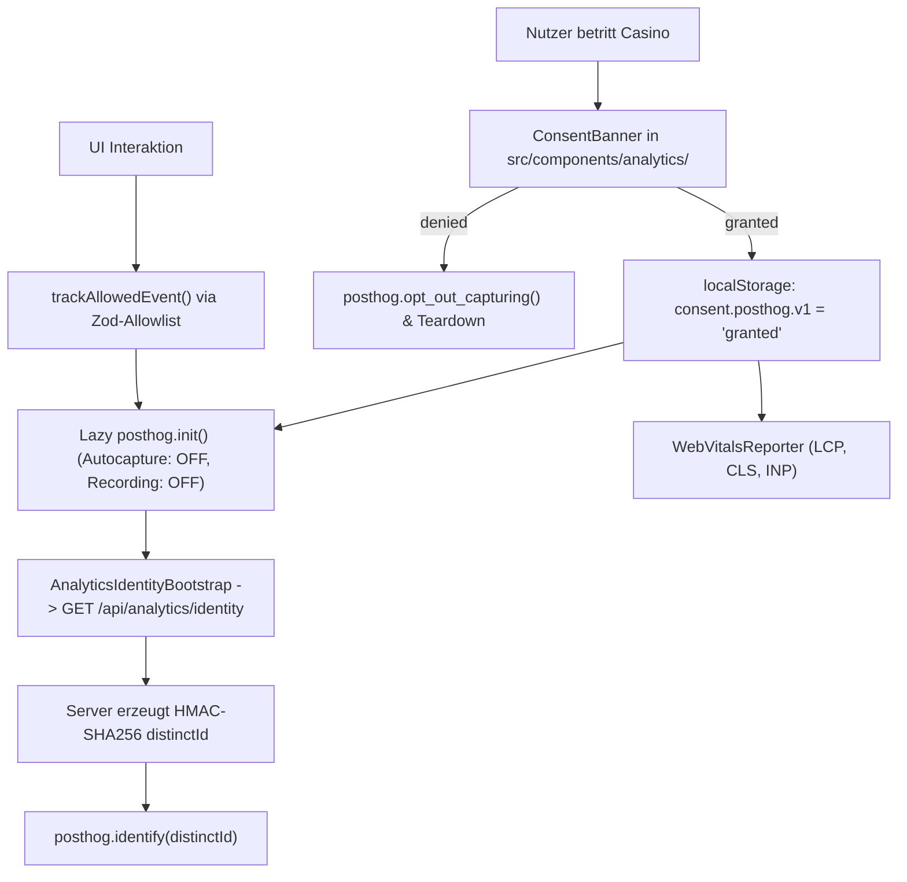

# 06 — Analytics, Consent & Privacy-Kontext

> **Zweck:** Kanonische Modulkarte und Spezifikation für privacy-first PostHog-Produkt-Analytics (`src/lib/analytics/`), den Zod-Event-Katalog und die serverseitige HMAC-Pseudonymisierung.
> **SOP & Handlungsanweisungen:** [`xx_sop/08_analytics_posthog.md`](../xx_sop/08_analytics_posthog.md).
> **Sicherheits- & Wallet-Invarianten:** [`xx_sop/09_security_wallet_invariants.md`](../xx_sop/09_security_wallet_invariants.md).
> **Qualitätsmaßstab:** [`xx_sop/12_workflow_dokument_qualitaet.md`](../xx_sop/12_workflow_dokument_qualitaet.md).

---

## 1 — Systemgrenze & Laufzeitkette



* **Best-Effort Prinzip:** Analytics bestimmt weder Spielausgänge noch Wallet-, Auth- oder UI-Abläufe. Ausfälle von PostHog verändern das Nutzererlebnis nicht.
* **Consent-Zwang:** Vor `granted` wird kein SDK-Script geladen und kein HTTP-Request an `us.i.posthog.com` gesendet.

---

## 2 — Modul- & Komponenten-Inventar

| Pfad | Typ | Verantwortung |
| :--- | :---: | :--- |
| `src/lib/analytics/consent.ts` | Shared | LocalStorage-State (`consent.posthog.v1`), Cross-Tab-Sync via Storage-Event. |
| `src/lib/analytics/events.ts` | Shared | Zentrale Capture-Grenze, strikte Zod-Allowlist aller erlaubten Events. |
| `src/lib/analytics/identify.ts` | Client | Browser-Helfer für `posthog.identify()` mit HMAC-`distinctId`. |
| `src/lib/analytics/identity-hmac.ts` | Server | Serverseitige SHA-256 HMAC-Hasherstellung aus `user.id` + Secret. |
| `src/lib/analytics/posthog-client.ts` | Client | Lazy Client-Initialisierung mit erzwungener Privacy-Konfiguration. |
| `src/lib/analytics/posthog-erasure.ts` | Server | DSGVO-Löschroutine über die PostHog Persons API (`erasePostHogPerson`). |
| `src/lib/analytics/web-vitals.ts` | Client | RUM-Performance-Messung (LCP, CLS, INP) bei aktivem Consent. |
| `src/components/analytics/ConsentBanner.tsx` | Client | Glassmorphism-Banner für Cookie- und Analytics-Opt-In. |
| `src/components/analytics/WebVitalsReporter.tsx`| Client | Mountet Web-Vitals-Observer im Root-Layout. |
| `src/app/api/analytics/identity/route.ts` | API | Authentifizierter Identity-Endpunkt (`Cache-Control: private, no-store`). |

---

## 3 — Kanonische Zod-Event-Allowlist (14 Events)

Jedes gesendete Event muss exakt einem dieser Zod-Schemas in `events.ts` entsprechen:

| Event-Name | Erlaubte Properties (strikt) | Trigger-Ort |
| :--- | :--- | :--- |
| `landing_viewed` | Keine | Hero / Startseite |
| `cta_play_now_clicked`| `source: string` | Hero-CTA-Button |
| `sign_up_completed` | `method: 'email' \| 'oauth'` | Auth Callback |
| `first_game_started` | `game: 'DICE' \| 'SLOTS' \| 'ROULETTE' \| 'CRASH' \| 'BLACKJACK'` | Erstes Spiel nach Registrierung |
| `stats_viewed` | Keine | `/stats` Seitenaufruf |
| `passkey_registered` | `success: boolean` | Security-Settings |
| `passkey_sign_in_completed`| `success: boolean` | Login-Flow |
| `mfa_totp_enrolled` | Keine | 2FA-Aktivierung |
| `mfa_totp_unenrolled` | Keine | 2FA-Deaktivierung |
| `identity_linked` | `provider: string` | Account-Verknüpfung |
| `identity_unlinked` | `provider: string` | Account-Trennung |
| `password_reset_requested`| Keine | Passwort-Reset-Formular |
| `password_reset_completed`| Keine | Passwort-Reset-Bestätigung |
| `web_vital_measured` | `metric: 'LCP' \| 'CLS' \| 'INP'`, `value: number`, `rating: 'good' \| 'needs-improvement' \| 'poor'` | WebVitalsReporter |

---

## 4 — Test- & Validierungsbefehle

```powershell
# 1. Alle Analytics-Tests ausführen
npm test -- src/lib/analytics/__tests__/

# 2. Spezifische Tests prüfen
npm test -- src/lib/analytics/__tests__/events.test.ts
npm test -- src/lib/analytics/__tests__/identity-hmac.test.ts
npm test -- src/lib/analytics/__tests__/consent.test.ts

# 3. TypeScript Typ-Integrität prüfen
npm run typecheck
```

---

## 5 — Risiko- & Freigabeklassifizierung (K-Level)

| Analytics-Aktion | K-Level | Freigabe-Voraussetzung |
| :--- | :---: | :--- |
| **Neues Event in `events.ts` aufnehmen** | **K2** | Lokale Vitest-Tests ausreichend. |
| **Consent-Banner UI-Design anpassen** | **K2** | Lokale Sichtprüfung. |
| **Änderung an HMAC-Secret-Länge oder Hashing** | **K4** | **Explizite Jan-Freigabe zwingend erforderlich.** |
| **Änderung an DSGVO-Datenlöschprozessen** | **K4** | **Explizite Jan-Freigabe zwingend erforderlich.** |

---

## 6 — Didaktischer Mehrwert & Lerneffekt für Jan

1. **Warum strikte Zod-Allowlists statt freier Events?**
   In vielen Web-Apps werden wahllos Strings getrackt (`posthog.capture('clicked_button_xyz')`). Das führt zu Datenmüll und gefährdet die DSGVO-Compliance. Strikte Zod-Schemas stellen sicher, dass nur vorab definierte, geprüfte Events in der Analytics-Plattform ankommen.
2. **Warum kein Tracking vor dem Consent?**
   Nach europäischem Datenschutzrecht (DSGVO/ePrivacy) ist das Setzen von Tracking-Cookies oder Fingerprinting ohne explizites Opt-In unzulässig. Die Architektur blockiert jeden Request, bis `consent.posthog.v1 === 'granted'`.
3. **Warum HMAC-SHA256 für `distinctId`?**
   Ermöglicht es, das Verhalten eines Nutzers über mehrere Sessions hinweg zu analysieren, ohne dass PostHog oder Dritte die tatsächliche Identität (E-Mail oder Supabase-ID) erfahren.

---

## 7 — Bekannte offene Probleme & Ist-Diskrepanzen

> **Stand:** 2026-08-23 · Wird bei Behebung aktualisiert.

- **1. Erasure-Aufrufer noch nicht verdrahtet:**
  `posthog-erasure.ts` stellt die DSGVO-Löschfunktion bereit, besitzt jedoch noch keinen automatischen Trigger aus der UI, da der Kontolösch-Workflow noch nicht final implementiert ist.
- **2. Historisches Prüfdatum nachgetragen:**
  Aktualitäts-Check auf `2026-08-23` synchronisiert.

---

## 8 — Verwandte Artefakte

| Bedarf | Datei |
| :--- | :--- |
| **Analytics SOP** | [`xx_sop/08_analytics_posthog.md`](../xx_sop/08_analytics_posthog.md) |
| **API Backend Kontext** | [`xx_docs/08_api_backend_context.md`](08_api_backend_context.md) |
| **Sicherheits- & Wallet-Invarianten** | [`xx_sop/09_security_wallet_invariants.md`](../xx_sop/09_security_wallet_invariants.md) |
| **Dokument-Qualitäts-Rubrik** | [`xx_sop/12_workflow_dokument_qualitaet.md`](../xx_sop/12_workflow_dokument_qualitaet.md) |
