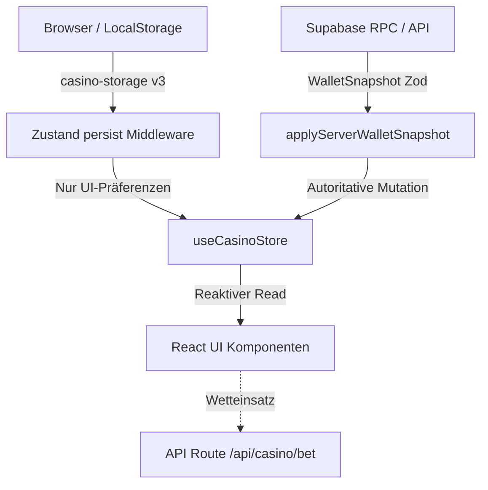

# 07 — State & Zustand Store-Kontext

> **Zweck:** Kanonische Modulkarte und Architekturvertrag für den globalen Client-State (`src/store/useCasinoStore.ts`), Persistenzgrenzen, Snapshot-Schnittstellen und Rehydration.
> **Service Layer Logik:** [`xx_docs/05_service_layer_context.md`](05_service_layer_context.md).
> **Sicherheits- & Wallet-Invarianten:** [`xx_sop/09_security_wallet_invariants.md`](../xx_sop/09_security_wallet_invariants.md).
> **Qualitätsmaßstab:** [`xx_sop/12_workflow_dokument_qualitaet.md`](../xx_sop/12_workflow_dokument_qualitaet.md).

---

## 1 — Systemgrenze & Eigentümerschaft



* **0 % finanzielle Autorität:** Der Zustand-Store berechnet weder Guthaben noch Multiplikatoren oder Progression eigenmächtig.
* **Startbalance strikt 0:** Bei Initialisierung ist `balance: 0`, `xp: 0`, `level: 1`, `rank: 'BRONZE'`, bis der Server einen bestätigten Snapshot liefert.
* **Snapshot-Schleuse:** `applyServerWalletSnapshot()` ist die **einzige** autorisierte Methode zur Mutation von Finanzwerten im Client.

---

## 2 — Persistenz-Grenzen (`partialize` & Storage-Filter)

Der Store nutzt Zustand 5 `persist` unter dem Schlüssel `casino-storage` (Version 3, `skipHydration: true`):

| Kategorie | Enthaltene Felder | Persistiert in LocalStorage? |
| :--- | :--- | :---: |
| **Client-Präferenzen** | `soundVolume`, `soundEnabled`, `hideBalance`, `anonymousBetting`, `language`, `oddsFormat`, `autoBetSettings` | **JA (Erlaubt)** |
| **Finanz- & Progressionsstatus**| `balance`, `xp`, `level`, `rank` | **NEIN (STRIKT VERBOTEN)** |
| **Transaktionshistorie** | `bets`, `allBets` | **NEIN (STRIKT VERBOTEN)** |
| **Server-Konfigurationen** | `gameConfig`, `vipTiers`, `ranks`, `achievementConfigs` | **NEIN (STRIKT VERBOTEN)** |
| **Flüchtiger UI-Zustand** | `sessionId`, `toasts`, `isProcessing`, `isMobile`, `_hasHydrated` | **NEIN (STRIKT VERBOTEN)** |

---

## 3 — Die Snapshot-Schnittstelle (`applyServerWalletSnapshot`)

```typescript
// Einzige autorisierte Schnittstelle für Saldenänderungen:
applyServerWalletSnapshot: (snapshot: WalletSnapshot) => {
  // 1. Laufzeit-Validierung via Zod
  const validated = walletSnapshotSchema.parse(snapshot);
  
  // 2. Atomares Store-Update
  set({
    balance: validated.balance,
    xp: validated.xp,
    level: validated.level,
    rank: validated.rank,
  });
}
```

* **Fail-Closed bei Schema-Mismatch:** Weicht der Server-Payload vom `walletSnapshotSchema` ab, wirft der Parser einen Fehler und verwirft das Update.
* **`processGameResult()` trennt Historie von Geld:** Schreibt nur visuelle Spielausgänge in die lokale Ansichtshistorie und den Achievement-Fortschritt, mutiert aber keine Salden.

---

## 4 — Rehydration- & Initialisierungs-Ablauf

1. **Rehydration:** `MainLayout.tsx` ruft im `useEffect` explizit `useCasinoStore.persist.rehydrate()` auf, um Client-Einstellungen aus dem LocalStorage zu laden.
2. **Server-Prefetch:** Parallel dazu lädt `initialize()` Konfigurationen von `/api/user/balance`, `/api/casino/seeds` und `/api/community`.
3. **Session-Sync:** `getOrCreateSessionId()` erzeugt eine anonyme Session-ID für Tracking und Rakeback-Zuordnung.

---

## 5 — Test- & Validierungsbefehle

```powershell
# 1. Store Unit- & Invariantentests ausführen
npm test -- src/store/__tests__/useCasinoStore.test.ts

# 2. Coverage-Gate prüfen (60% Branches, 80% Functions)
npm test -- --coverage src/store/useCasinoStore.ts

# 3. TypeScript-Typen prüfen
npm run typecheck
```

---

## 6 — Risiko- & Freigabeklassifizierung (K-Level)

| Store-Aktion | K-Level | Freigabe-Voraussetzung |
| :--- | :---: | :--- |
| **UI-Settings & Toast-Actions modifizieren** | **K1/K2** | Lokale Tests ausreichend. |
| **Persistenzfilter-Änderungen (`partialize`)** | **K3** | Standard-Review erforderlich (Gefahr von Storage-Leaks). |
| **Änderungen an `applyServerWalletSnapshot` oder Zod-Schema** | **K4** | **Explizite Jan-Freigabe zwingend erforderlich.** |

---

## 7 — Didaktischer Mehrwert & Lerneffekt für Jan

1. **Warum keine Salden im LocalStorage persistieren?**
   Würde `balance` im LocalStorage gespeichert, könnte ein Nutzer im Browser-Storage den Wert auf `$1.000.000` setzen. Beim nächsten Page-Load würde kurz ein falscher Betrag aufflackern. Durch Startbalance `0` und Server-Prefetch ist Betrug im Keim erstickt.
2. **Warum `skipHydration: true` bei SSR?**
   Next.js rendert HTML auf dem Server. Greift der Store sofort auf den Browser-LocalStorage zu, entsteht ein Hydration-Mismatch ("Text content did not match server HTML"). `skipHydration` stellt sicher, dass erst nach dem Client-Mount synchronisiert wird.
3. **Warum Zod-Validierung im Client-Store?**
   Defensive Programmierung: Selbst wenn eine API-Route fehlerhafte Daten senden würde, verhindert die Zod-Validierung in `applyServerWalletSnapshot`, dass korrupte State-Zustände die React-Komponenten zum Absturz bringen.

---

## 8 — Bekannte offene Probleme & Ist-Diskrepanzen

> **Stand:** 2026-08-23 · Wird bei Behebung aktualisiert.

- **1. Monolithischer Store (~1.048 Zeilen):**
  `useCasinoStore.ts` bündelt Settings, Toasts, Games, Achievements und VIP-Logik. Ein künftiges Refactoring in modulare Zustand-Slices (`createSettingsSlice`, `createWalletSlice`) ist vorgemerkt.
- **2. Drift-Abschnitt nachgetragen:**
  Transparenz über Store-Größe und Slice-Planung synchronisiert.

---

## 9 — Verwandte Artefakte

| Bedarf | Datei |
| :--- | :--- |
| **Service Layer Kontext** | [`xx_docs/05_service_layer_context.md`](05_service_layer_context.md) |
| **Sicherheits- & Wallet-Invarianten** | [`xx_sop/09_security_wallet_invariants.md`](../xx_sop/09_security_wallet_invariants.md) |
| **Layout Shell Kontext** | [`xx_docs/09_layout_shell_context.md`](09_layout_shell_context.md) |
| **Dokument-Qualitäts-Rubrik** | [`xx_sop/12_workflow_dokument_qualitaet.md`](../xx_sop/12_workflow_dokument_qualitaet.md) |
