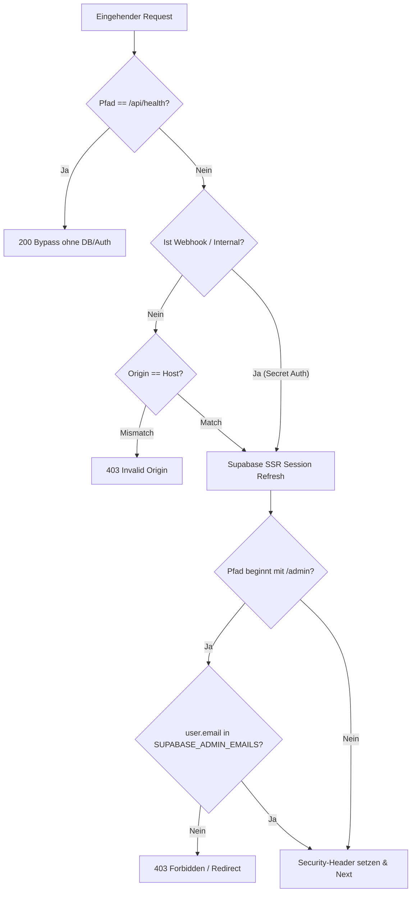

# 08 — API, Middleware & Backend-Kontext

> **Zweck:** Kanonische Spezifikation und Modulkarte aller 47 Server-Endpunkte in `src/app/api/`, der Auth- und Security-Middleware `src/proxy.ts` und der Admin-Routen.
> **SOP & Handlungsanweisungen:** [`xx_sop/07_api_backend_routes.md`](../xx_sop/07_api_backend_routes.md).
> **Sicherheits-Invarianten:** [`xx_sop/09_security_wallet_invariants.md`](../xx_sop/09_security_wallet_invariants.md).
> **Qualitätsmaßstab:** [`xx_sop/12_workflow_dokument_qualitaet.md`](../xx_sop/12_workflow_dokument_qualitaet.md).

---

## 1 — Systemgrenze & Transport-Schicht

- **Exklusive Transport-Rolle:** `src/app/api/` dient ausschließlich als Transport-, Validierungs- (Zod) und Autorisierungsschicht zwischen Client und Service-Layer (`src/lib/casino/`) bzw. Supabase-RPCs.
- **Keine Geschäftslogik in Routen:** Wettberechnungen, RNG, Kartendecks, Crash-Multiplikatoren und Wallet-Mutationen dürfen niemals direkt im Route-Handler implementiert werden.
- **Fail-Closed-Invariante:** Schreibende Endpunkte schließen bei DB-Timeouts, Rate-Limit-Überschreitungen oder Authentifizierungsfehlern strikt mit `401`, `403`, `429` oder `503`. Phantom-Guthaben oder lokale Fallback-Gewinne sind verboten.
- **Idempotenz:** Alle Finanz-Mutationsanfragen erzwingen eine Client-generierte UUIDv4 (`requestId` / `Idempotency-Key`).

---

## 2 — Middleware & Auth-Protection (`src/proxy.ts`)

Die Edge-Middleware `src/proxy.ts` schützt alle Routen vor dem Eintreffen im Handler:



### Kernregeln der Middleware:

1. **Liveness Probe (`/api/health`):** Wird direkt am Anfang vor der Supabase-Client-Erstellung freigegeben. Ein Ausfall von Supabase darf nicht dazu führen, dass der Healthcheck fehlschlägt.
2. **CSRF & Origin-Schutz (`hasValidOrigin`):** Bei Mutationen (`POST`, `PUT`, `DELETE`, `PATCH`) muss der `Origin`-Header exakt mit dem `Host`- bzw. `x-forwarded-host`-Header übereinstimmen. Ausgenommen sind Webhook-Routen mit Signaturprüfung.
3. **Cookie-Rotation (`withRefreshedCookies`):** Terminale Antworten (wie `403 Forbidden` oder `Redirect`) müssen zwingend die vom Session-Refresh aktualisierten Cookies übertragen, um Token-Verlust zu verhindern.
4. **Admin-Gate (`/admin/**`):** Anonyme Nutzer werden auf `/sign-in` geleitet. Authentifizierte Nicht-Admins erhalten `403 Forbidden`. Autorisierung erfolgt ausschließlich über `isAdminEmail()` (`SUPABASE_ADMIN_EMAILS`).
5. **Security-Header:** Erzwingt `Strict-Transport-Security` (2 Jahre), `X-Frame-Options: SAMEORIGIN`, `X-Content-Type-Options: nosniff` und strikte Content-Security-Policy (CSP) mit Whitelists für Sentry, PostHog und Supabase.

---

## 3 — Vollständiges API-Routen-Inventar (47 Routen)

### 3.1 Casino, Gaming & Provably Fair (`src/app/api/casino/`)

| Route                               | Methode |  Auth  | Rate-Limit | Zweck & Verhalten                                                                           |
| :---------------------------------- | :-----: | :----: | :--------: | :------------------------------------------------------------------------------------------ |
| `/api/casino/bet`                   | `POST`  |  User  |   60/min   | Singleplayer-Wetten für Dice, Slots, Roulette, Crash Singleplayer. Führt atomare RPCs aus.  |
| `/api/casino/bet-crash-multiplayer` | `POST`  |  User  |   60/min   | Wetteinsatz und Cashout für Multiplayer-Crash im globalen Raumtakt.                         |
| `/api/casino/blackjack`             | `POST`  |  User  |   60/min   | Blackjack-Aktionen (`deal`, `hit`, `stand`, `double`, `split`). Versionierte Rundenführung. |
| `/api/casino/config`                |  `GET`  | Public |  120/min   | Öffentliche Spielkonfigurationen, Min-/Max-Einsätze, Auszahlungsquoten.                     |
| `/api/casino/jackpot`               |  `GET`  | Public |   60/min   | Aktueller Progressive-Jackpot-Poolstand und Gewinnereignisse.                               |
| `/api/casino/active-round`          |  `GET`  | Public |  120/min   | Liefert aktiven Multiplayer-Crash-Raumstatus (`sharedRound`).                               |
| `/api/casino/seeds`                 |  `GET`  |  User  |   60/min   | Liefert aktiven Server-Seed-Hash, Client-Seed und Nonce für Provably Fair.                  |
| `/api/casino/seeds/history`         |  `GET`  |  User  |   60/min   | Historie aufgedeckter Server-Seeds zur Verifikation vergangener Runden.                     |
| `/api/casino/redeem-code`           | `POST`  |  User  |   10/min   | Einlösung von Promotion-Codes; schreibt in `promo_redemptions`.                             |
| `/api/casino/session-sync`          | `POST`  | Public |     —      | `410 Gone` — Clientseitige Synchronisation deaktiviert.                                     |
| `/api/casino/migrate-session`       | `POST`  | Public |     —      | `410 Gone` — Deaktivierter Legacy-Endpunkt.                                                 |

### 3.2 User, Progression & Balance (`src/app/api/user/`)

| Route               | Methode | Auth | Rate-Limit | Zweck & Verhalten                                                                                |
| :------------------ | :-----: | :--: | :--------: | :----------------------------------------------------------------------------------------------- |
| `/api/user/balance` |  `GET`  | User |   60/min   | Auto-Provisionierung fehlender Profile & typisierter Wallet-Snapshot (`balance`, `xp`, `level`). |
| `/api/user/history` |  `GET`  | User |   60/min   | Paginierte Spiel- und Transaktionshistorie des authentifizierten Nutzers.                        |
| `/api/user/stats`   |  `GET`  | User |   60/min   | Aggregierte Performance-Werte (Winrate, Umsatz, Lieblingsspiele).                                |

### 3.3 In-App Benachrichtigungen (`src/app/api/notifications/`)

| Route                         | Methode | Auth | Rate-Limit | Zweck & Verhalten                                                           |
| :---------------------------- | :-----: | :--: | :--------: | :-------------------------------------------------------------------------- |
| `/api/notifications`          |  `GET`  | User |   60/min   | Abruf aktiver Benachrichtigungen (Level-Up, Big Wins, System-Meldungen).    |
| `/api/notifications/[id]`     | `PATCH` | User |   60/min   | Status-Update (gelesen / archiviert) für eine spezifische Benachrichtigung. |
| `/api/notifications/read-all` | `POST`  | User |   20/min   | Markiert alle Benachrichtigungen des Nutzers als gelesen.                   |

### 3.4 Telegram Integration (`src/app/api/telegram/`)

| Route                   | Methode |  Auth  | Rate-Limit | Zweck & Verhalten                                                         |
| :---------------------- | :-----: | :----: | :--------: | :------------------------------------------------------------------------ |
| `/api/telegram/link`    | `POST`  |  User  |   10/min   | Erzeugt temporären Deep-Link-Token zur Bot-Koppelung.                     |
| `/api/telegram/unlink`  | `POST`  |  User  |   10/min   | Trennt die Verknüpfung zwischen Casino-Konto und Telegram-Chat-ID.        |
| `/api/telegram/toggle`  | `POST`  |  User  |   30/min   | Schaltet Benachrichtigungskanäle (Big Win, Daily Race) aktiv/inaktiv.     |
| `/api/telegram/status`  |  `GET`  |  User  |   60/min   | Prüft den aktuellen Koppelungs- und Zustellstatus des Nutzers.            |
| `/api/telegram/webhook` | `POST`  | Secret |  120/min   | Webhook für eingehende Bot-Befehle (gesichert per `TELEGRAM_BOT_SECRET`). |

### 3.5 Community & Tournaments (`src/app/api/`)

| Route                         | Methode |  Auth  | Rate-Limit | Zweck & Verhalten                                                     |
| :---------------------------- | :-----: | :----: | :--------: | :-------------------------------------------------------------------- |
| `/api/leaderboard`            |  `GET`  | Public |   60/min   | Öffentliche Bestenliste nach Profit, XP und Multiplikatoren.          |
| `/api/tournaments/daily-race` |  `GET`  | Public |   60/min   | Aktueller Punktestand, Rangliste und Preispool des Daily-Race-Events. |
| `/api/community`              |  `GET`  | Public |   60/min   | Aggregierter Activity-Feed über weltweite Casino-Aktionen.            |

### 3.6 Chat & KI Royale Guide (`src/app/api/chat/`)

| Route                        | Methode | Auth | Rate-Limit | Zweck & Verhalten                                                  |
| :--------------------------- | :-----: | :--: | :--------: | :----------------------------------------------------------------- |
| `/api/chat`                  | `POST`  | User |   30/min   | Senden von Chat-Nachrichten im globalen Community-Chat.            |
| `/api/chat/bot-response`     | `POST`  | User |   20/min   | Streaming-Antworten des KI Royale Guides via OpenAI Responses API. |
| `/api/chat/feedback`         | `POST`  | User |   30/min   | Speichert Nutzer-Bewertungen (Daumen hoch/runter) zu KI-Antworten. |
| `/api/chat/voice-synthesize` | `POST`  | User |   15/min   | Text-to-Speech Audio-Synthese für Antworten des KI-Guides.         |
| `/api/chat/voice-transcribe` | `POST`  | User |   15/min   | Whisper/OpenAI Audio-Transkription von Spracheingaben.             |

### 3.7 Admin & Backoffice (`src/app/api/admin/`)

| Route                             |  Methode   | Auth  | Rate-Limit | Zweck & Verhalten                                                                                                                                           |
| :-------------------------------- | :--------: | :---: | :--------: | :---------------------------------------------------------------------------------------------------------------------------------------------------------- |
| `/api/admin/overview`             |   `GET`    | Admin |   60/min   | Aggregierte Finanz- und User-KPIs (GGR, NGR, aktive Sessions).                                                                                              |
| `/api/admin/games`                |   `GET`    | Admin |   60/min   | Spielstatistiken, RTP-Abweichungen und House-Edge-Monitoring.                                                                                               |
| `/api/admin/users`                |   `GET`    | Admin |   60/min   | Benutzerliste, Kontosperren, Wallet-Status und Transaktionssummen.                                                                                          |
| `/api/admin/promo-codes`          | `GET/POST` | Admin |   30/min   | Erstellung, Monitoring und Deaktivierung von Gutschein-Codes.                                                                                               |
| `/api/admin/fraud`                |   `GET`    | Admin |   60/min   | Anomalie-Dashboard und Betrugs-Früherkennung.                                                                                                               |
| `/api/admin/fraud/scan`           |   `POST`   | Admin |   5/min    | Manueller Trigger für heuristische Fraud-Scans.                                                                                                             |
| `/api/admin/fraud/complete-wait`  |   `POST`   | Admin |   30/min   | Manuelle Freigabe oder Sperrung von verdächtigen Auszahlungen.                                                                                              |
| `/api/admin/analytics`            |   `GET`    | Admin |   60/min   | Cohort-Retention, VIP-Analysen und Umsatztrends.                                                                                                            |
| `/api/admin/knowledge`            |   `GET`    | Admin |   60/min   | Wissensbasis-Status und pgvector-Indexierungszustand.                                                                                                       |
| `/api/admin/evals`                |   `GET`    | Admin |   60/min   | Evaluations-Metriken und Testfall-Ergebnisse des KI-Guides.                                                                                                 |
| `/api/admin/digest-preview/start` |   `POST`   | Admin |   5/min    | Triggert die Generierung eines Vorschau-Reports / Daily Digests.                                                                                            |
| `/api/admin/job-health`           |   `GET`    | Admin |   60/min   | Snapshot-Alter (`admin_analytics_snapshots.generated_at`) + Dead-Letter-Zählung (`wallet_events`, `attempts >= 5`) für die Background-Jobs-Beobachtbarkeit. |

### 3.8 Analytics, System & Interne Webhooks (`src/app/api/`)

| Route                          | Methode |  Auth  | Rate-Limit | Zweck & Verhalten                                                        |
| :----------------------------- | :-----: | :----: | :--------: | :----------------------------------------------------------------------- |
| `/api/analytics/identity`      |  `GET`  |  User  |   60/min   | Erzeugt HMAC-gesicherte `distinctId` für PostHog (niemals Klartext-IDs). |
| `/api/health`                  |  `GET`  | Public |     —      | Liveness-Probe ohne DB-Abhängigkeit für Monitoring.                      |
| `/api/internal/cron-alert`     | `POST`  | Secret |   60/min   | Empfängt Alarme von fehlgeschlagenen Supabase `pg_net`-Cronjobs.         |
| `/api/internal/big-win-events` | `POST`  | Secret |  120/min   | Auslöser für globale WebSocket-Broadcasts bei Großgewinnen.              |
| `/api/internal/wallet-events`  | `POST`  | Secret |  120/min   | Interne Benachrichtigung bei serverseitigen Guthabenänderungen.          |
| `/api/webhooks/clerk`          | `POST`  | Public |     —      | `410 Gone` — Altes Webhook-System abgelöst durch DB-Trigger.             |

---

## 4 — Test- & Validierungsbefehle

Vor jedem Commit oder Deploy an API-Routen sind folgende Befehle auszuführen:

```powershell
# 1. API- & Security-Integrationstests ausführen
npm test -- src/lib/security/__tests__/

# 2. Spezifische Route-Tests prüfen
npm test -- src/app/api/

# 3. TypeScript Typ-Integrität prüfen
npm run typecheck

# 4. Linting-Konformität verifizieren
npm run lint
```

---

## 5 — Risiko- & Freigabeklassifizierung (K-Level)

| Kategorie                                                                      |  K-Level  | Freigabe-Voraussetzung                            |
| :----------------------------------------------------------------------------- | :-------: | :------------------------------------------------ |
| **Read-Only Routen** (`/api/leaderboard`, `/api/health`, `/api/user/stats`)    | **K1/K2** | Lokale Verifikation via Vitest ausreichend.       |
| **Interne Notification- & Chat-Endpunkte** (`/api/notifications`, `/api/chat`) |  **K3**   | Standard-Review im Rahmen des Tasks.              |
| **Finanz- und Wettrouten** (`/api/casino/bet`, `/api/casino/blackjack`, RPCs)  |  **K4**   | **Explizite Jan-Freigabe zwingend erforderlich.** |
| **Middleware & Auth-Änderungen** (`src/proxy.ts`, `isAdminEmail`)              |  **K4**   | **Explizite Jan-Freigabe zwingend erforderlich.** |

---

## 6 — Didaktischer Mehrwert & Lerneffekt für Jan

### Warum dieses API-Architekturmuster?

1. **Separation of Concerns (Transport vs. Logik):**
   Wenn API-Handler lediglich Parameter via Zod validieren und sofort an `src/lib/casino/` delegieren, bleibt der Code wartbar und vollständig ohne HTTP-Mocks in Vitest testbar.
2. **Fail-Closed als Sicherheitsnetz:**
   In einem Casino-System darf bei einem Datenbankausfall niemals "geraten" oder lokal ein Gewinn berechnet werden. Das strikte Schließen mit `503 Service Unavailable` schützt das Haus vor Inkonsistenzen.
3. **Session-Sicherheit bei SSR:**
   Das automatische Durchreichen rotierter Supabase-Cookies (`withRefreshedCookies`) verhindert einen der häufigsten Next.js-SSR-Bugs: den plötzlichen Logout aktiver Nutzer nach einem Redirect.

---

## 6a — Response-Envelope-Standard für neue Routen (seit 2026-08-25)

> **Scope:** Nur für **neue** Routen ab jetzt. Die 47 bestehenden Routen werden nicht rückwirkend migriert (opportunistisch bei ohnehin anstehenden Änderungen). Details & Herleitung: `worldmap/01_api_response_envelope.md` (Plan wurde nach Verifikation gelöscht, Ergebnis lebt hier und in `xx_sop/07_api_backend_routes.md`).

- **Befund:** Vor diesem Standard streuten Erfolgsantworten über mindestens 4 Formen (rohes Objekt, `{ success: true }`, `{ ok: true }`, Named-Key-Hüllen) über die 47 Routen. Das Fehlerformat war für die 7 kritischsten Routen (Bet, Blackjack, Crash-Multiplayer, Redeem-Code, Admin-Users, Admin-Promo-Codes, Analytics-Identity) bereits über `ApiError` in `src/lib/security/form-errors.ts` vereinheitlicht — nur der Erfolgsfall hatte keinen Standard.
- **Erfolgs-Envelope:** `{ data: T }`, gebaut über `apiSuccessResponse<T>(data, init?)` aus `src/lib/api/response.ts`.
- **Fehler-Envelope:** unverändert `{ error: ApiError }` aus `src/lib/security/form-errors.ts` (`apiErrorResponse()`, `createApiError()`) — kein neues Fehlerformat eingeführt.
- **Client-Helper:** `apiFetch<T>(input, init)` aus `src/lib/api/client.ts` entpackt `data` bei Erfolg und wirft bei Fehler eine typisierte `ApiFetchError` (`code`, `message`, `status`) — liest sowohl das strukturierte als auch das alte `{ error: string }`-Format über die bestehenden `getApiErrorCode`/`getApiErrorMessage`-Funktionen. Fail-closed bei Netzwerkfehler (`NETWORK_ERROR`) oder nicht-parsbarer/nicht-enveloped Antwort (`INVALID_RESPONSE`).
- **Pflicht ab jetzt:** Jede neue Route unter `src/app/api/**` gibt Erfolgsantworten über `apiSuccessResponse()` zurück; neuer Client-Code, der eine neue Route aufruft, nutzt `apiFetch<T>()` statt eines rohen `fetch()`.
- **Tests:** `src/lib/api/__tests__/response.test.ts`, `src/lib/api/__tests__/client.test.ts` (10/10 grün, TDD).

## 7 — Bekannte offene Probleme & Ist-Diskrepanzen

> **Stand:** 2026-08-25 · Wird bei Behebung aktualisiert.

- **4. Response-Envelope-Migration ausstehend:** Die 47 bestehenden Routen (siehe Abschnitt 3) geben Erfolgsantworten noch nicht über `apiSuccessResponse()` zurück — nur neue Routen sind seit 2026-08-25 verpflichtet (siehe Abschnitt 6a). Migration bewusst opportunistisch, kein dedizierter Umbau geplant.

- **5. Origin-Rejection-Envelope vereinheitlicht (behoben 2026-09-02):** `validateMutationOrigin()` (`src/lib/security/request-security.ts`) lieferte bei CSRF/Origin-Fehlern rohen Klartext-`Response` statt eines JSON-Envelopes. 17 Call-Sites reichten das ungefiltert als `403` durch. Alle Call-Sites wrappen die Rückgabe jetzt einheitlich über `apiErrorResponse('PERMISSION_DENIED', 'Keine Berechtigung.', status)`, identisch zum bereits bestehenden Muster in `bet`/`blackjack`/`bet-crash-multiplayer`/`redeem-code`/`admin/users`/`admin/promo-codes`. `validateMutationOrigin()` selbst wurde nicht verändert. Details: `worldmap/07_api_origin_envelope_hardening.md`.

- **1. Route-Konsolidierung `bet` vs. `bet-crash-multiplayer`:**
  `POST /api/casino/bet` und `POST /api/casino/bet-crash-multiplayer` laufen parallel. Eine vollständige Zusammenführung unter `/bet` mit einheitlicher Typ-Diskriminierung steht noch aus.
- **2. Deprecated Routen im Codebaum:**
  `/api/webhooks/clerk`, `/api/casino/session-sync` und `/api/casino/migrate-session` liefern bereits `410 Gone`, verbleiben aber noch als Dateien im Repo, um alte Clients sauber abzufangen.
- **3. Retired `/fairness`-Route:**
  Liefert gewollt 404 und ist in `src/proxy.ts` als Ausnahme hinterlegt, damit kein Auth-Redirect ausgelöst wird.

---

## 8 — Verwandte Artefakte

| Bedarf                                | Datei                                                                                     |
| :------------------------------------ | :---------------------------------------------------------------------------------------- |
| **SOP API Backend Routes**            | [`xx_sop/07_api_backend_routes.md`](../xx_sop/07_api_backend_routes.md)                   |
| **Sicherheits- & Wallet-Invarianten** | [`xx_sop/09_security_wallet_invariants.md`](../xx_sop/09_security_wallet_invariants.md)   |
| **Service Layer Kontext**             | [`xx_docs/05_service_layer_context.md`](05_service_layer_context.md)                      |
| **Analytics & Identity Kontext**      | [`xx_docs/06_analytics_context.md`](06_analytics_context.md)                              |
| **Dokument-Qualitäts-Rubrik**         | [`xx_sop/12_workflow_dokument_qualitaet.md`](../xx_sop/12_workflow_dokument_qualitaet.md) |
