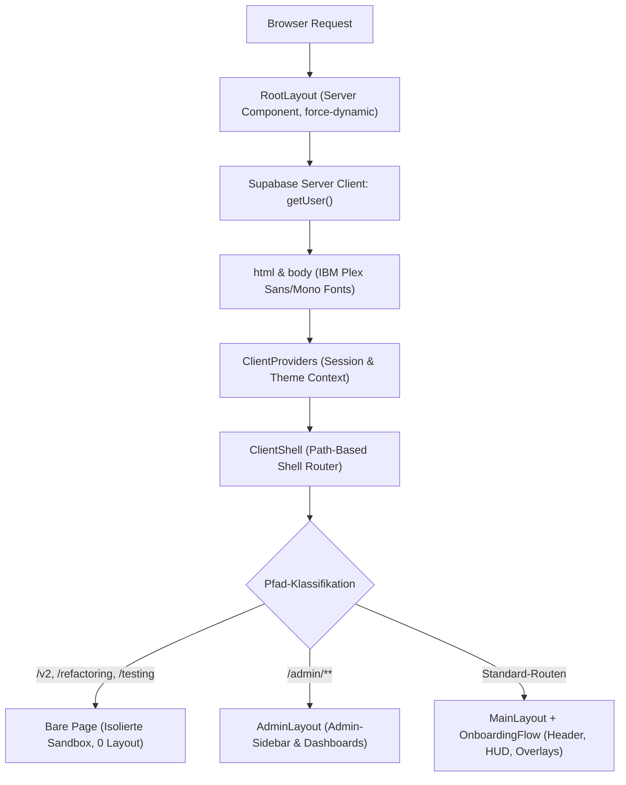

# 09 — Layout, Shell & UI-Provider-Kontext

> **Zweck:** Kanonische Modulkarte und Architektur für das Server-Root-Layout (`src/app/layout.tsx`), den Shell-Router (`src/components/layout/ClientShell.tsx`), `ClientProviders.tsx` und globale UI-Overlays in `MainLayout.tsx`.
> **Design-System & Z-Index-Hierarchie:** [`xx_sop/04_design_system_ui.md`](../xx_sop/04_design_system_ui.md).
> **Frontend-Revamp-Workflow:** [`xx_sop/10_workflow_frontend_revamp.md`](../xx_sop/10_workflow_frontend_revamp.md).
> **Qualitätsmaßstab:** [`xx_sop/12_workflow_dokument_qualitaet.md`](../xx_sop/12_workflow_dokument_qualitaet.md).

---

## 1 — Systemgrenze & Render-Hierarchie



### Kernregeln der Render-Hierarchie:
* **`force-dynamic` im Root-Layout:** `src/app/layout.tsx` erzwingt `export const dynamic = 'force-dynamic'`, da Middleware und Session-Provider jede Anfrage dynamisch verarbeiten.
* **Server-Side Session Prefetch:** `RootLayout` holt den initialen Supabase-Nutzer via `createClient()` serverseitig ab und reicht ihn als `initialUser` an `ClientProviders` weiter, um Authentifizierungs-Flicker beim ersten Rendern zu verhindern.
* **Typografie & CSS-Variablen:**
  * `IBM_Plex_Sans`: UI-Body, Buttons, Navigation (`--font-inter`).
  * `IBM_Plex_Mono`: Dynamische Zahlen, Multiplikatoren, Guthaben, Quoten (`--font-mono`).

---

## 2 — Shell-Routing (`ClientShell.tsx`)

`ClientShell` schützt die Benutzeroberfläche vor Navigations- und Layout-Interferenzen durch strikte Pfad-Trennung:

| Pfad-Bereich | Shell-Container | Enthaltene Komponenten | Zweck |
| :--- | :--- | :--- | :--- |
| **Isolierte Sandboxen** (`/v2`, `/refactoring`, `/testing`) | **Keine Shell (`<>{children}</>`)** | Nur Seiten-Inhalt (Bare DOM) | Ermöglicht isolierte 3D-/UI-Prototypen ohne Navigation, Header oder Modals. |
| **Admin-Bereich** (`/admin/**`) | `AdminLayout` | AdminSidebar, Berechtigungs-Header, KPI-Leiste | Geschützter Bereich für Admins; erfordert `isAdminEmail()`. |
| **Standard-Casino** (alle übrigen Pfade) | `MainLayout` | MainHeader, MainSidebar, Wallet-HUD, Modals, Overlays | Reguläre Spielerfahrung inklusive `OnboardingFlow`. |

---

## 3 — Globale UI-Layer & Z-Index-Staffelung in `MainLayout`

`MainLayout` koordiniert alle globalen UI-Elemente anhand der in [`xx_sop/04_design_system_ui.md`](../xx_sop/04_design_system_ui.md) definierten Zonen:

| Layer-Rolle | Z-Index im Code | Komponenten in `MainLayout.tsx` |
| :--- | :---: | :--- |
| **Game Stage & Content** | `0 – 35` | Spielbretter, Canvas-Hintergrund, Tische (`{children}`) |
| **Navigation & Header** | `40 – 50` | `MainHeader` (Wallet-HUD, Profile-Button), `MainSidebar`, `MobileNav` |
| **Content-Modals** | `1000 – 2000` | `SettingsModal` (`1000`), `ProvablyFairModal` (`1000`), `CrashTutorial` (`2000`) |
| **Priority-Modals** | `5000` | `WalletModal` (`5000`), `PlayerProfileModal` (`5000`), `RankBenefitsModal` (`5000`) |
| **Global Big Win Overlay**| `9999` | `BigWinOverlay` (Vollbild-Animation bei Gewinnen $\ge 20\times$) |
| **Global Splash & Loading**| `99999`| `LoadingOverlay` (Blocker bei Routenübergängen) |

---

## 4 — Test- & Validierungsbefehle

```powershell
# 1. Responsive Shell-Layout prüfen
node scripts/fast-responsive-audit.mjs

# 2. TypeScript-Typen im Layout-Tree prüfen
npm run typecheck

# 3. Linter auf Layout- & JSX-Konformität prüfen
npm run lint
```

---

## 5 — Risiko- & Freigabeklassifizierung (K-Level)

| Layout-Aktion | K-Level | Freigabe-Voraussetzung |
| :--- | :---: | :--- |
| **Font-, CSS-Variablen- oder Metadaten-Anpassung** | **K1/K2** | Lokale Prüfung ausreichend. |
| **Neue Sandbox-Routen in `ClientShell.tsx` ergänzen** | **K2** | Standard-Review im Task-Scope. |
| **Umbau von `MainLayout.tsx` oder `ClientProviders.tsx`** | **K3** | Standard-Review (hohes Regressionsrisiko für globale Overlays). |
| **Änderungen an `RootLayout` Auth-Prefetch oder Middleware-Bindung** | **K4** | **Explizite Jan-Freigabe zwingend erforderlich.** |

---

## 6 — Didaktischer Mehrwert & Lerneffekt für Jan

1. **Warum Server-Prefetch im Root-Layout?**
   Wenn der Nutzerzustand erst clientseitig via `useEffect` abgefragt wird, springt das UI für wenige Millisekunden vom "Nicht eingeloggt"- in den "Eingeloggt"-Zustand (Layout Shift). Der serverseitige Pass-Through in `RootLayout` eliminiert dieses Flackern vollständig.
2. **Warum Bare Sandboxen (`/v2`, `/testing`) in `ClientShell`?**
   Wenn neue 3D-Canvas-Spiele (z. B. Three.js) entwickelt werden, führen globale Fixed-Header und Scroll-Container oft zu unerwünschten Canvas-Verzerrungen. Die Sandbox-Bypass-Logik ermöglicht 100 % sauberes Prototyping.
3. **Warum strikte Modal-Trennung (1000 vs. 5000 vs. 9999)?**
   Ein Spieler im `SettingsModal` (`1000`) muss bei einem Klick auf sein Wallet sofort das `WalletModal` (`5000`) im Vordergrund sehen. Ein Großgewinn (`9999`) muss wiederum jedes Modal überlagern.

---

## 7 — Bekannte offene Probleme & Ist-Diskrepanzen

> **Stand:** 2026-08-23 · Wird bei Behebung aktualisiert.

- **1. Hydration-Warning im ClientShell:**
  `ClientShell` nutzt aktuell `suppressHydrationWarning`, um minimale Time-Mismatches beim Onboarding-Mounten zu ignorieren.
- **2. Historische Bereinigung:**
  `DailyReward` und `Challenges` wurden aus dem Layout-Tree entfernt; veraltete Import-Fragmente wurden bereinigt.

---

## 8 — Verwandte Artefakte

| Bedarf | Datei |
| :--- | :--- |
| **Design System & UI Standards** | [`xx_sop/04_design_system_ui.md`](../xx_sop/04_design_system_ui.md) |
| **Frontend Revamp Workflow** | [`xx_sop/10_workflow_frontend_revamp.md`](../xx_sop/10_workflow_frontend_revamp.md) |
| **State Store Kontext** | [`xx_docs/07_state_store_context.md`](07_state_store_context.md) |
| **Dokument-Qualitäts-Rubrik** | [`xx_sop/12_workflow_dokument_qualitaet.md`](../xx_sop/12_workflow_dokument_qualitaet.md) |
