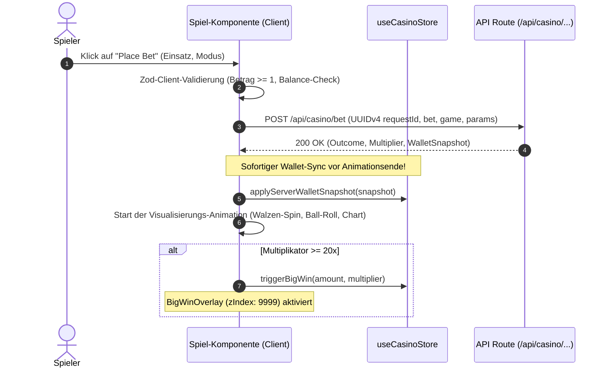

# 10 — Games & Frontend-Spielmodule-Kontext

> **Zweck:** Kanonische Modulkarte und Spezifikation für alle Casino-Spiele (`src/app/games/`), spielspezifische UI-Komponenten (`src/components/casino/games/`) und deren API-Anbindung.
> **Service Layer Logik:** [`xx_docs/05_service_layer_context.md`](05_service_layer_context.md).
> **API Backend Kontext:** [`xx_docs/08_api_backend_context.md`](08_api_backend_context.md).
> **Design System & UI:** [`xx_sop/04_design_system_ui.md`](../xx_sop/04_design_system_ui.md).
> **Qualitätsmaßstab:** [`xx_sop/12_workflow_dokument_qualitaet.md`](../xx_sop/12_workflow_dokument_qualitaet.md).

---

## 1 — Systemgrenze & Komponenten-Isolation

* **Isolierte Page-Struktur:** Jedes Spiel existiert als eigenständige Page unter `src/app/games/[game]/page.tsx`.
* **Gekapselte Komponenten:** UI-Elemente (Walzen, Roulette-Rad, Crash-Chart, Spielkarten, Steuerungsleisten) liegen strikt getrennt unter `src/components/casino/games/[game]/`.
* **0 % Client-Gewinnberechnung:** Die Spieloberfläche steuert ausschließlich Animationen, Sounds, Haptik und Nutzereingaben. Sämtliche Quoten, Multiplikatoren, Kartendecks und Salden stammen ausnahmslos von der Server-API.

---

## 2 — Spiele-Transport & API-Mapping Matrix (6 Spielmodule)

| Spiel | Seiten-Route | Transport | API-Endpunkt | Wichtigste Komponenten & Besonderheiten |
| :--- | :--- | :---: | :---: | :--- |
| **Dice** | `/games/dice` | REST (POST) | `/api/casino/bet` | `DiceCenterStage.tsx`, `DiceControls.tsx` — Provably Fair Roll (0–100), Target-Slider, Sofort-Settlement. |
| **Slots** | `/games/slots` | REST (POST) | `/api/casino/bet` | `SlotsCenterStage.tsx`, `SlotReel.tsx`, `SlotSymbol.tsx` — Server-Reel-Indizes, Paytable-Matrix, Gewinnlinien. |
| **Roulette** | `/games/roulette` | REST (POST) | `/api/casino/bet` | `LuxuryRouletteWheel.tsx`, `RouletteFeltBoard.tsx`, `RouletteWinnerReveal.tsx` — European Single Zero (0–36), Multi-Bet Chips. |
| **Blackjack** | `/games/blackjack` | REST (POST) | `/api/casino/blackjack` | `BlackjackCenterStage.tsx`, `BlackjackLeftSidebar.tsx`, `CardHand.tsx` — Versionierte State-Machine (Deal, Hit, Stand, Double, Split). |
| **Crash (Solo)** | `/games/crash` | REST (POST) | `/api/casino/bet` | `CrashStage.tsx`, `CrashControlSidebar.tsx`, `useCrashGameLoop.ts` — Lokaler Multiplikator-Graph, Server-Cashout. |
| **Crash (Multiplayer)**| `/games/crash-multiplayer`| REST + Realtime | `/api/casino/bet-crash-multiplayer` | `CrashStage.tsx`, `realtime.ts` — Synchronisierter Raumtakt (`sharedRound`), Broadcast-Kanal, `crashRoundId`. |

---

## 3 — Standard-Spielablauf & Wallet-Synchronisation



---

## 4 — Test- & Validierungsbefehle

```powershell
# 1. Alle Casino- & Spiellogik-Tests ausführen
npm test -- src/lib/casino/__tests__/

# 2. Spezifische Spiele testen
npm test -- src/lib/casino/__tests__/blackjack-authority.test.ts
npm test -- src/lib/casino/__tests__/dice-fair-multiplier.test.ts
npm test -- src/lib/casino/__tests__/roulette.test.ts
npm test -- src/lib/casino/__tests__/multiplayer-crash-reveal-leak.test.ts

# 3. TypeScript-Kompilierung prüfen
npm run typecheck
```

---

## 5 — Risiko- & Freigabeklassifizierung (K-Level)

| Spiel-Aktion | K-Level | Freigabe-Voraussetzung |
| :--- | :---: | :--- |
| **Animationen, CSS & Sound-Effekte im Spiel** | **K1/K2** | Lokale Sichtprüfung ausreichend. |
| **Refactoring von Spiel-Seitenkomponenten** | **K2** | Nach 3-Optionen-Gate frei ausführbar. |
| **Änderungen an Einsatzlimits, Quoten oder Gewinnfaktoren** | **K4** | **Explizite Jan-Freigabe zwingend erforderlich.** |
| **Änderungen am Multiplayer-Crash-Raumprotokoll** | **K4** | **Explizite Jan-Freigabe zwingend erforderlich.** |

---

## 6 — Didaktischer Mehrwert & Lerneffekt für Jan

1. **Warum `applyServerWalletSnapshot` vor Animationsende?**
   Wenn der Spieler während einer Walzen-Drehung die Seite neu lädt oder schließt, muss das Guthaben in der Datenbank bereits exakt stimmen. Die UI ist nur eine verzögerte visuelle Inszenierung des bereits feststehenden Server-Ergebnisses.
2. **Warum `crashRoundId` statt Multiplikator beim Start?**
   Würde der Server beim Start von Crash den Ziel-Crashpunkt (z. B. `2.45x`) an den Browser senden, könnte jeder Spieler via DevTools-Netzwerk-Tab den Zeitpunkt ablesen und immer bei `2.44x` aussteigen. Beim Multiplayer-Crash erfährt der Client den Wert erst beim Eintreten des Crash-Events.
3. **Warum Monospace in Spiel-HUDs?**
   Bei Spielen wie Crash oder Slots rollen Zahlenwerte im 60fps-Takt hoch. Proportionale Schriftarten erzeugen ständiges horizontales Layout-Flickern.

---

## 7 — Bekannte offene Probleme & Ist-Diskrepanzen

> **Stand:** 2026-08-23 · Wird bei Behebung aktualisiert.

- **1. Parallele Crash-Routen:**
  Crash existiert sowohl als Singleplayer- (`/games/crash`) als auch als Multiplayer-Variante (`/games/crash-multiplayer`). Eine Vereinheitlichung der UI-Komponenten bei getrenntem Backend-Transport ist in Arbeit.
- **2. Historische Dokumentations-Lücke:**
  Multiplayer-Crash fehlte in früheren Dokumenten; diese Modulkarte führt alle 6 Spielmodule kanonisch auf.

---

## 8 — Verwandte Artefakte

| Bedarf | Datei |
| :--- | :--- |
| **Service Layer Kontext & Mathematik** | [`xx_docs/05_service_layer_context.md`](05_service_layer_context.md) |
| **API Backend Kontext** | [`xx_docs/08_api_backend_context.md`](08_api_backend_context.md) |
| **Design System & UI Standards** | [`xx_sop/04_design_system_ui.md`](../xx_sop/04_design_system_ui.md) |
| **Dokument-Qualitäts-Rubrik** | [`xx_sop/12_workflow_dokument_qualitaet.md`](../xx_sop/12_workflow_dokument_qualitaet.md) |
