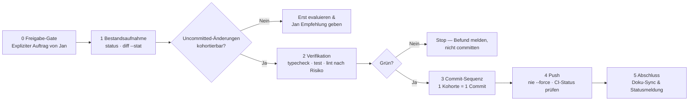

# 12 — Git Commit & Push Workflow (Master-Dokumentation)

> **Status:** 🟢 Verbindlicher Workflow (**Top 1 % — Referenzstandard**) · **Stand:** 2026-08-27 · **Owner:** Jan / LLM
> **Zweck:** Einstiegsdatei für jede Git-Commit- oder Git-Push-Aufgabe in diesem Repo. Definiert Freigabe-Gate, Verifikationspflichten, Commit-Kohorten und Push-Regeln — ohne Overengineering: 5 Phasen, 1 Worked-Example, 1 Blocker-Matrix.
> **Grundregeln (aus CLAUDE.md, verbindlich):** Nie committen ohne Jans explizite Aufforderung · Conventional Commits (`feat:`, `fix:`, `refactor:`, `docs:`, `test:`, `chore:`, `perf:`, `ci:`) · keine Co-Author-Attribute · niemals `--no-verify` oder `--no-gpg-sign`.

---

## 1 — Executive Summary für Jan (High-Level)

Der Workflow ist eine **5-Phasen-Pipeline**: Jeder Commit ist eine isolierte, revertierbare Einheit mit klarer Kohorte (Security → Features → Assets → Docs), jede Behauptung über Tests/Builds basiert auf aktueller Befehlsausgabe, und jeder Push auf `main` ist ein Production-Event (Vercel-Auto-Deploy), kein Routineakt.



**Die 5 eisernen Regeln auf einen Blick:**

| #   | Regel                                           | Konsequenz bei Verstoß                                                                                               |
| :-- | :---------------------------------------------- | :------------------------------------------------------------------------------------------------------------------- |
| 1   | **Kein Commit/Push ohne expliziten Janauftrag** | Auto-Allow deckt read-only + Tests ab — `git commit`/`git push` sind K4-Aktionen                                     |
| 2   | **Vor Commit: Verifikation nach Risiko**        | Security-/API-Änderungen: `npm run typecheck && npm run test`; reine Docs: Diff-Review genügt                        |
| 3   | **Eine Kohorte = ein Commit**                   | Security-Fixes nie mit UI-Refactors mischen — sonst ist ein Revert unmöglich, ohne das Falsche mitzureißen           |
| 4   | **Nie `git add .` blind**                       | Erst `git status` sichten — unignored Fremdprojekte (z. B. `remotion-ad/` mit `node_modules`) würden sonst committet |
| 5   | **Push auf `main` = Production-Nähe**           | Vercel deployt automatisch; nie `--force`, nie `--no-verify`                                                         |

---

## 2 — Technischer Workflow (5 Phasen im Detail)

### Phase 0 — Freigabe-Gate (immer zuerst)

| Prüfpunkt                                    | Quelle                   | Konsequenz                                                                                      |
| :------------------------------------------- | :----------------------- | :---------------------------------------------------------------------------------------------- |
| Hat Jan **explizit** commit/push beauftragt? | Nutzerauftrag im Chat    | Ohne Auftrag: nur evaluieren + Empfehlung geben (siehe `xx_sop/01_workflow_jan_option_gate.md`) |
| Welche Kohorten liegen an?                   | `git status --porcelain` | Kohorten bilden (siehe Phase 3) und Sequenz vorschlagen                                         |
| Gibt es Blocker?                             | Blocker-Matrix unten     | Blocker zuerst beseitigen, bevor irgendetwas staged wird                                        |

### Phase 1 — Bestandsaufnahme (read-only, immer auto-allow)

```bash
git status --porcelain        # Welche Dateien, welche Kohorten?
git diff --stat               # Umfang je Datei
git log --oneline -5          # An welchen Commit-Stil anzuschließen
```

Jede Datei einer Kohorte zuordnen (Security / Feature / Refactor / Assets / Docs / Chore / Ignore). Gemischte Dateien (z. B. Doku + Code in einem File) → die dominante Kohorte, im Commit-Body erwähnen.

### Phase 2 — Verifikation vor Commit (nach Risiko)

| Änderungstyp                                                                                         | Pflichtprüfung                                                                                       |
| :--------------------------------------------------------------------------------------------------- | :--------------------------------------------------------------------------------------------------- |
| API-Routen, Security, Wallet, DB (`src/app/api/**`, `src/lib/security/**`, `supabase/migrations/**`) | `npm run typecheck && npm run test` (Zusatz: `security-reviewer`-Pass bei Auth-/Input-Pfaden)        |
| UI-Komponenten, Pages                                                                                | `npm run typecheck && npm run lint` (+ visuelle Abnahme durch Jan — **nie visuell selbst bewerten**) |
| Nur Docs/Planungsdateien                                                                             | Diff-Gegenlesen genügt                                                                               |
| Migrationsdateien                                                                                    | Zusätzlich `@migration-security-guard` (read-only) → `PASS`/`FINDING`/`BLOCKED`                      |

Der Pre-Commit-Hook (`.husky/pre-commit` → `lint-staged`: `eslint --fix` + `typecheck-staged` + `prettier --write`) fängt Staging-Fehler automatisch ab — **er ersetzt aber nicht die Vollprüfung** über alle Kohorten eines Mehrfach-Commits, da er nur staged Files sieht.

### Phase 3 — Commit-Sequenz & Format

**Sequenz-Logik (Reihenfolge = Revertierbarkeit):**

1. `chore(git)`: Blocker beseitigen (z. B. `.gitignore`-Lücken) — **immer zuerst**
2. `fix(...)` — Security-/Bugfixes (kleinste Diffs, höchster Wert, isoliert revertierbar)
3. `feat(...)` / `refactor(...)` — Assets **vor** dem Code, der sie referenziert
4. `chore(scripts)` / Tooling
5. `docs(...)` — zuletzt (beschreibt den finalen Stand)
6. Fremde Subprojekte/Sandbox-Experiments — zuletzt und nur als bewusste Einzelfreigabe

**Commit-Message-Format (Conventional Commits, verbindlich):**

```
<type>(<scope>): <Imperativ-Beschreibung, ≤ 72 Zeichen>

[Optional: Body mit 1–2 Sätzen Begründung/Kontext]
```

- Kein Co-Author/Footer-Zusatz (global deaktiviert)
- Kein `--amend` auf bereits gepushte Commits
- Bei Multi-Kohorten-Aufträgen: jeder Commit einzeln ausführen und mit `git log --oneline -N` gegen die geplante Sequenz verifizieren

**Worked Example — reale Kohorten-Sequenz (Evaluation vom 2026-08-27, 45 geänderte + 12 neue Dateien):**

```
1. chore(git):      .gitignore-Lücke schließen (remotion-ad/)          ← Blocker zuerst
2. fix(api):        Rate-Limit-Argumentreihenfolge in Voice-Routen     ← Security-Fix, isoliert
3. fix(api):        Admin-Evals & Feedback-Härtung + Tests
4. feat(personas):  fehlende Persona-Assets (Stufe-P-Nachlass)         ← Assets vor Code
5. feat(ui):        History- & Home-Responsive-Revamp
6. refactor(games): Blackjack-Dekomposition + Roulette-Felt
7. feat(guide):     Guide-UI-Revamp + Sandbox
8. chore(scripts):  Telemetrie-/Loadtest-Skripte
9. docs(llm):       Status-Doku (beschreibt den finalen Stand)
10. chore(remotion): Fremd-Subprojekt — nur als bewusste Einzelfreigabe, ganz zuletzt
```

Die Sequenz folgt einer einzigen Logik: **Jeder Schritt ist einzeln revertierbar, ohne einen späteren sinnlos zu machen** — Security zuerst (höchster Wert, kleinster Diff), Doku zuletzt (gilt für den finalen Stand), Blocker vor allem anderen.

### Phase 4 — Push (K4, immer explizit)

| Aktion                | Regel                                                                                                                                                                                                                                                         |
| :-------------------- | :------------------------------------------------------------------------------------------------------------------------------------------------------------------------------------------------------------------------------------------------------------ |
| `git push` auf `main` | Löst Vercel-Auto-Deploy in Production aus — nur auf ausdrückliche Jan-Freigabe (Production nur nach ausdrücklicher Freigabe, siehe `xx_sop/11_cicd_deployment.md`)                                                                                            |
| `git push --force`    | **Immer verboten** ohne manuelle Jan-Bestätigung (K5-Block)                                                                                                                                                                                                   |
| Push-Nachweis         | `git log origin/main..HEAD` muss **leer** sein (= lokale Commits sind auf dem Remote angekommen); CI-Status via `gh pr checks` / `gh run list`                                                                                                                |
| Bekannter CI-Zustand  | `security-staging.yml` scheitert real am Fail-Closed-Guard (`PHASE1_TARGET_CONFIRMED`), `red-team-security.yml` hat 0 Läufe — ein roter Lauf ist dort **kein** Indiz gegen den Commit (Stand 2026-08-27, siehe `worldmap/00_WORLDMAP_STATUS.md` Kategorie 09) |

### Phase 5 — Abschluss

- `git status` sauber (nur bewusst untracked/ignorierte Pfade übrig)
- Zuständige Doku im selben Schritt aktualisieren (Systemkarte, Archivlog, Status-Quelle) — Doku-Regeln siehe `xx_sop/12_workflow_dokument_qualitaet.md`
- Ergebnisbericht: was committed wurde (Kohorten + Hashes), was bewusst nicht (untracked/ignored), offene Punkte
- **Branch-Hygiene:** Nach jedem vollständigen Merge einer Branch nach `main` sofort `git branch -d <branch>` ausführen, nicht liegen lassen — verhindert Branch-Leichen (Kategorie 14/#2 fand 4 solcher verwaisten `worktree-*`-Branches, davon 2 mit zusammen 23 nie gemergten, inzwischen technisch überholten Commits, siehe `docs/archive/00-14-VersionControlDoku.md`). Ausnahme: bewusst als Sicherheitsnetz gehaltene Branches (z. B. eine Recovery-Branch nach einem Stash-Zwischenfall) sind explizit zu dokumentieren, nicht stillschweigend zu löschen.

---

## 3 — Blocker-Matrix (Stop-Kriterien)

| Blocker                                                                                                                            | Warum                                                                 | Auflösung                                                                                                                                 |
| :--------------------------------------------------------------------------------------------------------------------------------- | :-------------------------------------------------------------------- | :---------------------------------------------------------------------------------------------------------------------------------------- |
| Unignored Fremdprojekt/`node_modules` im Tree                                                                                      | Tausende Junk-Files im Repo-Historie, irreversibel teuer zu entfernen | `.gitignore`-Eintrag **vor** dem ersten `git add`                                                                                         |
| Secrets/`.env`-Dateien im Diff                                                                                                     | Credential-Leak in der Git-Historie                                   | Stop, `security-reviewer`, Secrets rotieren                                                                                               |
| Failing Typecheck/Tests im betroffenen Scope                                                                                       | Commit würde roten Stand zementieren                                  | Erst beheben oder Befund an Jan melden                                                                                                    |
| Sandbox-Dateien versehentlich staged (`remotion-ad/` ist ignored)                                                                  | Fremd-Subprojekt gehört bewusst nicht ins Repo                        | `git reset --staged <file>`, Kohorte prüfen                                                                                               |
| Neuer Vendored-/Recherche-Klon unter `worldmap/` versehentlich mitgestaged (externe Repo-Checkouts, z. B. npm-Packages zum Testen) | Kann eine eigene, verschachtelte `.git`-Historie mitziehen            | Vor dem ersten Commit sofort eine eigene `.gitignore`-Zeile nach dem Muster `/worldmap/<name>/` anlegen — Vorbild: `/worldmap/.research/` |
| Gemischte Kohorte ohne Sequenz-Plan                                                                                                | Revertierbarkeit geht verloren                                        | Erst Sequenz vorschlagen, dann ausführen                                                                                                  |

---

## Release- & Versions-Pflege

- Jeder `feat:`- oder `fix:`-Commit-Batch auf `main`, der einen sichtbaren Produktions-Effekt hat, bekommt
  einen `CHANGELOG.md`-Eintrag unter `[Unreleased]` (nicht bei `chore:`/`docs:`/`ci:`).
- Beim Verschieben von `[Unreleased]` in eine versionierte Sektion: `package.json`-Version bumpen
  (PATCH bei reinen Fixes, MINOR bei Features, MAJOR nur nach dokumentierter Breaking-Change-Entscheidung)
  und `git tag -a vX.Y.Z` auf demselben Commit setzen.
- Keine rückwirkenden Tags auf bereits vergangene Commits — Historie vor der Einführung dieser Konvention
  (siehe [`docs/archive/00-14-Release.md`](../docs/archive/00-14-Release.md) M1/M2) bleibt tag-los, nur im `CHANGELOG.md` nach Datum dokumentiert.

### Version → Deployment nachschlagen

1. Ziel-Version in `CHANGELOG.md` finden (z. B. `0.2.0`).
2. `git log vX.Y.Z -1 --format=%H` → zugehöriger Commit-Hash.
3. Im Vercel-Dashboard (Projekt `casino`) nach diesem Commit-Hash im Deployment-Verlauf suchen.
4. Rollback-Ausführung folgt dem bestehenden Dry-Run in [`docs/archive/00-09-CICD.md`](../docs/archive/00-09-CICD.md) M8.

---

## 4 — Verweise

| Thema                                             | Datei                                                                                     |
| :------------------------------------------------ | :---------------------------------------------------------------------------------------- |
| Command-Referenz (Scripts, Hooks)                 | [`xx_docs/02_command_reference.md`](02_command_reference.md)                              |
| Execution-Umgebungen (wo Befehle laufen)          | [`xx_docs/03_execution_environment_reference.md`](03_execution_environment_reference.md)  |
| Doku-Qualität & Doku-Sync-Pflicht                 | [`xx_sop/12_workflow_dokument_qualitaet.md`](../xx_sop/12_workflow_dokument_qualitaet.md) |
| Uncommitted-Cleanup-Vorbild (Kohorten-Evaluation) | [`docs/archive/06_UNCOMMITTED_CLEANUP.md`](../docs/archive/06_UNCOMMITTED_CLEANUP.md)     |
| CI/CD-Kontext (was der Push auslöst)              | [`xx_docs/11_cicd_deployment_context.md`](11_cicd_deployment_context.md)                  |
| Live-Status (nur hier behaupten)                  | [`worldmap/00_WORLDMAP_STATUS.md`](../worldmap/00_WORLDMAP_STATUS.md)                     |
