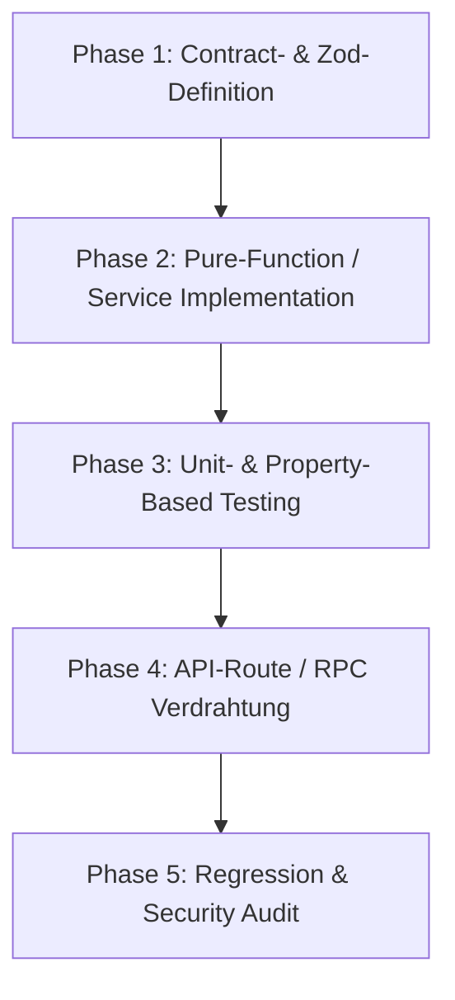

# Workflow Service-Layer & Casino-Geschäftslogik

> **Zweck:** Verbindliche Richtlinien für Änderungen an Spielregeln, RNG-, Settlement-, Provably-Fair- und Backend-Service-Modulen in `src/lib/casino/`.
> **Fachkontext & Modulinventar:** [`xx_docs/05_service_layer_context.md`](../xx_docs/05_service_layer_context.md).
> **Sicherheits- & Wallet-Invarianten:** [`xx_sop/09_security_wallet_invariants.md`](09_security_wallet_invariants.md).
> **Qualitätsmaßstab:** [`xx_sop/12_workflow_dokument_qualitaet.md`](12_workflow_dokument_qualitaet.md).

---

## 1 — Trigger und Start-Gate

- **Gilt für:**
  - Jede Neuentwicklung oder Modifikation von Modulen unter `src/lib/casino/`.
  - Anpassungen an Gewinnquoten, House-Edge, Multiplikatoren oder Spielregeln (Blackjack, Roulette, Dice, Slots, Crash).
  - Integration neuer Backend-Services (z. B. Benachrichtigungen, Fraud Detection, Tournaments, KI-Guide).
- **Start-Gate (Vor der Umsetzung prüfen):**
  1. [`xx_docs/05_service_layer_context.md`](../xx_docs/05_service_layer_context.md) lesen und Modulbesitzer bestimmen.
  2. Modul-Kategorie einordnen (siehe Abschnitt 2).
  3. Bei Änderungen an Wallet-, Guthaben- oder RNG-Logik ist zwingend ein **K4-Sicherheitsgate** erforderlich.

---

## 2 — Schicht-Architektur & Modul-Klassifikation

`src/lib/casino/` ist in vier strikt getrennte Modul-Klassen unterteilt:

| Modul-Klasse | Suffix / Namenskonvention | Laufzeit-Umgebung | Regeln & Grenzen |
| :--- | :--- | :--- | :--- |
| **Pure Functions (Shared)** | `*.ts` (z. B. `dice.ts`, `roulette.ts`) | Client & Server | Deterministisch, keine Side-Effects, kein `process.env`, mathematische Berechnungen & Zod-Schemas. |
| **Server-Services** | `*-server.ts` / `*.server.ts` | **Server-only** | Darf Node-APIs, DB-Clients, `process.env` und Secrets nutzen. **Niemals in Client-Komponenten importieren!** |
| **Provably Fair Core** | `provably-fair.ts`, `seeds.ts` | Client & Server | Web Crypto / HMAC-SHA256 basierte Hash-Ketten und Verifikations-Algorithmen. |
| **Realtime & Event-Bus** | `realtime.ts`, `event-bus.ts` | Server / Edge | WebSocket-Broadcasts, Presence-Tracking und Supabase-Broadcast-Channels. |

---

## 3 — Der 5-Phasen-Entwicklungsablauf



### Phase 1: Contract- & Schema-Definition
- Jede Funktion definiert ihre Ein- und Ausgaben über strikte Zod-Schemas (z. B. `betSchema`, `blackjackActionSchema`).
- Niemals rohe TypeScript-Typen ohne Runtime-Validierung an Systemgrenzen verwenden.

### Phase 2: Implementierung der Geschäftslogik
- **Keine Wallet-Mutationen im Service-Layer:** Service-Module berechnen Multiplikatoren und Deltas; die eigentliche Guthabenabbuchung/-gutschrift erfolgt atomar in der Supabase-RPC (`007_consolidated_financial_system.sql`).
- **Fail-Closed & Fehlerklassen:** Eigene Fehlerklassen definieren (`CasinoError`, `InvalidBetError`). Niemals Exceptions stillschweigend schlucken.

### Phase 3: Vitest-Testabdeckung (Pflicht vor Integration)
- Für jedes neue Modul ist eine entsprechende `__tests__/<name>.test.ts`-Datei anzulegen.
- 100 % Abdeckung für mathematische Edge-Cases (z. B. Split-Hand-Limits bei Blackjack, Null-Sektor bei Roulette).

### Phase 4: Verdrahtung mit API-Transport
- API-Handler in `src/app/api/` importieren den Service und fungieren als schlanke Validierungs- und Auth-Schicht.

### Phase 5: Dokumentations-Sync
- Neues Modul im Inventar von [`xx_docs/05_service_layer_context.md`](../xx_docs/05_service_layer_context.md) eintragen.

---

## 4 — Test- & Validierungsbefehle

```powershell
# 1. Alle Casino-Service-Tests ausführen
npm test -- src/lib/casino/__tests__/

# 2. Spezifische Spiellogik testen (Beispiel: Blackjack)
npm test -- src/lib/casino/__tests__/blackjack-authority.test.ts

# 3. Mathematische Fairness & Quoten prüfen
npm test -- src/lib/casino/__tests__/dice-fair-multiplier.test.ts

# 4. TypeScript-Kompilierung prüfen
npm run typecheck
```

---

## 5 — Risiko- & Freigabeklassifizierung (K-Level)

| Aktion im Service-Layer | K-Level | Freigabe-Voraussetzung |
| :--- | :---: | :--- |
| **Reine UI-Helper & Sound-Mappings (`voice-audio.ts`)** | **K1/K2** | Lokale Vitest-Tests ausreichend. |
| **Erweiterung von Hilfsservices (`notifications.ts`, `daily-race.ts`)** | **K3** | Standard-Review im Task-Scope. |
| **Änderungen an Spielquoten, RTP oder Multiplikatoren** | **K4** | **Explizite Jan-Freigabe zwingend erforderlich.** |
| **Änderungen an Provably Fair oder RNG-Logik** | **K4** | **Explizite Jan-Freigabe zwingend erforderlich.** |

---

## 6 — Didaktischer Mehrwert & Lerneffekt für Jan

1. **Warum Trennung von Pure Functions und Server-Services?**
   Pure Functions (wie `calculatePayout(bet, outcome)`) können sowohl im Browser zur sofortigen Vorschau als auch auf dem Server zur Validierung genutzt werden – ohne Bundle-Größe durch Server-Dependencies aufzublähen.
2. **Warum berechnet der Service-Layer kein Endguthaben?**
   Concurrency (Race Conditions): Wenn zwei Wetten gleichzeitig eintreffen, würde ein Server-Service mit veralteten Guthabenständen rechnen. Deshalb berechnet der Service nur den Gewinnfaktor ($X$), während die Datenbank via `pg_advisory_xact_lock` das Guthaben atomar fortschreibt.
3. **Warum strikte `*-server.ts`-Konvention?**
   Verhindert das versehentliche Leakage von Server-Secrets (z. B. `SUPABASE_SERVICE_ROLE_KEY` oder OpenAI-Keys) in das Client-JavaScript-Bundle.

---

## 7 — Bekannte offene Probleme & Ist-Diskrepanzen

> **Stand:** 2026-08-23 · Wird bei Behebung aktualisiert.

- **1. Hohe Modulkomplexität in `casino-core.ts`:**
  `casino-core.ts` bündelt historisch noch Level-, XP- und Basis-Rechenlogik. Eine Modularisierung in `progression.ts` und `payout-engine.ts` steht noch aus.
- **2. Fehlender Server-Only-Linter:**
  Aktuell wird die Trennung von `*-server.ts` manuell geprüft; eine ESLint-Regel (`import/no-nodejs-modules` im Client-Scope) ist noch nicht konfiguriert.

---

## 8 — Verwandte Artefakte

| Bedarf | Datei |
| :--- | :--- |
| **Service-Layer Inventar** | [`xx_docs/05_service_layer_context.md`](../xx_docs/05_service_layer_context.md) |
| **Sicherheits- & Wallet-Invarianten** | [`xx_sop/09_security_wallet_invariants.md`](09_security_wallet_invariants.md) |
| **API Backend Routen** | [`xx_sop/07_api_backend_routes.md`](07_api_backend_routes.md) |
| **Dokument-Qualitäts-Rubrik** | [`xx_sop/12_workflow_dokument_qualitaet.md`](12_workflow_dokument_qualitaet.md) |
