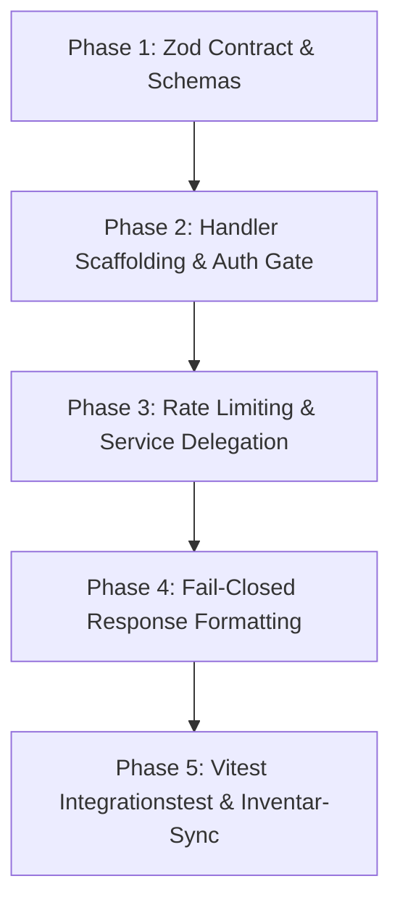

# SOP: API Backend Routes, Middleware & Admin

> **Zweck:** Verbindlicher Workflow für Entwurf, Implementierung, Absicherung und Verifikation aller Server-Endpunkte (`src/app/api/`), Edge-Middleware (`src/proxy.ts`) und Admin-Dashboards (`src/app/admin/`).
> **API-Kontext & Vollständiges Inventar:** [`xx_docs/08_api_backend_context.md`](../xx_docs/08_api_backend_context.md).
> **Sicherheits- & Wallet-Invarianten:** [`xx_sop/09_security_wallet_invariants.md`](09_security_wallet_invariants.md).
> **Qualitätsmaßstab:** [`xx_sop/12_workflow_dokument_qualitaet.md`](12_workflow_dokument_qualitaet.md).

---

## 1 — Trigger und Start-Gate

- **Gilt für:**
  - Erstellung neuer API-Routen unter `src/app/api/`.
  - Änderungen an Request-/Response-Schemas, Authentifizierung oder Rate-Limiting bestehender Endpunkte.
  - Modifikationen an der zentralen Routing- & Security-Middleware `src/proxy.ts`.
  - Anpassungen an Admin-Dashboards unter `src/app/admin/`.
- **Pre-Flight-Prüfung vor jeder Routen-Änderung:**
  1. Ist der Endpunkt *Public*, *User-authentifiziert*, *Admin-only* oder *Webhook (Shared-Secret)*?
  2. Welches Upstash-Rate-Limit greift (Standard: 60 req/min, Mutationen: 10–30 req/min)?
  3. Ist das Zod-Request-Schema strikt (`strict()`), um Parameter-Injection zu verhindern?

---

## 2 — Middleware-Schutz & Sicherheits-Architektur (`src/proxy.ts`)

Jede Route wird durch `src/proxy.ts` geschützt, bevor Next.js den Route-Handler betritt:

| Sicherheitsstufe | Routen-Muster | Validierungs-Mechanismus | Verhalten bei Verstoß |
| :--- | :--- | :--- | :--- |
| **Liveness Bypass** | `/api/health` | Direkter Durchlass vor Supabase-Client | — |
| **CSRF Origin-Guard**| Alle Non-GET/Mutationen | `hasValidOrigin`: `Origin == Host` | `403 Invalid Origin` |
| **Session-Refresh** | Alle Routen | `@supabase/ssr` Token-Refresh | `withRefreshedCookies` auf Terminal-Responses |
| **Admin-Gate** | `/admin/**`, `/api/admin/**` | `isAdminEmail(user.email)` Allowlist | Nicht-Admin: `403 Forbidden`, Anonym: Redirect `/sign-in` |
| **Webhook-Bypass** | `/api/telegram/webhook`, `/api/internal/*` | Signaturprüfung / `process.env`-Secret | `401 Unauthorized` bei ungültiger Signatur |

---

## 3 — Standard-Ablauf für neue API-Routen (5 Phasen)



### Phase 1: Zod-Schema definieren
- Input-Schema mit strenger Typisierung (z. B. Betrag $\ge 1$, gültige Spielarten).
- Schemas liegen bei komplexen Domänen in `src/lib/casino/` oder lokal im Route-Verzeichnis.

### Phase 2: Auth-Gate & Kontext-Initialisierung
```typescript
import { createClient } from '@/utils/supabase/server';

export async function POST(req: Request) {
  const supabase = await createClient();
  const { data: { user }, error: authError } = await supabase.auth.getUser();
  if (authError || !user) {
    return NextResponse.json({ error: 'Unauthorized' }, { status: 401 });
  }
  // Handler Logic
}
```

### Phase 3: Upstash Rate Limiting
- Schreibende Endpunkte nutzen den zentralen Rate-Limiter aus `@/lib/security/rate-limiter`.
- Bei Überschreitung: `429 Too Many Requests` mit `Retry-After`-Header.

### Phase 4: Service-Delegation & Fail-Closed
- Keine direkten SQL-Abfragen im Handler — Delegation an `src/lib/casino/` oder typisierte RPCs.
- DB-Fehler oder Race-Condition-Locks fangen und mit `503 Service Unavailable` fail-closed antworten.
- **Response-Envelope (Pflicht für neue Routen seit 2026-08-25):** Erfolgsantworten über `apiSuccessResponse<T>(data, init?)` aus `src/lib/api/response.ts` zurückgeben (`{ data: T }`). Fehlerantworten weiterhin über `apiErrorResponse()`/`createApiError()` aus `src/lib/security/form-errors.ts` (`{ error: ApiError }`, unverändert). Neuer aufrufender Client-Code nutzt `apiFetch<T>()` aus `src/lib/api/client.ts` statt rohem `fetch()`. Bestehende Routen werden nicht rückwirkend migriert — Details: `xx_docs/08_api_backend_context.md` Abschnitt 6a.

### Phase 5: Test & Dokumentation
- Integrationstest unter `src/app/api/**/__tests__/` anlegen.
- Route in der Matrix von [`xx_docs/08_api_backend_context.md`](../xx_docs/08_api_backend_context.md) eintragen.

---

## 4 — Vollständige Routen-Matrix nach Schutzklasse

*Hinweis: Das vollständige 47-Routen-Inventar ist kanonisch in [`xx_docs/08_api_backend_context.md`](../xx_docs/08_api_backend_context.md) gepflegt.*

| Schutzklasse | Routen-Beispiele | Auth-Methode | Fehler-Code |
| :--- | :--- | :--- | :---: |
| **Public Read-Only** | `/api/health`, `/api/casino/config`, `/api/leaderboard` | Keine | `500` |
| **User Authenticated** | `/api/casino/bet`, `/api/casino/blackjack`, `/api/user/balance`, `/api/notifications` | Supabase SSR Cookie | `401` |
| **Admin Only** | `/api/admin/overview`, `/api/admin/fraud`, `/api/admin/users` | E-Mail in `SUPABASE_ADMIN_EMAILS` | `403` |
| **Internal / Webhook** | `/api/telegram/webhook`, `/api/internal/cron-alert`, `/api/internal/big-win-events` | Shared Secret / HMAC-Signatur | `401` |
| **Deprecated / Gone** | `/api/webhooks/clerk`, `/api/casino/session-sync`, `/api/casino/migrate-session` | Keine (Hardcoded `410`) | `410` |

---

## 5 — Verifikation & Testbefehle

```powershell
# 1. API-Security- & Auth-Tests ausführen
npm test -- src/lib/security/__tests__/

# 2. Spezifische Routen-Tests ausführen
npm test -- src/app/api/

# 3. TypeScript Typ-Integrität prüfen
npm run typecheck

# 4. ESLint Konformität prüfen
npm run lint
```

---

## 6 — Risiko- & Freigabeklassifizierung (K-Level)

| API-Aktion | K-Level | Freigabe-Voraussetzung |
| :--- | :---: | :--- |
| **Read-Only Endpunkte (`/api/leaderboard`, `/api/user/stats`)** | **K1/K2** | Lokale Vitest-Tests ausreichend. |
| **In-App Notification & Chat Routen** | **K3** | Standard-Review im Task-Scope. |
| **Finanz-, Wett- & Settlement-Routen (`/api/casino/bet`, `/blackjack`)** | **K4** | **Explizite Jan-Freigabe zwingend erforderlich.** |
| **Änderungen an `src/proxy.ts` (CSRF, CSP, Auth-Filter)** | **K4** | **Explizite Jan-Freigabe zwingend erforderlich.** |

---

## 7 — Didaktischer Mehrwert & Lerneffekt für Jan

1. **Warum ist die Middleware schlank und stateless?**
   Next.js Edge-Middleware läuft vor jeder Route auf Edge-Nodes. Komplexe Datenbankabfragen in der Middleware verlangsamen jede statische Asset-Anfrage und erzeugen unnötige Latenz. `src/proxy.ts` prüft nur Session-Tokens und Origin-Header.
2. **Warum striktes Zod-Parsing am Eingang?**
   Verhindert SQL-Injection, Buffer-Overruns und Typ-Coercion-Angriffe (z. B. negative Einsätze oder ungültige Strings als Zahlen), bevor die Geschäftslogik überhaupt aktiv wird.
3. **Warum Idempotenz (`requestId`) bei Finanz-APIs?**
   Wenn ein mobiler Nutzer bei schlechter Verbindung doppelt auf "Wette platzieren" tippt, sorgt der `requestId`-Lock in der DB dafür, dass der Einsatz nur exakt einmal abgebucht wird.

---

## 8 — Bekannte offene Probleme & Ist-Diskrepanzen

> **Stand:** 2026-08-23 · Wird bei Behebung aktualisiert.

- **1. Fehlende zentrale Error-Response-Fabrik:**
  Einige Routen geben `{ error: string }`, andere `{ message: string, code: number }` zurück. Eine Standardisierung über `createApiErrorResponse()` steht noch aus.
- **2. Historische 410er-Routen:**
  `/api/webhooks/clerk` und `/api/casino/session-sync` verbleiben als `410 Gone`-Handler im Tree, um alte Clients abzufangen.

---

## 9 — Verwandte Artefakte

| Bedarf | Datei |
| :--- | :--- |
| **API Kontext & 47-Routen-Inventar** | [`xx_docs/08_api_backend_context.md`](../xx_docs/08_api_backend_context.md) |
| **Sicherheits- & Wallet-Invarianten** | [`xx_sop/09_security_wallet_invariants.md`](09_security_wallet_invariants.md) |
| **Service Layer Kontext** | [`xx_docs/05_service_layer_context.md`](../xx_docs/05_service_layer_context.md) |
| **Dokument-Qualitäts-Rubrik** | [`xx_sop/12_workflow_dokument_qualitaet.md`](12_workflow_dokument_qualitaet.md) |
