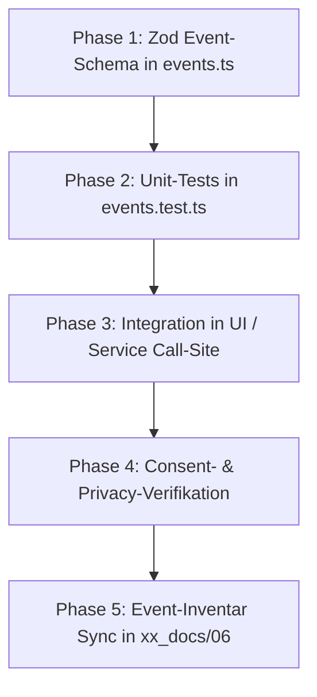

# SOP: PostHog Analytics, Consent & Privacy

> **Zweck:** Verbindliche Richtlinien für privacy-first Produkt-Analytics (`src/lib/analytics/`), DSGVO-Consent-Management, serverseitige HMAC-Pseudonymisierung und Event-Tracking.
> **Fachkontext & Event-Inventar:** [`xx_docs/06_analytics_context.md`](../xx_docs/06_analytics_context.md).
> **Sicherheits- & Wallet-Invarianten:** [`xx_sop/09_security_wallet_invariants.md`](09_security_wallet_invariants.md).
> **Qualitätsmaßstab:** [`xx_sop/12_workflow_dokument_qualitaet.md`](12_workflow_dokument_qualitaet.md).

---

## 1 — Trigger und Start-Gate

- **Gilt für:**
  - Hinzufügen, Ändern oder Entfernen von Tracking-Events in `src/lib/analytics/events.ts`.
  - Änderungen am Consent-Banner, Opt-In-Status (`consent.ts`) oder Storage-Key (`consent.posthog.v1`).
  - Änderungen an der HMAC-Pseudonymisierung (`identity-hmac.ts`) oder der Identity-API (`/api/analytics/identity`).
  - Änderungen an DSGVO-Datenlöschprozessen (`posthog-erasure.ts`) oder Web Vitals (`web-vitals.ts`).
- **Pre-Flight-Prüfung vor Umsetzung:**
  1. Ist das Event strikt auf minimal notwendige Daten beschränkt (Privacy by Design)?
  2. Enthält das Event **keine** PII (keine Klartext-IDs, E-Mails, Passwörter, IP-Adressen, Kreditkarten)?
  3. Ist das Event als Zod-Schema in der Allowlist in `events.ts` modelliert?

---

## 2 — Die 5 Unverhandelbaren Datenschutz-Invarianten

1. **Strikte Zod-Allowlist (`events.ts`):** Direkte Aufrufe von `posthog.capture()` im UI-Code sind strengstens verboten. Jeder Event-Aufruf muss über `trackAllowedEvent()` laufen.
2. **Opt-in-Zwang (Zero-Tracking ohne Consent):** Vor expliziter Zustimmung (`status === 'granted'`) initialisiert kein PostHog-Client und kein Netzwerk-Request verlässt den Browser.
3. **HMAC-Pseudonymisierung (`identity-hmac.ts`):** PostHog erhält niemals die echte Supabase-`user.id`. Identifikation erfolgt ausschließlich über eine serverseitig mit SHA-256 HMAC gehashte `distinctId`.
4. **Keine sensiblen Daten im Payload:** Finanzbeträge werden nur aggregiert oder in Spiel-Kontexten erfasst; Secrets, Tokens oder Session-Keys dürfen niemals in Properties stehen.
5. **Fail-Open für Gameplay / Fail-Closed für Identity:**
   - Ein Ausfall von PostHog darf niemals das Spielgeschehen oder UI blockieren (Best-Effort).
   - Ein Ausfall des HMAC-Secrets im Backend schließt mit `503 Service Unavailable`, um das Versenden ungesicherter Klartext-IDs strukturell zu verhindern.

---

## 3 — Der 5-Phasen-Ablauf für neue Analytics-Events



### Phase 1: Event in `events.ts` definieren
```typescript
export const gamePlayedEventSchema = z.object({
  event: z.literal('game_played'),
  properties: z.object({
    game: z.enum(['blackjack', 'crash', 'dice', 'roulette', 'slots']),
    bet_tier: z.enum(['low', 'medium', 'high', 'vip']),
    is_win: z.boolean(),
  }).strict(),
});
```

### Phase 2: Unit-Test mit Negativ-Fällen
- Valide Payloads müssen passieren.
- Unerlaubte Extra-Properties (z. B. versehentlich übergebene `user_id`) müssen vom Zod-`strict()`-Check abgewiesen werden.

### Phase 3: Call-Site anbinden
```typescript
import { trackAllowedEvent } from '@/lib/analytics/events';

// Am Ende der Spielrunde aufrufen:
trackAllowedEvent({
  event: 'game_played',
  properties: { game: 'dice', bet_tier: 'low', is_win: true }
});
```

### Phase 4: Consent- & Identity-Check
- Verifizieren, dass ohne Consent kein Network-Request an `us.i.posthog.com` gesendet wird.

### Phase 5: Dokumentation
- Event im Inventar von [`xx_docs/06_analytics_context.md`](../xx_docs/06_analytics_context.md) registrieren.

---

## 4 — Modul-Übersicht (`src/lib/analytics/`)

| Modul | Rolle & Verantwortung | Test-Datei |
| :--- | :--- | :--- |
| `consent.ts` | Verwaltet LocalStorage-Zustand (`consent.posthog.v1`), Opt-In & Opt-Out. | `__tests__/consent.test.ts` |
| `events.ts` | Strikte Zod-Event-Allowlist & `trackAllowedEvent()` Dispatcher. | `__tests__/events.test.ts` |
| `identify.ts` | Client-Helfer für PostHog-`identify` mit HMAC-Token. | `__tests__/identify.test.ts` |
| `identity-hmac.ts`| Serverseitige SHA-256 HMAC-Generierung der `distinctId`. | `__tests__/identity-hmac.test.ts` |
| `posthog-client.ts`| Lazy-Initialisierung des PostHog SDKs (Autocapture: OFF, Recording: OFF). | `__tests__/posthog-client.test.ts` |
| `posthog-erasure.ts`| DSGVO Right-to-be-Forgotten: Löschung von Profilen via PostHog API. | `__tests__/posthog-erasure.test.ts` |
| `web-vitals.ts` | Erfassung von Core Web Vitals (LCP, FID, CLS) bei aktivem Consent. | `__tests__/web-vitals.test.ts` |

---

## 5 — Test- & Validierungsbefehle

```powershell
# 1. Alle Analytics-Tests ausführen
npm test -- src/lib/analytics/__tests__/

# 2. Event-Zod-Allowlist isoliert testen
npm test -- src/lib/analytics/__tests__/events.test.ts

# 3. HMAC-Generierung & Secret-Handling prüfen
npm test -- src/lib/analytics/__tests__/identity-hmac.test.ts

# 4. TypeScript-Typen prüfen
npm run typecheck
```

---

## 6 — Risiko- & Freigabeklassifizierung (K-Level)

| Analytics-Aktion | K-Level | Freigabe-Voraussetzung |
| :--- | :---: | :--- |
| **Neues Tracking-Event in `events.ts` anlegen** | **K2** | Lokale Zod-Tests ausreichend. |
| **Call-Site in UI-Komponenten platzieren** | **K2** | Lokale Sichtprüfung. |
| **Änderung an Consent-Key oder Cookie-Banner** | **K3** | Standard-Review erforderlich (Rechtliche Relevanz). |
| **Änderung an HMAC-Hashing oder DSGVO-Erasure** | **K4** | **Explizite Jan-Freigabe zwingend erforderlich.** |

---

## 7 — Didaktischer Mehrwert & Lerneffekt für Jan

1. **Warum serverseitiges HMAC-Hashing für User-IDs?**
   Wenn rohe Datenbank-IDs (UUIDs) an Drittanbieter wie PostHog übertragen werden, können Datenlecks bei Drittanbietern direkt mit Benutzerdatenbanken korreliert werden. Ein SHA-256 HMAC mit geheimem Server-Secret macht die ID irreversibel für Dritte, bleibt aber konsistent für Kohorten-Analysen.
2. **Warum Zod-`strict()` für Analytics?**
   JavaScript-Objekte neigen dazu, durch "Spread-Operator" (`{ ...props }`) versehentlich sensible Zustandswerte mitzusenden. `z.object().strict()` wirft sofort einen Fehler, wenn unerlaubte Keys im Objekt existieren.
3. **Warum Autocapture deaktiviert ist?**
   PostHog Autocapture liest standardmäßig Klicks und DOM-Elemente mit. In einem Casino könnten dadurch sensible Eingaben (wie Chat-Inhalte oder Guthaben) ungewollt übertragen werden. Explizite Events garantieren 100 % Datenkontrolle.

---

## 8 — Bekannte offene Probleme & Ist-Diskrepanzen

> **Stand:** 2026-08-23 · Wird bei Behebung aktualisiert.

- **1. US-Host Bindung:**
  PostHog Ingestion nutzt `us.i.posthog.com`. Eine Evaluierung bezüglich EU-Region (`eu.posthog.com`) für strengere DSGVO-Compliance ist als zukünftiger Meilenstein vermerkt.
- **2. Keine automatisierte Consent-Banner E2E-Prüfung:**
  Aktuell wird der Consent-Zustand per Vitest Unit-Test geprüft; ein Playwright E2E-Test für das UI-Banner existiert noch nicht.

---

## 9 — Verwandte Artefakte

| Bedarf | Datei |
| :--- | :--- |
| **Analytics Fachkontext & Event-Inventar** | [`xx_docs/06_analytics_context.md`](../xx_docs/06_analytics_context.md) |
| **Sicherheits- & Wallet-Invarianten** | [`xx_sop/09_security_wallet_invariants.md`](09_security_wallet_invariants.md) |
| **API Backend Kontext** | [`xx_docs/08_api_backend_context.md`](../xx_docs/08_api_backend_context.md) |
| **Dokument-Qualitäts-Rubrik** | [`xx_sop/12_workflow_dokument_qualitaet.md`](12_workflow_dokument_qualitaet.md) |
