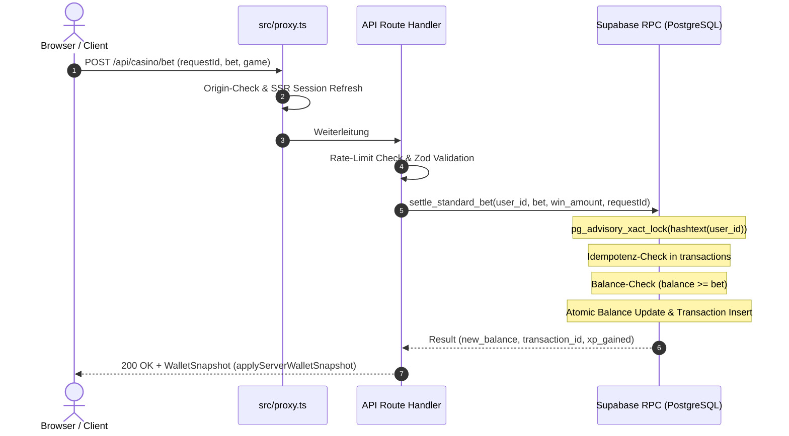

# SOP: Security, Wallet-Invarianten & Transaktionsintegrität

> **Zweck:** Unverletzliche Sicherheitsrichtlinien, finanzielle Transaktions-Invarianten, Server-Autorität, Concurrency-Sperren und Secret-Isolation für das gesamte Casino-System.
> **Database & RPC-SOP:** [`xx_sop/05_database_supabase.md`](05_database_supabase.md).
> **Supabase-Kontext:** [`xx_docs/01_supabase_context.md`](../xx_docs/01_supabase_context.md).
> **Qualitätsmaßstab:** [`xx_sop/12_workflow_dokument_qualitaet.md`](12_workflow_dokument_qualitaet.md).

---

## 1 — Die 5 Unverhandelbaren Finanz- & Wallet-Invarianten

1. **0 % Client-Autorität:** Der Browser besitzt keinerlei Befugnis, Salden, Gewinne, Multiplikatoren oder Progression zu manipulieren. Sämtliche Beträge werden serverseitig in PostgreSQL berechnet und persistiert.
2. **Fail-Closed Prinzip:** Bei Datenbankausfällen, Lock-Timeouts, Netzwerkfehlern oder Rate-Limit-Verstößen schließt das System sofort mit HTTP `401`, `403`, `429` oder `503`. Es gibt keinen optimistischen Fallback und keine lokale Guthaben-Annahme.
3. **Idempotenz (`requestId`):** Jeder Wetteinsatz und jedes Settlement erzwingt eine Client-generierte UUIDv4 (`requestId`). Wiederholte Anfragen mit identischer `(user_id, request_id)` liefern das identische Ergebnis, ohne einen zweiten Einsatz abzubuchen.
4. **PostgreSQL Advisory Locks:** Alle saldenrelevanten Transaktionen sperren die Nutzer-ID via:
   ```sql
   PERFORM pg_advisory_xact_lock(hashtext(p_user_id::text));
   ```
   Dies verhindert Race Conditions und Double-Spending-Angriffe bei parallelen Anfragen strukturell.
5. **Verbot der alten Bet-Kette:** Die veraltete `place_bet()` / `settle_bet()`-Kette ist streng verboten. Ausschließlich die atomaren RPCs aus Migration `007_consolidated_financial_system.sql` (`settle_standard_bet`, `start_game_round`, `settle_game_round`, `split_blackjack_hand`) dürfen aufgerufen werden.

---

## 1.1 — Finanz- & Wallet-RPCs Sicherheitsmodus (`SECURITY DEFINER` vs. `SECURITY INVOKER`)

Alle salden- und progressionsrelevanten Datenbankfunktionen sind als **`SECURITY DEFINER`** deklariert. Das bedeutet:
- **Ausführungskontext:** Die Funktionen laufen mit den Rechten des Datenbankbesitzers (`postgres`/Migrations-Rolle), nicht mit den Rechten des aufrufenden Nutzers.
- **RLS-Wirkung:** Row-Level-Security greift **nicht** innerhalb der `SECURITY DEFINER`-Funktionen selbst (Schutz vor Race Conditions und Ledger-Integrität wird stattdessen programmatisch durch Advisory Locks und Constraints gewährleistet). RLS dient als **Defense-in-Depth-Linie** gegen direkte PostgREST-/Client-Zugriffe außerhalb dieser RPCs.
- **Search-Path-Härtung:** Jede Funktion erzwingt strikt `SET search_path = public, pg_temp`, um Search-Path-Hijacking-Angriffe zu verhindern.
- **Zugriffsrestriktion:** Sämtliche Ausführungsrechte für `PUBLIC`, `anon` und `authenticated` sind via `REVOKE ALL` entzogen; ausschließlich `service_role` besitzt `GRANT EXECUTE`.

### Matrix der Finanz- & Wallet-RPCs

| RPC-Funktion | Sicherheitsmodus | `search_path` | Berechtigung | Migration(en) | Zweck |
| :--- | :---: | :---: | :---: | :---: | :--- |
| `settle_game_bet(...)` | `SECURITY DEFINER` | `public, pg_temp` | `service_role` | `007`, `010`, `014`, `019`, `033` | Atomarer Einsatz & Settlement für Dice, Slots, Roulette |
| `start_game_round(...)` | `SECURITY DEFINER` | `public, pg_temp` | `service_role` | `007` | Rundeninitialisierung & Bet-Debiting (Crash, Blackjack) |
| `settle_game_round(...)` | `SECURITY DEFINER` | `public, pg_temp` | `service_role` | `007`, `010`, `014` | Rundensettlement & Payout-Crediting (Crash, Blackjack) |
| `advance_blackjack_round(...)` | `SECURITY DEFINER` | `public, pg_temp` | `service_role` | `007`, `010`, `014` | Zwischenzüge & Additional Bets bei Blackjack |
| `admin_update_user(...)` | `SECURITY DEFINER` | `public, pg_temp` | `service_role` | `028` | Auditierte manuelle Balance-/Rang-Mutation durch Admins |
| `reconcile_wallet_ledger(...)` | `SECURITY DEFINER` | `public, pg_temp` | `service_role` | `028` | Deterministiche Ledger-Reconciliation & Discrepancy-Audit |
| `redeem_promo_code(...)` | `SECURITY DEFINER` | `public, pg_temp` | `service_role` | `021`, `023` | Atomare Promo-Code-Einlösung & Guthabengutschrift |
| `casino_rank_for_level(...)` | `SECURITY DEFINER` | `public, pg_temp` | Intern / Helper | `007` | Deterministische Rang-Ermittlung aus Level |

---

## 2 — Atomarer Transaktions-Lebenszyklus



---

## 3 — Key- & Secret-Management

### 3.1 Server-Only Isolation
Folgende Umgebungsvariablen dürfen **unter keinen Umständen** ein `NEXT_PUBLIC_`-Präfix erhalten und sind im Client-Scope strengstens verboten:
- `SUPABASE_SERVICE_ROLE_KEY` (Voller DB-Bypass)
- `SUPABASE_ADMIN_EMAILS` (Admin-Whitelisting)
- `UPSTASH_REDIS_REST_TOKEN` (Rate-Limiter Backend)
- `POSTHOG_DISTINCT_ID_SECRET` (HMAC-Salt für Analytics)
- `TELEGRAM_BOT_SECRET` (Webhook-Authentifizierung)
- `OPENAI_API_KEY` (KI-Guide & Audio-Synthese)

### 3.2 PII- & Secret-Redaction (`sentry-scrub.ts`)
Alle Log- und Fehler-Meldungen filtern Tokens, Passwörter, Cookies und Authorization-Header automatisch heraus, bevor Telemetriedaten an Sentry übertragen werden.

---

## 4 — Provably-Fair Sicherheits-Architektur

* **Deterministische Integrität:** Jedes Spielergebnis basiert auf der kryptografischen Formel:
  $$\text{Result} = \text{HMAC-SHA256}(\text{ServerSeed}, \text{ClientSeed} : \text{Nonce})$$
* **Aktive Seed-Maskierung:** Der unverschlüsselte Server-Seed verbleibt auf dem Server, bis der Nutzer den Seed aktiv rotiert. Im aktiven Zustand wird ausschließlich der `server_seed_hash` offengelegt.
* **Multiplayer Crash Entkopplung:** Beim Multiplayer-Crash wird der Crash-Punkt serverseitig in der DB fixiert; der Client erhält während des Laufs nur `crashRoundId` und den Takt, aber niemals vor Rundenende den Zielmultiplikator (`reveal-leak`-geschützt).

---

## 5 — Verifikation & Security-Audit-Befehle

```powershell
# 1. Alle Sicherheits- & Auth-Tests ausführen
npm test -- src/lib/security/__tests__/

# 2. Provably Fair & RNG-Tests ausführen
npm test -- src/lib/casino/__tests__/provably-fair-verification.test.ts

# 3. Multiplayer Crash Leakage-Schutz testen
npm test -- src/lib/casino/__tests__/multiplayer-crash-reveal-leak.test.ts

# 4. Vault- & Wallet-Integrationstests prüfen
npm test -- src/lib/casino/__tests__/vault-integration.test.ts
```

---

## 6 — Risiko- & Freigabeklassifizierung (K-Level)

| Aktion | K-Level | Freigabe-Voraussetzung |
| :--- | :---: | :--- |
| **Lokale Security-Tests & Audits** | **K1/K2** | Jederzeit frei ausführbar. |
| **Änderung an Rate-Limits oder Error-Codes** | **K3** | Standard-Review erforderlich. |
| **Änderung an RPC-Transaktionen oder Wallet-Sperren** | **K4** | **Explizite Jan-Freigabe zwingend erforderlich.** |
| **Löschen von Finanztabellen oder `supabase db reset`** | **K5** | **Explizite Bestätigung mit K5-Blockade erforderlich.** |

---

## 7 — Didaktischer Mehrwert & Lerneffekt für Jan

1. **Warum `pg_advisory_xact_lock` statt Tabellen-Locks?**
   Ein Tabellen-Lock sperrt die gesamte Tabelle `profiles` und blockiert alle Nutzer gleichzeitig. Ein transaktionales Advisory Lock sperrt ausschließlich den Hashwert der spezifischen `user_id` für die Dauer der Transaktion. Dadurch können tausende Spieler parallel wetten, ohne sich gegenseitig zu blockieren.
2. **Warum strikte Server-Autorität?**
   Im Web-Frontend kann jeder Angreifer mit DevTools JavaScript-Variablen oder Netzwerk-Payloads manipulieren. Nur wenn der Server die absolute Wahrheit über Kontostand und Quoten besitzt, ist ein Casino mathematisch sicher gegen Betrug.
3. **Warum HMAC-SHA256 für Provably Fair?**
   HMAC-SHA256 ist eine Einweg-Funktion: Selbst wenn der Spieler den Hashwert und seinen eigenen Client-Seed kennt, kann er den Server-Seed vorab nicht erraten. Nach der Runde kann er jedoch überprüfen, ob der Hash zum aufgedeckten Server-Seed passt.

---

## 8 — Bekannte offene Probleme & Ist-Diskrepanzen

> **Stand:** 2026-08-23 · Wird bei Behebung aktualisiert.

- **1. `/fairness`-Bypass in `proxy.ts`:**
  Die Seite `/fairness` liefert 404 und ist in `src/proxy.ts` als Public-Ausnahme hinterlegt, damit Next.js das native 404 rendert.
- **2. In-Memory Rate-Limiter Fallback im Dev-Modus:**
  Im lokalen Entwicklungsmodus ohne Upstash-Keys läuft ein In-Memory-Limiter. Auf Staging/Production ist Upstash Redis zwingend erforderlich.

---

## 9 — Verwandte Artefakte

| Bedarf | Datei |
| :--- | :--- |
| **Database & Migrationen SOP** | [`xx_sop/05_database_supabase.md`](05_database_supabase.md) |
| **Supabase Kontext** | [`xx_docs/01_supabase_context.md`](../xx_docs/01_supabase_context.md) |
| **API Backend Routen** | [`xx_sop/07_api_backend_routes.md`](07_api_backend_routes.md) |
| **Dokument-Qualitäts-Rubrik** | [`xx_sop/12_workflow_dokument_qualitaet.md`](12_workflow_dokument_qualitaet.md) |
