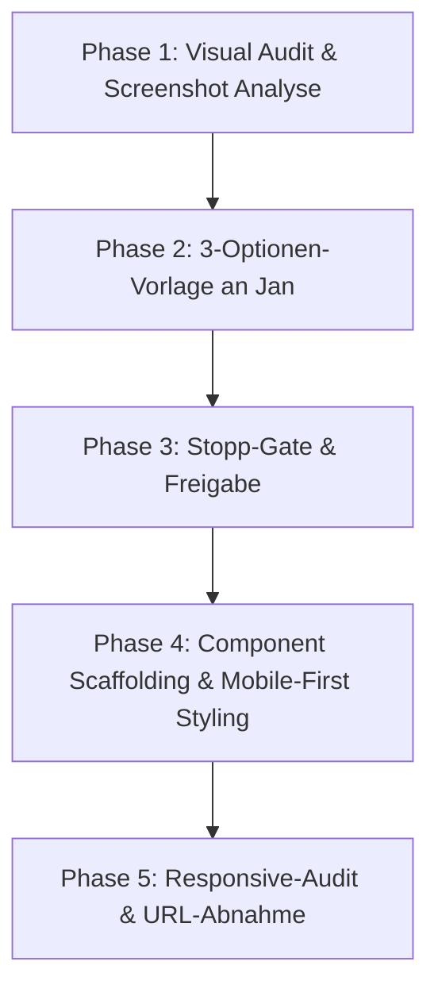

# SOP: Frontend-Revamp & UI-Redesign (Jan-Frontend-Schema)

> **Zweck:** Standardisierter 5-Phasen-Ablauf für UI/UX-Überarbeitungen, Screen-Redesigns, Responsive-Optimierungen und Komponenten-Umbauten auf Basis des Design-Systems („Obsidian & Gold“).
> **Design-System & Z-Index-Standards:** [`xx_sop/04_design_system_ui.md`](04_design_system_ui.md).
> **Option-Gate-Workflow:** [`xx_sop/01_workflow_jan_option_gate.md`](01_workflow_jan_option_gate.md).
> **Ausführung & Selbstprüfung:** [`xx_sop/02_workflow_jan_execution.md`](02_workflow_jan_execution.md).
> **Qualitätsmaßstab:** [`xx_sop/12_workflow_dokument_qualitaet.md`](12_workflow_dokument_qualitaet.md).

---

## 1 — Trigger und Start-Gate

- **Gilt für:**
  - Jedes Redesign bestehender Spiel- oder Dashboard-Screens (z. B. Blackjack, Roulette, Vault, Admin).
  - Umbau von Layout-Containern, Navigationsleisten (`MainHeader`, `MainSidebar`) oder Modals.
  - Behebung von Responsive-Layout-Bugs auf Mobile (375px–430px) oder Desktop (1440px+).
- **Pre-Flight-Prüfung vor dem ersten Code-Edit:**
  1. Ist der lokale Dev-Server auf Port 3015 aktiv (`http://localhost:3015/`)?
  2. Wurde der Screen gegen das Design-System ([`xx_sop/04_design_system_ui.md`](04_design_system_ui.md)) auditiert?
  3. Liegt eine Freigabe für eines der 3 Design-Konzepte vor (Abschnitt 2)?

---

## 2 — Das 3-Optionen-Frontend-Schema (Pflicht vor Umsetzung)

Vor jeder visuellen Code-Änderung werden Jan genau 3 Design-Konzepte vorgelegt:

```markdown
| Option | UI/UX-Konzept | Visuelle Dichte & Stil | Motion & Interaktion | Empfehlung |
| :--- | :--- | :--- | :--- | :---: |
| **Option 1 (Empfohlen)** | <z. B. High-Density Glass Stage> | Obsidian (#0B0E14), Gold-Akzente, tabular-nums | Spring-Hover (1.02x), Glow-Fade | ✅ Empfohlen |
| **Option 2** | <z. B. Minimalist Slate Grid> | Kompakte Kacheln, 0 Glow, reduzierte Borders | Lineare Transitions (150ms) | ⚪ Alternative |
| **Option 3** | <z. B. 3D Parallax Vegas> | Maximaler 3D-Tilt, Gold-Sheen, Partikel | Parallaxe, Spring-Zoom (1.05x) | ❌ Nicht empfohlen |

### Detailbereich je Frontend-Option (Pflicht)
- **Layout & Responsive:** DOM-Struktur, Grid/Flexbox-Staffelung, Mobile-Collapse.
- **Styling & Motion:** Tailwind-Klassen, Blur-Werte, Borders, Framer-Motion-Parameter.
- **Betroffene Dateien & URLs:** Pfade (`[MODIFY]`, `[NEW]`) + Ziel-URL (`http://localhost:3015/...`).
```

---

## 3 — Der 5-Phasen-Revamp-Lebenszyklus



### Phase 1: Visuelles Audit
- Farben prüfen: Obsidian-Hintergrund (`#0B0E14`), Gold-Akzente (`#D4AF37`), Smaragd (Win), Rubin (Loss).
- Typografie prüfen: Monospace (`tabular-nums` / `font-mono`) für alle dynamischen Zahlenwerte.
- Z-Indexe prüfen: Konformität mit den Zonen aus [`xx_sop/04_design_system_ui.md`](04_design_system_ui.md).

### Phase 2 & 3: 3-Optionen-Gate & Freigabe
- Optionen vorlegen, Vor- und Nachteile benennen, auf Jans Freigabe (z. B. "Option 1") warten.

### Phase 4: Umsetzung
- Mobile-First Styling: Keine horizontalen Scrollbalken auf kleinen Displays ($375\text{px}$).
- Glassmorphism: `backdrop-filter: blur(12px)` und `bg-black/40` bis `bg-black/60`.
- Spring-Physik: Framer Motion mit `bounce: 0.4` für interaktive Buttons.

### Phase 5: Responsive-Audit & Übergabe
- Automatisierte Prüfskripte ausführen (siehe Abschnitt 4).
- Übergabe mit konkreten Test-URLs (`http://localhost:3015/games/...`).

---

## 4 — Test- & Validierungsbefehle

```powershell
# 1. Automatisierter Responsive-Layout-Audit (schnell)
node scripts/fast-responsive-audit.mjs

# 2. Tiefen-Audit über alle Viewports (375px, 768px, 1024px, 1440px)
node scripts/deep-responsive-audit.mjs

# 3. TypeScript Typ-Integrität prüfen
npm run typecheck

# 4. ESLint Konformität prüfen
npm run lint
```

---

## 5 — Risiko- & Freigabeklassifizierung (K-Level)

| Revamp-Aktion | K-Level | Freigabe-Voraussetzung |
| :--- | :---: | :--- |
| **CSS-Token- & Typo-Anpassungen** | **K1/K2** | Lokale Sichtprüfung ausreichend. |
| **Screen-Redesign einzelner Spiele (z. B. Blackjack)** | **K2** | Nach bestätigtem 3-Optionen-Gate frei ausführbar. |
| **Globale Shell- & Navigationsumbauten (`MainLayout.tsx`)** | **K3** | Standard-Review im Task-Scope. |
| **Architektur-Redesign oder Framework-Wechsel** | **K4** | **Explizite Jan-Freigabe zwingend erforderlich.** |

---

## 6 — Didaktischer Mehrwert & Lerneffekt für Jan

1. **Warum immer 3 Optionen statt direktem Coden?**
   Verhindert zeitraubende Code-Rollbacks. Durch die tabellarische Gegenüberstellung von Aufwand, Stil und Motion wird das Zielbild vor der ersten Code-Zeile geschärft.
2. **Warum Mobile-First selbst bei Desktop-Spielen?**
   Über 65 % der Casino-Nutzer spielen auf mobilen Geräten. Komponenten, die auf $375\text{px}$ ohne horizontales Scrollen funktionieren, lassen sich auf Desktop mühelos skalieren.
3. **Warum dedizierte Responsive-Audit-Skripte?**
   Manuelle Browser-Resizes übersehen oft minimale 1px-Overflow-Bugs. Skripte wie `fast-responsive-audit.mjs` erkennen Layout-Brüche in Sekundenbruchteilen.

---

## 7 — Bekannte offene Probleme & Ist-Diskrepanzen

> **Stand:** 2026-08-23 · Wird bei Behebung aktualisiert.

- **1. Historische T_FRONTEND/-Verweise:**
  Frühere Entwürfe nutzten temporäre Plandateien in `T_FRONTEND/`. Die kanonische Ablage für Planungsdokumente erfolgt heute zentral in `worldmap/` oder `docs/archive/`.
- **2. Touch-Targets auf Mobile teilweise unter 44px:**
  Einige Jeton-Auswahl-Buttons in Blackjack/Roulette unterschreiten auf kleinen Screens die empfohlene Touch-Fläche von $44\times 44\text{px}$.

---

## 8 — Verwandte Artefakte

| Bedarf | Datei |
| :--- | :--- |
| **Design System & UI Standards** | [`xx_sop/04_design_system_ui.md`](04_design_system_ui.md) |
| **Workflow Option Gate** | [`xx_sop/01_workflow_jan_option_gate.md`](01_workflow_jan_option_gate.md) |
| **Execution Workflow** | [`xx_sop/02_workflow_jan_execution.md`](02_workflow_jan_execution.md) |
| **Dokument-Qualitäts-Rubrik** | [`xx_sop/12_workflow_dokument_qualitaet.md`](12_workflow_dokument_qualitaet.md) |
