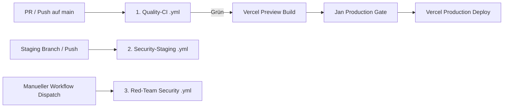

# SOP: CI/CD, Deployment & Release-Management

> **Zweck:** Verbindlicher Ablauf für Continuous Integration (GitHub Actions), Security-Staging-Workflows, Vercel-Preview-Validierung, Production-Releases und Rollback-Verfahren.
> **Fachkontext & Infrastruktur:** [`xx_docs/11_cicd_deployment_context.md`](../xx_docs/11_cicd_deployment_context.md).
> **Live-Status-Quelle:** [`worldmap/00_WORLDMAP_STATUS.md`](../worldmap/00_WORLDMAP_STATUS.md).
> **Qualitätsmaßstab:** [`xx_sop/12_workflow_dokument_qualitaet.md`](12_workflow_dokument_qualitaet.md).

---

## 1 — Trigger und Start-Gate

- **Gilt für:**
  - Jede Erstellung oder Änderung von GitHub Actions Workflows (`.github/workflows/*.yml`).
  - Abfrage, Monitoring oder Freigabe von GitHub CI-Runs und Vercel-Previews.
  - Vorbereitung von Releases, Production-Deployments oder Notfall-Rollbacks.
- **Start-Gate & Voraussetzungen:**
  1. Ist der aktuelle Live-Status aus [`worldmap/00_WORLDMAP_STATUS.md`](../worldmap/00_WORLDMAP_STATUS.md) verifiziert?
  2. Sind alle lokalen Prüfungen (`npm test`, `typecheck`, `lint`, `build`) grün?
  3. Liegt für K4/K5-Schritte (Production-Deploy) die ausdrückliche Freigabe von Jan vor?

---

## 2 — Die 3 GitHub-Actions-Workflows



### 2.1 Quality-CI (`.github/workflows/quality-ci.yml`)
- **Trigger:** `pull_request` gegen `main` und `push` auf `main`.
- **Berechtigungen:** Strikt `contents: read` (keine Schreibrechte, keine Secrets im Standard-Run).
- **Prüfsequenz (muss zu 100 % grün sein):**
  1. `npm run test` (Vitest Unit- & Integrationstests)
  2. `npm run typecheck` (TypeScript ohne Emit)
  3. `npm run lint` (ESLint)
  4. `npm run build` (Next.js Production Build)

### 2.2 Security-Staging (`.github/workflows/security-staging.yml`)
- Läuft isoliert gegen die Staging-Umgebung; prüft RLS-Policies und Service-Role-Isolation.

### 2.3 Red-Team Security (`.github/workflows/red-team-security.yml`)
- Manueller Dispatch (`workflow_dispatch`); führt Penetration- & Fuzzing-Tests gegen API-Routen aus.

---

## 3 — Der 5-Phasen-Release-Lebenszyklus

### Phase 1: Lokale Pre-Flight-Verifikation
Vor jedem Git-Push ist die lokale Prüfkette vollständig auszuführen:
```powershell
npm run test && npm run typecheck && npm run lint && npm run build
```

### Phase 2: Pull-Request & Quality-CI
- PR erstellen; automatischer Quality-Run startet.
- Ein roter Run blockiert den Merge bedingungslos (Fail-Closed).

### Phase 3: Vercel Preview-Validierung
- Eindeutige Zuordnung des Commits zur Vercel-Preview-URL (`https://casino-*-preview.vercel.app`).
- Smoke-Test auf der Preview-Umgebung: Login, Wallet-Snapshot-Laden (`/api/user/balance`), Navigation.

### Phase 4: Production-Freigabe (Jan-Gate)
- Jan bestätigt die Zielumgebung `Production` und führt die Promotion im Vercel-Dashboard aus.
- Das KI-System löst niemals selbstständig ein Production-Deployment aus (K4-Grenze).

### Phase 5: Post-Deployment Smoke-Test & Status-Sync
- Verifikation des Live-Status auf Production.
- Aktualisierung von [`worldmap/00_WORLDMAP_STATUS.md`](../worldmap/00_WORLDMAP_STATUS.md).

---

## 4 — Fehler- und Rollback-Matrix

| Fehlerbild | Sofortmaßnahme | Rollback-Vorgehen | Freigabe |
| :--- | :--- | :--- | :---: |
| **Quality-CI schlägt fehl** | Merge sofort stoppen | Fix-Commit auf PR-Branch pushen; erneuten Run abwarten | **K2** |
| **Staging-Security meldet Leak** | Staging einfrieren | Betroffene Route sperren, Ursache lokalisieren | **K3** |
| **Vercel Preview wirft 500** | Production-Freigabe sperren | Build-Logs read-only prüfen, Dependency-Mismatch beheben | **K3** |
| **Kritischer Production-Bug** | **Releases sofort stoppen** | **Jan promoted vorheriges Ready-Deployment in Vercel** | **K5** |
| **Secret-Leak Verdacht** | Tokens sperren | Jan rotiert Supabase/Upstash/PostHog Secrets | **K5** |

---

## 5 — Risiko- & Freigabeklassifizierung (K-Level)

| CI/CD-Aktion | K-Level | Freigabe-Voraussetzung |
| :--- | :---: | :--- |
| **Lokale Tests & CI-Run Statusabfrage (Read-Only)** | **K1/K2** | Jederzeit frei ausführbar. |
| **Anpassung von CI-Workflow-Konfigurationen (`.yml`)** | **K3** | Standard-Review im Task-Scope. |
| **Merge in `main` & Production-Release-Freigabe** | **K4** | **Explizite Jan-Freigabe zwingend erforderlich.** |
| **Notfall-Rollback auf Production & Secret-Rotation** | **K5** | **Explizite Jan-Freigabe mit Bestätigung.** |

---

## 6 — Didaktischer Mehrwert & Lerneffekt für Jan

1. **Warum striktes `contents: read` im CI-Workflow?**
   Wenn CI-Workflows Schreibrechte oder Secrets besitzen, können Pull-Requests von Drittanbietern oder kompromittierte Dependencies Server-Secrets exfiltrieren. Ein minimales Rechteprofil schützt die gesamte Pipeline.
2. **Warum Concurrency-Abbruch älterer Runs?**
   Wenn bei schnellen Commits drei CI-Runs parallel laufen, verbrauchen sie unnötige GitHub-Actions-Minuten. Die Regel `cancel-in-progress: true` bricht veraltete Runs automatisch ab und spart Ressourcen.
3. **Warum kein automatisches Auto-Deploy auf Production?**
   Im Casino-Umfeld hängen Datenbank-Migrationen und App-Releases voneinander ab. Erst wenn RPCs remote angewendet wurden, darf das Frontend live gehen. Eine bewusste Freigabe durch Jan verhindert Schema-Inkompatibilitäten.

---

## 7 — Bekannte offene Probleme & Ist-Diskrepanzen

> **Stand:** 2026-08-23 · Wird bei Behebung aktualisiert.

- **1. Fehlende automatisierte GitHub Branch Protection:**
  Aktuell wird das Merge-Verbot bei roter CI durch Disziplin und SOP eingehalten; eine erzwungene Branch Protection Rule in den GitHub-Repository-Einstellungen steht noch aus.
- **2. Manuelle Vercel-Promotion:**
  Deployments auf Production erfolgen über manuelle Jan-Interaktion im Vercel-Dashboard statt über CLI-Automatisierung.

---

## 8 — Verwandte Artefakte

| Bedarf | Datei |
| :--- | :--- |
| **CI/CD Kontext & Infrastruktur** | [`xx_docs/11_cicd_deployment_context.md`](../xx_docs/11_cicd_deployment_context.md) |
| **Live-Status Master-Quelle** | [`worldmap/00_WORLDMAP_STATUS.md`](../worldmap/00_WORLDMAP_STATUS.md) |
| **Execution & Verifikation SOP** | [`xx_sop/02_workflow_jan_execution.md`](02_workflow_jan_execution.md) |
| **Dokument-Qualitäts-Rubrik** | [`xx_sop/12_workflow_dokument_qualitaet.md`](12_workflow_dokument_qualitaet.md) |
