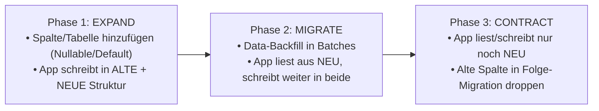

# SOP: PostgreSQL Patterns & Zero-Downtime Migrations (Top 1 % Weltklasse)

> **Zweck:** Verbindliche Richtlinien für hochgradig nebenläufige Finanzeinsätze, unterbrechungsfreie Schema-Migrationen (Zero-Downtime), optimierte Row-Level-Security (RLS) und Lock-freie Performance im Supabase/Postgres-Cluster (`hmqwozhdckbwjqzcmire`).
> **Datenbank-Architektur & RPCs:** [`xx_sop/05_database_supabase.md`](./05_database_supabase.md).
> **Supabase-Kontext & Migrationen:** [`xx_docs/01_supabase_context.md`](../xx_docs/01_supabase_context.md).
> **Wallet-Invarianten & Transaktionen:** [`xx_sop/09_security_wallet_invariants.md`](./09_security_wallet_invariants.md).
> **Qualitätsmaßstab:** [`xx_sop/12_workflow_dokument_qualitaet.md`](./12_workflow_dokument_qualitaet.md).
> **Neuer `pg_cron`-Job geplant?** Erst [`xx_sop/20_background_jobs_scheduling.md`](./20_background_jobs_scheduling.md) lesen — klärt, ob `pg_cron` oder ein Trigger.dev-Task der richtige Mechanismus ist.

---

## 1 — Zero-Downtime Migrationen (Expand-Contract-Lifecycle)

Produktions-Datenbanken dürfen für Schema-Updates niemals gesperrt werden. Jede Änderung an Live-Tabellen (`wallets`, `bets`, `profiles`, `game_sessions`) folgt zwingend dem 3-Phasen-Modell:



### Die 6 Goldenen Migrations-Regeln

1. **Kein `NOT NULL` ohne DEFAULT:**
   - Ein nachträgliches `ALTER TABLE t ADD COLUMN c TEXT NOT NULL;` führt zu einem exklusiven Table-Lock (`ACCESS EXCLUSIVE`) und schreibt jede einzelne Zeile um.
   - **Korrekt:** Spalte mit `DEFAULT` anlegen (in Postgres $\ge 11$ ein O(1)-Metadaten-Update ohne Zeilen-Rewrite) oder als `NULLABLE` erstellen, Daten im Hintergrund backfillen und anschließend den `NOT NULL`-Constraint setzen.
2. **Index-Erstellung immer `CONCURRENTLY`:**
   - Standard-`CREATE INDEX` blockiert alle schreibenden Transaktionen auf der Zieltabelle.
   - **Korrekt:** `CREATE INDEX CONCURRENTLY IF NOT EXISTS idx_name ON table (col);`
   - _Wichtig:_ `CONCURRENTLY` kann nicht innerhalb eines Transaktionsblocks (`BEGIN ... COMMIT`) ausgeführt werden.
3. **Strikte Trennung von DDL und DML:**
   - Niemals Tabellendefinitionen (`CREATE TABLE`, `ALTER TABLE`) und Datenmutationen (`UPDATE`, `INSERT`) in dieselbe Migrationsdatei packen.
4. **Keine manuellen Schema-Änderungen in der Supabase-UI:**
   - Jede DDL-Änderung muss als fortlaufende Datei (`supabase/migrations/0XX_*.sql`) existieren.
5. **Namensraum-Disziplin:**
   - Alle Tabellen und Funktionen nutzen strikt `search_path = public`.
6. **Idempotente DDL:**
   - Alle DDL-Statements nutzen `IF NOT EXISTS` bzw. `IF EXISTS`.

---

## 2 — Große Daten-Migrationen (Batch-Backfill ohne Lock-Starvation)

Wenn Millionen von Zeilen migriert oder bereinigt werden müssen, darf kein monolithisches `UPDATE` abgesetzt werden:

```sql
-- KANONISCHES PATTERN: Batch-Update mit FOR UPDATE SKIP LOCKED
DO $$
DECLARE
  batch_size INT := 5000;
  rows_updated INT;
BEGIN
  LOOP
    UPDATE bets
    SET normalized_payout = payout_amount
    WHERE id IN (
      SELECT id FROM bets
      WHERE normalized_payout IS NULL
      ORDER BY id ASC
      LIMIT batch_size
      FOR UPDATE SKIP LOCKED
    );
    GET DIAGNOSTICS rows_updated = ROW_COUNT;
    RAISE NOTICE 'Erfolgreich % Zeilen migriert', rows_updated;
    EXIT WHEN rows_updated = 0;
    COMMIT; -- Transaktion pro Batch freigeben, um Locks zu minimieren
  END LOOP;
END $$;
```

---

## 3 — Concurrency, Advisory Locks & Queue-Verarbeitung

Im Casino greifen hunderte Requests pro Sekunde auf dieselben Benutzerkonten zu. Zur Verhinderung von Race Conditions und Double-Spending gelten folgende Lock-Standards:

### 1. Transaktions-Advisory-Lock für User-Wallets

```sql
-- Verhindert parallele Bet-Settlements für denselben User
-- Sperre wird bei COMMIT/ROLLBACK der Transaktion automatisch freigegeben
SELECT pg_advisory_xact_lock(hashtext('wallet_lock_' || p_user_id::text));
```

### 2. Deadlock-freie Job- & Event-Queue

```sql
-- Sichere Entnahme von Auszahlungs- oder Telemetrie-Jobs
UPDATE transaction_queue
SET status = 'processing',
    locked_at = now()
WHERE id = (
  SELECT id FROM transaction_queue
  WHERE status = 'pending'
  ORDER BY created_at ASC
  LIMIT 1
  FOR UPDATE SKIP LOCKED
) RETURNING *;
```

---

## 4 — Row Level Security (RLS) Performance-Optimierung

Ein häufiger Performance-Killer in Supabase ist die unbedachte Verwendung von `auth.uid()` in RLS-Policies:

```sql
-- ❌ FALSCH: auth.uid() wird für JEDE Tabellenzeile neu evaluiert (O(N) CPU-Overhead!)
CREATE POLICY "Users access own bets" ON bets
  FOR SELECT USING (auth.uid() = user_id);

-- ✅ RICHTIG: Durch (SELECT auth.uid()) wird der Funktionsaufruf gecacht (O(1) Ausführung!)
CREATE POLICY "Users access own bets" ON bets
  FOR SELECT USING ((SELECT auth.uid()) = user_id);
```

---

## 5 — Index-Strategie & Cheat-Sheet

| Anwendungsfall                    | Index-Typ        | Kanonisches SQL-Muster                                                                              | Begründung                                                 |
| :-------------------------------- | :--------------- | :-------------------------------------------------------------------------------------------------- | :--------------------------------------------------------- |
| **Gleichheit + Sortierung/Range** | Composite B-Tree | `CREATE INDEX CONCURRENTLY idx_bets_user_date ON bets (user_id, created_at DESC);`                  | **Equality-Spalten zuerst**, Range-/Sortierspalten danach. |
| **Gefilterte Suche**              | Partial Index    | `CREATE INDEX CONCURRENTLY idx_active_sessions ON game_sessions (user_id) WHERE status = 'active';` | Kleiner Index, ignoriert beendete Runden.                  |
| **Index-Only Scans**              | Covering Index   | `CREATE INDEX CONCURRENTLY idx_profile_balance ON profiles (id) INCLUDE (balance, is_vip);`         | Erspart teuren Table-Heap-Lookup für Leseanfragen.         |
| **JSONB-Metadaten**               | GIN Index        | `CREATE INDEX CONCURRENTLY idx_bets_meta ON bets USING gin (metadata);`                             | Schnelle JSONB-Containment-Queries (`@>`).                 |
| **ID-Lookups**                    | B-Tree (Default) | `bigint` / `uuid` Primary Key Index                                                                 | O(1) Punktabfragen.                                        |

---

## 6 — Audit- & Diagnose-Abfragen für die Datenbank-Wartung

```sql
-- 1. Nicht indizierte Foreign Keys aufspüren (verursachen Kaskaden-Locks!)
SELECT conrelid::regclass AS table_name, a.attname AS fk_column, c.conname AS constraint_name
FROM pg_constraint c
JOIN pg_attribute a ON a.attrelid = c.conrelid AND a.attnum = ANY(c.conkey)
WHERE c.contype = 'f'
  AND NOT EXISTS (
    SELECT 1 FROM pg_index i
    WHERE i.indrelid = c.conrelid AND a.attnum = ANY(i.indkey)
  );

-- 2. Langsame Queries analysieren (erfordert pg_stat_statements)
SELECT substring(query, 1, 60) AS query_preview,
       calls,
       round(mean_exec_time::numeric, 2) AS mean_ms,
       round(max_exec_time::numeric, 2) AS max_ms
FROM pg_stat_statements
ORDER BY mean_exec_time DESC
LIMIT 10;

-- 3. Table Bloat & Dead Tuples prüfen (Vacuum-Bedarf)
SELECT relname, n_live_tup, n_dead_tup,
       round((n_dead_tup::numeric / nullif(n_live_tup + n_dead_tup, 0) * 100), 2) AS dead_ratio_pct,
       last_vacuum, last_autovacuum
FROM pg_stat_user_tables
WHERE n_dead_tup > 1000
ORDER BY n_dead_tup DESC;
```

---

## 7 — Test- & Validierungsbefehle

```powershell
# 1. Lokale Migrationen gegen Supabase-Diff validieren
npx supabase db diff -f verify_schema

# 2. TypeScript-Typen mit generierten Supabase-Typen prüfen
npm run typecheck

# 3. Unit- und Integrationstests für RPCs & Wallet-Operationen ausführen
npm test
```

---

## 8 — Risiko- & Freigabeklassifizierung (K-Level)

| Datenbank-Aktion                                                                  | K-Level | Freigabe-Voraussetzung                                  |
| :-------------------------------------------------------------------------------- | :-----: | :------------------------------------------------------ |
| **Lokale SQL-Tests & Read-Only Queries (`EXPLAIN ANALYZE`)**                      | **K1**  | Frei ausführbar.                                        |
| **Neue Migrationen lokal anlegen (`supabase/migrations/`)**                       | **K2**  | Lokale Prüfung via `npm test` erforderlich.             |
| **Index-Erstellung & RLS-Policy-Updates auf Staging/Prod**                        | **K3**  | Standard-Review im Task-Scope (`CONCURRENTLY` Pflicht). |
| **Remote-Migrations-Push (`supabase db push`) / DDL-Änderungen an Live-Tabellen** | **K4**  | **Explizite Jan-Freigabe zwingend erforderlich.**       |
| **Datenbank-Reset (`supabase db reset`) / Table Drop**                            | **K5**  | **STRIKT BLOCKIERT — Nur mit manueller Bestätigung.**   |

---

## 9 — Didaktischer Mehrwert & Lerneffekt für Jan

1. **Warum ist `(SELECT auth.uid())` in RLS so dramatisch schneller?**
   Ohne das umschließende `(SELECT ...)` behandelt PostgreSQL den Funktionsaufruf `auth.uid()` als volatile Funktion und ruft sie für jede einzelne geprüfte Zeile der Tabelle erneut auf. Bei einer Tabelle mit $100.000$ Wetten bedeutet das $100.000$ Funktionsaufrufe. Mit `(SELECT auth.uid())` wird der Wert genau **einmal** zu Beginn des Query-Plans ermittelt und als Konstante wiederverwendet.
2. **Warum ist `pg_advisory_xact_lock` besser als `SELECT FOR UPDATE` auf die Profile-Tabelle?**
   `SELECT FOR UPDATE` sperrt die tatsächliche physische Zeile in der Tabelle und kann Leseabfragen oder parallele unkritische Updates blockieren. Ein Advisory Lock ist eine reine In-Memory-Sperre in PostgreSQL, die exakt denselben Serialisierungs-Schutz bietet, aber den physischen Tabellenzugriff völlig unberührt lässt.
3. **Warum darf `CREATE INDEX CONCURRENTLY` nicht in Transaktionen laufen?**
   `CONCURRENTLY` führt intern zwei separate Tabellenscans in zwei Schritten durch, um sicherzustellen, dass während der Index-Erstellung weiter geschrieben werden kann. Dies erfordert per Definition das Committen von Zwischenzuständen, was innerhalb einer übergeordneten Transaktion unmöglich ist.

---

## 10 — Bekannte offene Probleme & Ist-Diskrepanzen

> **Stand:** 2026-08-29 · Wird bei Behebung aktualisiert.

- **1. Ältere Migrationen vor 007:**
  Frühe Migrationsdateien (001–006) nutzten vereinzelt noch die veraltete `place_bet()`-Kette ohne strikte Advisory Locks. Diese ist im Produktivbetrieb durch Migration 007 (`place_bet_atomic`) vollständig abgelöst.
- **2. Supabase Free-Tier Connection Limits:**
  Bei hohen Test-Spitzen kann der direkte Postgres-Port 5432 erschöpft werden. Alle Client-Verbindungen müssen den Connection-Pooler (Port 6543 / Supavisor) nutzen.

---

## 11 — Verwandte Artefakte

| Bedarf                                          | Datei                                                                             |
| :---------------------------------------------- | :-------------------------------------------------------------------------------- |
| **Supabase Datenbank-Architektur**              | [`xx_sop/05_database_supabase.md`](./05_database_supabase.md)                     |
| **Supabase Kontext & Client-Architektur**       | [`xx_docs/01_supabase_context.md`](../xx_docs/01_supabase_context.md)             |
| **Wallet-Invarianten & Transaktionssicherheit** | [`xx_sop/09_security_wallet_invariants.md`](./09_security_wallet_invariants.md)   |
| **Service Layer Geschäftsregeln**               | [`xx_sop/06_service_layer_casino.md`](./06_service_layer_casino.md)               |
| **API Backend Routen**                          | [`xx_sop/07_api_backend_routes.md`](./07_api_backend_routes.md)                   |
| **Dokument-Qualitäts-Rubrik**                   | [`xx_sop/12_workflow_dokument_qualitaet.md`](./12_workflow_dokument_qualitaet.md) |
