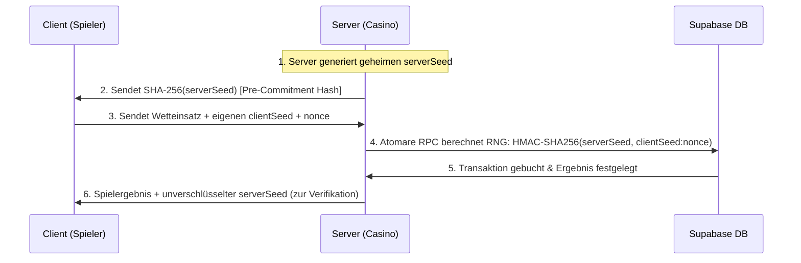

# SOP: Security Review Standards (Zero-Trust & Vault Invariants) (Top 1 % Weltklasse)

> **Zweck:** Verbindlicher Sicherheitskatalog und Audit-Verfahren zur kompromisslosen Abwehr von Betrug, Double-Spending, Race Conditions, Session-Hijacking, XSS, CSRF und Information-Leaks im gesamten Casino-Ökosystem.
> **Wallet-Invarianten & Transaktionssicherheit:** [`xx_sop/09_security_wallet_invariants.md`](./09_security_wallet_invariants.md).
> **API Backend & Middleware-Architektur:** [`xx_sop/07_api_backend_routes.md`](./07_api_backend_routes.md).
> **Secret-Rotation & Notfall-Prozedere:** [`xx_sop/14_secret_rotation.md`](./14_secret_rotation.md).
> **Analytics & Privacy:** [`xx_sop/08_analytics_posthog.md`](./08_analytics_posthog.md).
> **Qualitätsmaßstab:** [`xx_sop/12_workflow_dokument_qualitaet.md`](./12_workflow_dokument_qualitaet.md).

---

## 1 — Die 5 Zero-Trust-Mandate des Casinos

1. **Browser besitzt 0 % Wallet-Autorität:**
   - Wetteinsätze, Gewinnauszahlungen, XP-Berechnungen, Level-Ups und Kontostände werden **niemals** clientseitig kalkuliert oder überschrieben.
   - Der Client sendet ausschließlich den Wunsch (`betAmount`, `gameParams`). Das Settlement erfolgt atomar in der Supabase-Datenbank (`place_bet_atomic`, `process_game_result`).
2. **Striktes Fail-Closed-Prinzip (Kein Gratis-Guthaben bei Ausfall):**
   - Schlägt die Datenbank, Upstash Redis oder die Authentifizierung fehl, schließt das System **fail-closed** mit `503 Service Unavailable` oder `500 Internal Server Error`.
   - Bei einem Fehler wird weder Geld abgebucht noch ein Scheingewinn gutgeschrieben.
3. **Erzwungene Idempotenz (`Idempotency-Key`):**
   - Jede schreibende Wette oder Wallet-Transaktion erfordert einen eindeutigen `requestId` (UUIDv4). Wiederholte Requests (z. B. durch Netzwerk-Retries) liefern das identische Ergebnis ohne Doppelabbuchung.
4. **Keine Klartext-User-IDs in externen Systemen (HMAC-Privacy):**
   - Telemetrie (PostHog) und Error-Tracker (Sentry) erhalten niemals rohe Supabase-UUIDs oder E-Mails, sondern nur HMAC-SHA256-gehashte `distinctId`s.
5. **Vollständige Secret-Isolation:**
   - `SUPABASE_SERVICE_ROLE_KEY` darf **ausschließlich** in sicheren serverseitigen API-Routen (`src/app/api/`) oder Trigger.dev-Jobs verwendet werden — niemals in Client-Komponenten oder im Browser-Bundle.

---

## 2 — Eingabevalidierung & Sanitization (Zod-Strict-Pattern)

Jeder API-Handler validiert eintreffende Payloads ausnahmslos mit Zod unter Verwendung von `.strict()`:

```typescript
import { z } from 'zod';
import { NextRequest, NextResponse } from 'next/server';

// 1. Strikte Schema-Definition (verwirft unerwartete Zusatzfelder)
const BetRequestSchema = z
  .object({
    game: z.enum(['blackjack', 'crash', 'dice', 'roulette', 'slots']),
    betAmount: z.number().positive().max(10_000), // Maximaler Wetteinsatz
    requestId: z.string().uuid(),
    clientSeed: z.string().min(8).max(64),
  })
  .strict();

export async function POST(req: NextRequest) {
  try {
    const json = await req.json();
    const validated = BetRequestSchema.parse(json);
    // ... Weiterleitung an den Service-Layer
  } catch (error) {
    if (error instanceof z.ZodError) {
      return NextResponse.json(
        {
          error: {
            code: 'VALIDATION_ERROR',
            message: 'Ungültige Anfrageparameter',
            details: error.issues,
          },
        },
        { status: 400 },
      );
    }
    return NextResponse.json(
      { error: { code: 'INTERNAL_ERROR', message: 'Serverfehler' } },
      { status: 500 },
    );
  }
}
```

---

## 3 — Authentifizierung, Middleware & CSRF-Schutz

### 1. Cookie-Sicherheit (`@supabase/ssr`)

- Alle Session-Tokens liegen ausschließlich in `HttpOnly`, `Secure`, `SameSite=Lax` Cookies.
- Token-Refreshs in der Middleware (`src/proxy.ts`) müssen über `withRefreshedCookies()` auch bei Redirects oder Fehlern an den Browser zurückgegeben werden.

### 2. CSRF & Origin-Guard

- Für alle zustandsverändernden Requests (`POST`, `PUT`, `DELETE`) prüft die Middleware den `Origin`- und `Host`-Header gegen die Whitelist (`NEXT_PUBLIC_SITE_URL` / `localhost:3015`).

### 3. Timing-Safe API-Key-Prüfung

- Interne Cron- oder Webhook-Routen vergleichen API-Keys niemals mit `===` (anfällig für Timing-Angriffe), sondern mit `crypto.timingSafeEqual()`:

```typescript
import crypto from 'crypto';

export function timingSafeCompare(a: string, b: string): boolean {
  const bufA = Buffer.from(a);
  const bufB = Buffer.from(b);
  if (bufA.length !== bufB.length) {
    // Dummy-Vergleich zur Verhinderung von Length-Leak
    crypto.timingSafeEqual(bufA, bufA);
    return false;
  }
  return crypto.timingSafeEqual(bufA, bufB);
}
```

---

## 4 — Provably-Fair-Sicherheitskette

Das kryptografische Nachweisverfahren basiert auf HMAC-SHA256:



- **Sicherheits-Invariante:** Der aktive `serverSeed` darf unter keinen Umständen vor Abschluss der Spielrunde im Klartext an den Client gesendet werden.

---

## 5 — Sensitive Data Exposure & Log-Redaction

Server-Logs und Telemetriedaten dürfen keine sensiblen Daten enthalten:

```typescript
// KANONISCHES PATTERN: Log-Sanitization
export function sanitizeForLogs(data: Record<string, unknown>): Record<string, unknown> {
  const sanitized = { ...data };
  const SENSITIVE_KEYS = [
    'password',
    'token',
    'serverSeed',
    'serviceRoleKey',
    'secret',
    'email',
    'card',
  ];

  for (const key of Object.keys(sanitized)) {
    if (SENSITIVE_KEYS.some((s) => key.toLowerCase().includes(s))) {
      sanitized[key] = '[REDACTED]';
    }
  }
  return sanitized;
}
```

- **Client-Fehlermeldungen:** Fehlermeldungen an den Client nutzen ausschließlich generische Codes (`USER_SAFE_MESSAGES` aus `src/lib/casino/errors.ts`). Stacktraces und interne SQL-Details verbleiben im Server-Log.

---

## 6 — Pre-Deployment & Release Security Checkliste

Vor jedem Release oder Deployment auf Production (`main`-Branch):

- [ ] **1. Secrets Check:** Keine Hardcoded Keys, API-Tokens oder Passwörter im Git-Repository (`git diff` clean).
- [ ] **2. Parameter-Validierung:** Alle API-Endpunkte nutzen Zod-Schemas mit `.strict()`.
- [ ] **3. SQL-Sicherheit:** Keine String-Konkatenation in SQL; alle DB-Routinen nutzen RPCs mit `search_path = public`.
- [ ] **4. RLS-Garantie:** Row Level Security ist auf **jeder** Tabelle im `public`-Schema aktiv.
- [ ] **5. Rate Limiting:** Upstash Redis Rate-Limiter ist auf allen `/api/casino/*`- und Auth-Routen aktiv.
- [ ] **6. Cookie-Flags:** Session-Cookies haben `HttpOnly`, `Secure` und `SameSite=Lax`.
- [ ] **7. Admin-Routen:** `/api/admin/*` verifiziert zwingend `SUPABASE_ADMIN_EMAILS`.
- [ ] **8. Log-Prüfung:** Keine Ausgabe von Passwörtern, Tokens oder Roh-Seeds in `console.log`.

---

## 7 — Test- & Validierungsbefehle

```powershell
# 1. Automatisierte Security- und Auth-Tests ausführen
npm test src/lib/security

# 2. TypeScript Typ-Sicherheit verifizieren
npm run typecheck

# 3. Dependencies auf bekannte Schwachstellen prüfen
npm audit
```

---

## 8 — Risiko- & Freigabeklassifizierung (K-Level)

| Security-Aktion                                            |  K-Level  | Freigabe-Voraussetzung                                                                         |
| :--------------------------------------------------------- | :-------: | :--------------------------------------------------------------------------------------------- |
| **Erweiterung von Zod-Validierungsschemas**                | **K1/K2** | Lokale Testprüfung (`npm test`).                                                               |
| **Änderungen an Rate-Limits oder Cooldown-Zeiten**         |  **K2**   | Lokale Verifikation.                                                                           |
| **Anpassungen an `src/proxy.ts` (Middleware & Auth-Flow)** |  **K3**   | Standard-Review erforderlich (Gefahr von Aussperrung).                                         |
| **Änderung von RPC-Berechtigungen oder RLS-Policies**      |  **K4**   | **Explizite Jan-Freigabe zwingend erforderlich.**                                              |
| **Secret-Rotation (`SERVICE_ROLE_KEY`, `SESSION_SECRET`)** |  **K5**   | **STRIKTES NOTFALL-PROTOKOLL nach [`xx_sop/14_secret_rotation.md`](./14_secret_rotation.md).** |

---

## 9 — Didaktischer Mehrwert & Lerneffekt für Jan

1. **Warum ist `localStorage` für Tokens im Casino-Umfeld verboten?**
   Jedes Skript von Drittanbietern (Analytics, Ads, unbemerkte npm-Dependency-Injections) kann über `window.localStorage.getItem()` auf Tokens zugreifen (XSS-Token-Theft). `HttpOnly`-Cookies sind für JavaScript im Browser vollständig unsichtbar und immun gegen XSS-Token-Diebstahl.
2. **Warum sind Timing Attacks eine reale Bedrohung?**
   Vergleicht ein Server API-Keys per Standard-String-Vergleich (`a === b`), bricht der Vergleich beim ersten falschen Zeichen sofort ab. Ein Angreifer kann anhand von Nanosekunden-Laufzeitunterschieden Buchstabe für Buchstabe den korrekten Key erraten. `timingSafeEqual()` prüft immer die gesamte Länge in konstanter Zeit.
3. **Warum ist Pre-Commitment bei Provably Fair unverzichtbar?**
   Wenn der Server den Hash des Server-Seeds vorab veröffentlicht, kann das Casino das Spielergebnis nicht mehr nachträglich zugunsten des Hauses manipulieren, nachdem der Spieler seinen Einsatz platziert hat.

---

## 10 — Bekannte offene Probleme & Ist-Diskrepanzen

> **Stand:** 2026-08-29 · Wird bei Behebung aktualisiert.

- **1. IP-Header-Spoofing bei direktem Server-Zugriff:**
  Ohne vorgeschalteten Reverse-Proxy (z. B. Cloudflare) können `x-forwarded-for`-Header manipuliert werden. In Produktion muss der echte Client-IP-Header (`cf-connecting-ip`) forciert werden.

---

## 11 — Verwandte Artefakte

| Bedarf                                          | Datei                                                                               |
| :---------------------------------------------- | :---------------------------------------------------------------------------------- |
| **Wallet-Invarianten & Transaktionssicherheit** | [`xx_sop/09_security_wallet_invariants.md`](./09_security_wallet_invariants.md)     |
| **API Backend & Middleware Routen**             | [`xx_sop/07_api_backend_routes.md`](./07_api_backend_routes.md)                     |
| **Secret-Rotation & Notfall-Prozess**           | [`xx_sop/14_secret_rotation.md`](./14_secret_rotation.md)                           |
| **PostgreSQL & Transaktions-Locks**             | [`xx_sop/18_postgres_patterns_migrations.md`](./18_postgres_patterns_migrations.md) |
| **Analytics & Privacy Invarianten**             | [`xx_sop/08_analytics_posthog.md`](./08_analytics_posthog.md)                       |
| **Dokument-Qualitäts-Rubrik**                   | [`xx_sop/12_workflow_dokument_qualitaet.md`](./12_workflow_dokument_qualitaet.md)   |
