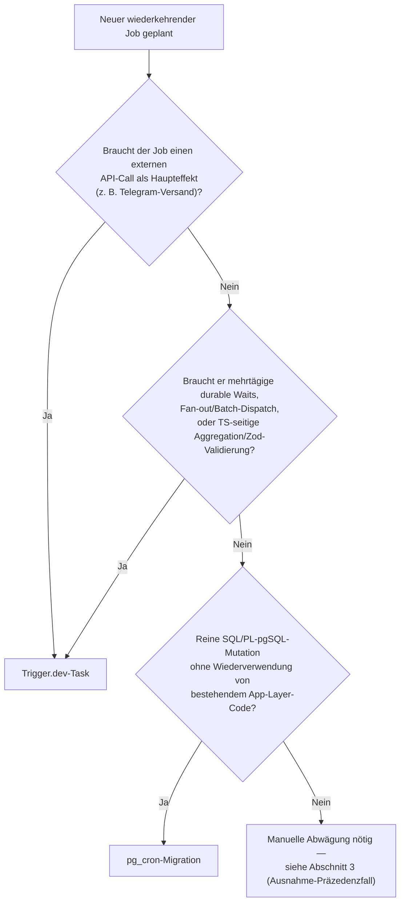

# SOP: Background Jobs & Scheduling — Trigger.dev vs. pg_cron

> **Zweck:** Verbindliches Entscheidungskriterium, welcher der beiden Scheduling-Mechanismen für einen neuen wiederkehrenden oder asynchronen Hintergrundjob gewählt wird — abgeleitet aus den 8 bereits geplanten Jobs im Repo (5 `pg_cron`-Migrationen + 3 native Trigger.dev-Crons), nicht aus einer abstrakten Präferenz.
> **Herkunft:** Diese Regel schließt Unterkategorie #10 aus `worldmap/07_background_jobs_scheduling.md` (dort mit Top 68 % als der schwächste Punkt der Kategorie identifiziert — die Regel existierte im Code bereits implizit, aber nirgends niedergeschrieben).
> **Postgres-Migrationsmechanik allgemein (nicht Scheduling-spezifisch):** [`xx_sop/18_postgres_patterns_migrations.md`](./18_postgres_patterns_migrations.md).
> **Wallet-/Outbox-Invarianten:** [`xx_sop/09_security_wallet_invariants.md`](./09_security_wallet_invariants.md).

---

## Trigger — wann diese Datei lesen

- Vor dem Anlegen eines **neuen wiederkehrenden** Hintergrundjobs (etwas, das zu einer festen Uhrzeit oder in festem Intervall laufen soll — nicht bei rein event-getriggerten Tasks wie `big-win-notify`, die direkt aus einem API-Request ausgelöst werden).
- Vor dem Hinzufügen eines **weiteren Konsumenten** auf einer bestehenden Outbox-/Event-Tabelle (`wallet_events` oder eine künftige, ähnlich gebaute Tabelle).
- Bei jeder Änderung an `src/trigger/**` oder an einer `supabase/migrations/**`-Datei, die `cron.schedule(...)` aufruft.

**Auffindbarkeit — bewusst kein CLAUDE.md-Router-Eintrag:** Diese Regel greift zu selten (ein neuer wiederkehrender Job ist ein seltenes Ereignis), um einen dauerhaften Platz im CLAUDE.md-SOP-Router zu rechtfertigen, der bei jeder Session mitgeladen wird. Stattdessen ist sie an den zwei Stellen verlinkt, an denen sie im Bedarfsfall organisch auftaucht: (1) [`xx_sop/18_postgres_patterns_migrations.md`](./18_postgres_patterns_migrations.md) — bereits über den bestehenden CLAUDE.md-Router-Eintrag „Postgres & DB-Migrationen" abgedeckt, deckt also automatisch jeden neuen `pg_cron`-Job ab, weil der als Migration angelegt wird; (2) ein Kommentar direkt in [`trigger.config.ts`](../trigger.config.ts), der einzigen Datei, die beim Anlegen eines neuen Trigger.dev-Tasks ohnehin geöffnet wird.

---

## 1 — Die Entscheidungsregel

**Kurzform:** _Reiner DB-Seiteneffekt ohne externen API-Call und ohne Wiederverwendung von App-Layer-Code → `pg_cron`. Externer API-Call, mehrtägige durable Waits, Fan-out/Batch-Dispatch oder TS-seitige Aggregation/Validierung → Trigger.dev._

**Warum genau diese zwei Kriterien und nicht andere:** `pg_cron` läuft ausschließlich innerhalb von Postgres — es kann keinen externen HTTP-Call als _Erfolgspfad_ ausführen (nur als _Fehlerpfad_ über `pg_net`, siehe Abschnitt 4), hat kein natives Retry/Backoff (siehe `xx_sop/18_postgres_patterns_migrations.md` für die DB-seitigen Konsequenzen) und keinen Zugriff auf TypeScript-Typen/Zod-Schemas. Trigger.dev bietet beides, kostet aber einen zusätzlichen Netzwerk-Hop und eine externe Abhängigkeit (Trigger.dev-Cloud) gegenüber einer reinen In-Datenbank-Lösung — deshalb ist `pg_cron` die günstigere Standardwahl, wann immer sie ausreicht.

## 2 — Belegtabelle: alle 8 bestehenden geplanten Jobs

| Job                           | Mechanismus                | Passt zur Regel? | Beleg                                                                                                                                                                                                                        |
| ----------------------------- | -------------------------- | :--------------: | ---------------------------------------------------------------------------------------------------------------------------------------------------------------------------------------------------------------------------- |
| `guide-telemetry-purge-daily` | `pg_cron`                  |        ✅        | Reine `DELETE ... WHERE created_at < now() - interval`, kein externer Call auf dem Erfolgspfad — [`supabase/migrations/027_guide_telemetry_purge_cron.sql:54-58`](../supabase/migrations/027_guide_telemetry_purge_cron.sql) |
| `bet-fingerprint-purge-daily` | `pg_cron`                  |        ✅        | Gleiches Muster, 30-Tage-Purge — [`supabase/migrations/030_fraud_signal_detection.sql:346-350`](../supabase/migrations/030_fraud_signal_detection.sql)                                                                       |
| `daily-race-settlement`       | `pg_cron`                  |        ✅        | Ruft `settle_daily_race()`, reine SQL-Settlement-Logik — [`supabase/migrations/041_daily_race.sql:235-239`](../supabase/migrations/041_daily_race.sql)                                                                       |
| `wallet-events-retry`         | `pg_cron`                  |        ✅        | Backstop-Retry, ruft `apply_xp_gain()` direkt per SQL — [`supabase/migrations/036_wallet_events_outbox.sql:197-201`](../supabase/migrations/036_wallet_events_outbox.sql)                                                    |
| `big-win-events-retry`        | `pg_cron`                  |        ✅        | Backstop-Retry für den Event-Bus-Konsumenten — [`supabase/migrations/047_event_bus_big_win_consumer.sql:244-248`](../supabase/migrations/047_event_bus_big_win_consumer.sql)                                                 |
| `daily-activity-digest`       | Trigger.dev (nativer Cron) |        ✅        | TS-Aggregation über Bets + löst `deliver-digest` (externer Telegram-Call) aus — [`src/trigger/daily-activity-digest.ts:57-64`](../src/trigger/daily-activity-digest.ts)                                                      |
| `weekly-player-recap`         | Trigger.dev (nativer Cron) |        ✅        | `batchTrigger`-Fan-out auf `send-player-recap`, externer Telegram-Call pro User — [`src/trigger/weekly-player-recap.ts:13`](../src/trigger/weekly-player-recap.ts)                                                           |
| `admin-analytics-snapshot`    | Trigger.dev (nativer Cron) | ⚠️ **Ausnahme**  | Reiner DB-Read+Upsert, kein externer Call — widerspricht der Kurzform. Begründung in Abschnitt 3. — [`src/trigger/admin-analytics-snapshot.ts:5-34`](../src/trigger/admin-analytics-snapshot.ts)                             |

## 3 — Dokumentierte Ausnahme: `admin-analytics-snapshot`

Dieser Job ist ein reiner Datenbank-Read+Upsert (`admin_analytics_snapshots`-Tabelle) ohne externen API-Call — nach der Kurzform in Abschnitt 1 wäre er ein `pg_cron`-Kandidat. Er läuft trotzdem als natives Trigger.dev-Cron. Begründung laut Migrationskommentar: bewusste Wiederverwendung des bestehenden `createAdminClient()`-Zugriffsmusters, das die zugehörige Admin-Route bereits nutzt, statt derselben Aggregationslogik ein zweites Mal in PL-pgSQL nachzubauen — [`supabase/migrations/046_admin_analytics_snapshot.sql:7-10`](../supabase/migrations/046_admin_analytics_snapshot.sql).

**Ergänzung der Kurzform um dieses Präzedenzfall-Kriterium:** _Wenn die Aggregationslogik bereits als TypeScript-Code existiert und von einer App-Route mitgenutzt wird, ist Trigger.dev auch ohne externen API-Call vertretbar — der Kosten-Vergleich ist dann nicht „`pg_cron` vs. Trigger.dev", sondern „Logik einmal in TS pflegen vs. zweimal (TS + PL-pgSQL) parallel pflegen"._ Jede künftige Ausnahme dieser Art wird nach demselben Muster hier ergänzt, statt implizit im Migrationskommentar zu verschwinden.

## 4 — Pflicht-Checkpunkt bei neuem Konsumenten auf einer bestehenden Event-Tabelle

Migration `048_fix_wallet_events_type_scoping.sql` dokumentiert einen bereits aufgetretenen CRITICAL-Bug: Der `wallet_events_notify`-Trigger und `apply_xp_gain()`/`retry_stale_wallet_events()` aus Migration 036 hatten ursprünglich keinen `event_type`-Filter. Nach Einführung eines zweiten Konsumenten (`big_win_notify`, Migration 047) auf derselben `wallet_events`-Tabelle konnte ein Insert versehentlich vom falschen Konsumenten als „bereits verarbeitet" markiert werden, bevor der richtige ihn sah — die Benachrichtigung wäre stillschweigend nie verschickt worden.

**Verbindliche Konsequenz:** Bevor ein dritter (oder weiterer) Konsument auf `wallet_events` — oder einer künftigen, ähnlich gebauten Multi-Konsumenten-Tabelle — hinzugefügt wird, müssen alle bestehenden `WHERE`-Klauseln, Trigger-Bedingungen und Retry-Funktionen, die auf dieser Tabelle lesen, explizit auf ein `event_type`-Scoping geprüft werden — nicht nur die neu hinzugefügte Funktion. Diese Prüfung ist Teil des `migration-security-guard`-Reviews (siehe `CLAUDE.md`-Regel „Bei Änderungen unter `supabase/migrations/**` vor Abschluss `@migration-security-guard` als read-only Review ausführen").

## 5 — Ablauf beim Anlegen eines neuen Jobs

1. Entscheidungsbaum aus Abschnitt 1 durchgehen.
2. Ergebnis gegen die Belegtabelle in Abschnitt 2 prüfen — passt der neue Job zu einem bestehenden Muster, oder ist er ein weiterer Ausnahmefall?
3. Falls Ausnahme: Begründung nach dem Muster in Abschnitt 3 in dieser Datei ergänzen (nicht nur im Migrationskommentar).
4. Falls der Job auf einer bestehenden Multi-Konsumenten-Tabelle aufsetzt: Checkpunkt aus Abschnitt 4 abarbeiten.
5. Gestaffelte Uhrzeit wählen, falls `pg_cron`: gegen die bestehenden 5 Zeitpunkte prüfen (`03:17`, `03:41`, `00:00`, `*/2 * * * *` ×2) und mit mindestens 5 Minuten Abstand zu täglichen/stündlichen Jobs planen, um Ressourcen-Kollision zu vermeiden — Präzedenzfall für die Staffelung: [`supabase/migrations/030_fraud_signal_detection.sql:337-338`](../supabase/migrations/030_fraud_signal_detection.sql).
6. Alert-on-Failure-Pattern übernehmen: `pg_cron`-Jobs melden Fehler über `net.http_post` an `/api/internal/cron-alert` (Beispiel: [`supabase/migrations/027_guide_telemetry_purge_cron.sql:38-39`](../supabase/migrations/027_guide_telemetry_purge_cron.sql)); Trigger.dev-Tasks haben aktuell **keinen** äquivalenten In-Repo-Alert-Hook (bekannte offene Lücke, siehe Abschnitt 6).

## 6 — Bekannte offene Lücke (nicht Teil dieser Regel, hier nur referenziert)

Diese Datei klärt ausschließlich die Wahl des Mechanismus. Sie behebt **nicht** die in `worldmap/07_background_jobs_scheduling.md` (Unterkategorie #2 und #4) benannten Lücken — fehlender `onFailure`→Sentry-Hook auf der Trigger.dev-Seite und fehlende Admin-Sichtbarkeit, ob ein Job heute gelaufen ist. Das sind separate, größere Vorhaben.

## 7 — Verwandte Artefakte

| Bedarf                                                      | Datei                                                                               |
| :---------------------------------------------------------- | :---------------------------------------------------------------------------------- |
| Vollständige Sub-Kategorie-Aufschlüsselung dieser Kategorie | `worldmap/07_background_jobs_scheduling.md`                                         |
| Cross-Referenz-Fundstelle für neue Trigger.dev-Tasks        | [`trigger.config.ts`](../trigger.config.ts)                                         |
| Ausführungsplan, der diese Datei erzeugt hat (archiviert)   | `docs/archive/07_1_scheduling_konsistenzregel_plan.md`                              |
| Postgres-Migrationsmechanik allgemein                       | [`xx_sop/18_postgres_patterns_migrations.md`](./18_postgres_patterns_migrations.md) |
| Wallet-/Outbox-Invarianten                                  | [`xx_sop/09_security_wallet_invariants.md`](./09_security_wallet_invariants.md)     |
| Migration-Security-Review-Pflicht                           | `CLAUDE.md` Abschnitt „Supabase"                                                    |
