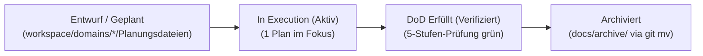

# 22 — Dokumenten-Lifecycle, Archivierungs-Governance & 80/20-Standard

> **Status:** Verbindlich · **Stand:** 2026-09-19 · **Owner:** LLM + Jan · **Scope:** Projektweiter Standard für Dokumenten-Lebenszyklus, Archivierungspflicht abgeschlossener Pläne und 80/20-Informationsdichte zur Vermeidung von LLM-Kontextvergiftung und Doku-Drift.  
> **Kanonischer Kontext:** Ergänzt [`xx_sop/02_workflow_jan_execution.md`](02_workflow_jan_execution.md) und [`xx_sop/03_workflow_jan_planungsdateien.md`](03_workflow_jan_planungsdateien.md).

---

## 1 — Das Kernproblem: Kontext-Vergiftung & Signalverlust

Wenn abgeschlossene Pläne in aktiven Domänenordnern (`workspace/domains/`) verbleiben, tritt ein doppelter Schaden ein:

1. **Menschlicher Überblick:** Entwickler verlieren die Orientierung zwischen aktuellen Aufgaben und vergangenem Stand.
2. **LLM-Signalstärke:** Bei Suchen (`grep_search`, `find_by_name`) lädt das Modell zehntausende Zeilen historischer Zwischenschritte, verwechselt überholte Entwürfe mit lebendigem Code und leitet fehlerhafte Refactorings ein.

---

## 2 — Die Drei-Zustands-Regel für Arbeitsdokumente

Jedes Planungs-, Analyse- und Handlungsdokument im Workspace unterliegt folgendem strikten Zyklus:



### Die Zustände im Detail:

- **1. Aktiv (`Geplant`, `Execution-Ready`, `In Execution`):**  
  Ausschließlich Dokumente mit diesem Status dürfen in den Arbeitsordnern unter `workspace/domains/<domain>/` liegen.
- **2. Abgeschlossen (`Executed`, `Completed`, `Bereit`):**  
  Sobald alle Meilensteine erreicht und die 5-Stufen-DoD erfüllt sind, gilt das Dokument als historisch.
- **3. Archiviert (`docs/archive/`):**  
  Abgeschlossene Pläne **müssen im selben Arbeitsgang** via `git mv` nach `docs/archive/<domain>/` verschoben werden.

---

## 3 — Die Goldenen Invarianten der Archivierungs-Governance

| Regel                        | Anweisung                                                                       | Begründung & Schutzwirkung                                   |
| :--------------------------- | :------------------------------------------------------------------------------ | :----------------------------------------------------------- |
| **Move Only (Kopierverbot)** | Pläne werden ausschließlich mit `git mv` verschoben, niemals kopiert.           | Kopien erzeugen zwei Fassungen mit unklarer Kanonizität.     |
| **Sofortiger Umzug**         | Die Archivierung ist Meilenstein-Pflichtbestandteil der Aufgabenfertigstellung. | Verhindert das Ansammeln von „Doku-Müllhalden“.              |
| **Archiv-Indexierung**       | Jede verschobene Datei erhält einen Eintrag in `docs/archive/README.md`.        | Historische Erkenntnisse bleiben in <10 Sekunden auffindbar. |
| **Link-Erhalt**              | Eingehende Verweise werden im selben Edit via Link-Sync synchronisiert.         | `npm run check-doc-links` bleibt dauerhaft Exit 0.           |

---

## 4 — Der 80/20-Dokumentationsstandard (Maximal 150 Zeilen)

Um Informationsballast zu minimieren, gilt für alle aktiven Arbeitsdokumente:

1. **Signal over Noise:**  
   Keine erzählenden Einleitungsaufsätze, keine Nacherzählung des Tech-Stacks. 80 % der Aussagekraft stecken in 20 % der Struktur: Invarianten, Schnittstellen, Testbefehle und Status.
2. **Tabellen & Flowcharts statt Fließtext:**  
   Prosa-Absätze über 4 Zeilen sind in Markdown-Tabellen oder Mermaid-Diagramme zu überführen.
3. **Template-Minimalismus:**  
   Handoff-Prompts und Prompt-Boilerplate werden nicht lokal dupliziert, sondern referenzieren zentrale Vorlagen.

### Standard-Struktur (Max. 150 Zeilen):

```markdown
# <Nummer> — <Titel> (<Präzises Thema>)

> **Status:** Execution-Ready · **Stand:** YYYY-MM-DD · **Owner:** LLM (Jan nur bei Gate)
> **Scope:** <1-Satz-Grenze> · **Money-Pfad:** Nein · **Security-Review:** Nein

## 1 — Meilenstein-Matrix (Ausführung)

| ID  | Meilenstein | Scope | Ausführung  | Status     | Zuständigkeit | Verifikation |
| --- | ----------- | ----- | ----------- | ---------- | ------------- | ------------ |
| L0  | Diagnose    | ...   | Sequenziell | 🔴 Geplant | LLM           | Tests lokal  |

## 2 — Technische Invarianten & Verträge (Dichte Tabelle)

...

## 3 — 5-Stufen-Abschlussprüfung (DoD)

...
```

---

## 5 — Das 3-in-1-Konsolidierungsprinzip für Fachmodule

Anstatt Informationen über drei parallele Orte zu streuen:

1. `docs/<kategorie>/` (Erklärung)
2. `workspace/domains/<kategorie>/` (Operative Details)
3. `worldmap/<kategorie>` (Status)

wird pro Submodul **genau ein autoritatives Dokument** geführt:

- **Zone 1 (Kopf):** Status & Worldmap-Verknüpfung (ersetzt separate Status-Dateien).
- **Zone 2 (Körper):** Systemvertrag, Datenmodell & Architektur-Invarianten (ersetzt `docs/`).
- **Zone 3 (Fuß):** Aktive Roadmap & offene Aufgaben (ersetzt zersplitterte Notizen).
