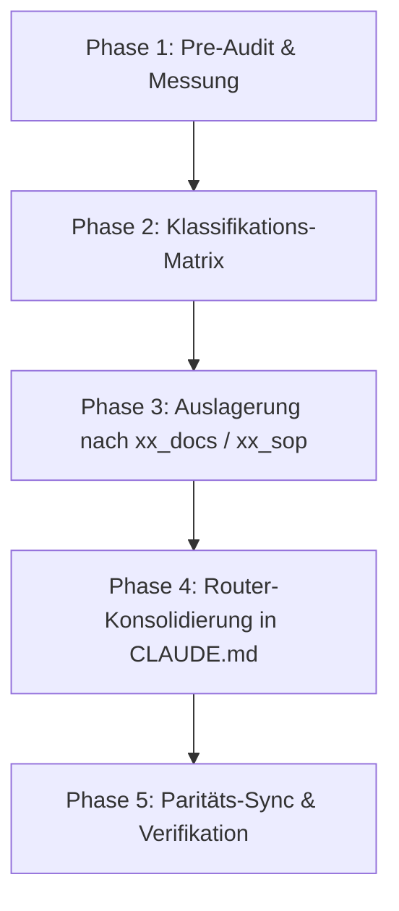

# Workflow Startkontext & CLAUDE.md-Struktur

> **Zweck:** Systematisches Bereinigungs-, Strukturierungs- und Verschlankungsverfahren für Startkontext-Dateien (`CLAUDE.md`, `AGENTS.md`, `GEMINI.md`) sowie die strikte Zuordnung von Inhalten auf On-Demand-Kontexte (`xx_docs/`), SOPs (`xx_sop/`), Systemkarten (`docs/architecture/`) und Statusdokumente (`worldmap/`).
> **Kontext:** [`CLAUDE.md`](../CLAUDE.md) · [`AGENTS.md`](../AGENTS.md) · [`GEMINI.md`](../GEMINI.md).
> **Qualitätsmaßstab:** [`xx_sop/12_workflow_dokument_qualitaet.md`](12_workflow_dokument_qualitaet.md).

---

## 1 — Trigger und Start-Gate

- **Gilt, wenn:**
  - `CLAUDE.md`, `AGENTS.md` oder `GEMINI.md` das Schwellenwert-Limit von **80 Zeilen** (bzw. 6.000 Bytes) überschreiten (aktueller Ist-Stand: ~140 Zeilen).
  - Neue Architekturmodule, Regeln oder Workflows hinzugefügt werden und die Gefahr besteht, Detailwissen in den Startkontext statt in On-Demand-Dateien zu schreiben.
  - Versions- oder Inhaltsdrifts zwischen den Startdateien der verschiedenen KI-Assistenten (`CLAUDE.md`, `AGENTS.md`, `GEMINI.md`) auftreten.
- **Gilt nicht für:**
  - Fachliche Code-Änderungen an Spiellogik oder APIs (zuständig: [`xx_sop/06_service_layer_casino.md`](06_service_layer_casino.md), [`xx_sop/07_api_backend_routes.md`](07_api_backend_routes.md)).
  - Reine Statusfortschreibungen in [`worldmap/00_WORLDMAP_STATUS.md`](../worldmap/00_WORLDMAP_STATUS.md).

---

## 2 — Das 5-Ebenen-Architektur-Modell (Klassifikation & Verortung)

Nicht jede Dokumentation gehört in den Startkontext oder in eine SOP. Um Redundanzen und Single-Source-of-Truth-Konflikte zu verhindern, gilt die folgende Zuordnungsmatrix:

| Ebene | Artefakt-Typ | Speicherort | Zweck & Kriterium | Ziel-Umfang | Beispiel |
| :--- | :--- | :--- | :--- | :--- | :--- |
| **Ebene 1** | **Startkontext (Kern)** | `CLAUDE.md`, `AGENTS.md`, `GEMINI.md` | Gilt bei **jeder einzelnen** Aufgabe ausnahmslos (Output, Klärung, Invarianten, Commands, SOP-Router). | ≤ 80 Zeilen / < 6 KB | Fail-Closed-Regel, Start-Commands, Router-Tabelle |
| **Ebene 2** | **Workflow & SOP** | `xx_sop/*.md` | Beschreibt **Wie** vorgegangen wird (Ablauf, Checklisten, K-Level, Rollback). | 60–120 Zeilen | Migrationsablauf, Frontend-Revamp, Dokument-Audit |
| **Ebene 3** | **Fachkontext & Inventar** | `xx_docs/*.md` | Beschreibt **Was** existiert (Ist-Zustand, Tabellen, Allowlists, Parameter). | 80–200 Zeilen | API-Routen-Inventar, Analytics-Event-Allowlist |
| **Ebene 4** | **Systemkarte** | `docs/architecture/` | Beschreibt **Wo** Komponenten liegen und wie Module interagieren. | Modulspezifisch | Schema-Konzepte, Sound-Design, State-Machine |
| **Ebene 5** | **Status & Historie** | `worldmap/`, `docs/archive/` | Beschreibt **Wann/Warum** etwas geplant, live oder archiviert wurde. | Dynamisch | `00_WORLDMAP_STATUS.md`, Migrationsprotokolle |

---

## 3 — Pre-Flight & Budget-Messung

Vor und nach jeder Bearbeitung der Startkontext-Dateien ist eine exakte Messung gegen die quantitativen Schwellenwerte durchzuführen.

### 3.1 Mess-Befehle (PowerShell / Shell)

```powershell
# Zeilenanzahl ermitteln
(Get-Content CLAUDE.md).Count
(Get-Content AGENTS.md).Count
(Get-Content GEMINI.md).Count

# Dateigröße in Bytes prüfen
(Get-Item CLAUDE.md).Length

# Paritäts-Prüfung zwischen den Assistenten-Dateien (muss leer sein)
git diff --no-index CLAUDE.md AGENTS.md
```

### 3.2 Quantitative Schwellenwerte & Limits

| Metrik | Soll (Weltklasse) | Warnschwelle (Gelb) | Kritisch (Rot — Handlungsbedarf) |
| :--- | :--- | :--- | :--- |
| **Zeilenanzahl `CLAUDE.md`** | **≤ 80 Zeilen** | 81–100 Zeilen | **> 100 Zeilen** (aktuell: 140 Zeilen) |
| **Dateigröße `CLAUDE.md`** | **< 6.000 Bytes** | 6.000–8.000 Bytes | **> 8.000 Bytes** (aktuell: ~10.872 Bytes) |
| **SOP-Router Vollständigkeit** | 100 % der aktiven SOPs | 1–2 fehlende SOPs | > 2 fehlende SOPs (aktuell: 8 SOPs fehlen) |
| **Redundanz-Toleranz** | 0 % Duplikate zu `xx_docs/` | 1 duplizierter Abschnitt | > 2 duplizierte Abschnitte (aktuell: 9 Abschnitte) |
| **Parität (CLAUDE/AGENTS/GEMINI)** | 100 % identisch (außer Imports) | Leichte Formatunterschiede | Inhaltliche Regeldivergenz |

---

## 4 — Der 5-Phasen-Ablauf für Startkontext-Verschlankung



### Phase 1: Pre-Audit & Messung
1. Zeilen und Bytes via Befehle aus Abschnitt 3.1 messen.
2. Identifizieren von Abschnitten, die bereits vollständige Äquivalente in `xx_docs/` oder `xx_sop/` besitzen.

### Phase 2: Klassifikations-Matrix anwenden
Für jeden Abschnitt in `CLAUDE.md` prüfen:
- *Ist es eine unverhandelbare Arbeits-/Sicherheitsregel für jede Aufgabe?* → **Behalten (Ebene 1)**.
- *Ist es ein Prozess mit Schritten?* → **Verschieben nach `xx_sop/` (Ebene 2)**.
- *Ist es ein Inventar/Katalog (Routen, Tabellen, Stores)?* → **Verschieben nach `xx_docs/` (Ebene 3)**.

### Phase 3: Modulare Auslagerung
1. Ziel-Datei in `xx_docs/` oder `xx_sop/` öffnen.
2. Vollständigkeit sicherstellen (keine Informationen verlieren, sondern anreichern).
3. Abschnitt aus `CLAUDE.md` entfernen.

### Phase 4: Kern-Zusammenfassung & Router-Erweiterung
1. `CLAUDE.md` auf die 8 Kern-Blöcke verdichten:
   1. Primärziel: Maximaler Lerneffekt für Jan
   2. Output-Regeln
   3. Klärung offener Punkte
   4. Doku-Aktualität
   5. Supabase-Kernbindung
   6. Commands & Auto-Allow
   7. Tech Stack (Einzeiler)
   8. Nicht verhandelbare Sicherheits- und Wallet-Invarianten (Fail-Closed, Advisory Locks)
   9. Vollständiger SOP-Router (Tabelle aller SOPs mit präzisen Triggern).

### Phase 5: Paritäts-Sync & Verifikation
1. `AGENTS.md` und `GEMINI.md` synchronisieren, damit alle Agenten exakt dieselben Vorgaben erhalten.
2. `npm run test` und `npm run typecheck` ausführen.
3. Budget-Befehle aus Abschnitt 3.1 erneut ausführen und Ziel-Budget (≤ 80 Zeilen) verifizieren.

---

## 5 — Risiko- & Freigabeklassifizierung (K-Level)

| Aktion | K-Level | Freigabe-Bedingung |
| :--- | :---: | :--- |
| **Audit & Zeilenmessung** | **K1** | Automatisch erlaubt (Read-only). |
| **Links & Router-Pfade aktualisieren** | **K2** | Im Rahmen von Refactorings frei ausführbar. |
| **Architektur-Details nach `xx_docs/` auslagern** | **K3** | Frei im bestätigten Scope, solange keine Regeln verändert werden. |
| **Änderung/Löschung von Kernregeln oder Invarianten** | **K4** | **Explizite Jan-Freigabe zwingend erforderlich.** |
| **Löschen historischer Dokumente** | **K4** | Nur Verschieben nach `docs/archive/`, kein `rm` / Löschen ohne Freigabe. |

---

## 6 — Didaktischer Mehrwert & Lerneffekt für Jan

### Warum ist ein ultrakompakter Startkontext entscheidend?

1. **Vermeidung des „Lost in the Middle“-Effekts bei LLMs:**
   Große Startkontexte (> 150 Zeilen) führen bei Sprachmodellen zu Aufmerksamkeitsverlust. Essenzielle Sicherheitsregeln (wie *Fail-Closed* oder *Server-Autorität*) gehen in langen Architekturbeschreibungen unter. Ein kompakter Kern garantiert 100 % Regeltreue.
2. **Single Source of Truth (SSOT) statt Drift:**
   Wenn API-Routen sowohl in `CLAUDE.md` als auch in `xx_docs/08_api_backend_context.md` stehen, veraltet bei Änderungen zwangsläufig eine der beiden Stellen. Details gehören ausschließlich in die kanonische Kontextdatei.
3. **Token-Ökonomie und Prompt-Geschwindigkeit:**
   Startkontexte werden bei jedem Prompt als System-Prompt übertragen. Eine Reduzierung von 140 auf 75 Zeilen spart bei 100 Interaktionen zehntausende Tokens und verkürzt die Antwortzeit messbar.
4. **Modulares Denken für Jan:**
   Jan lernt durch diese Architektur, komplexe Systeme nicht monolithisch, sondern in klar getrennte Abstraktionsebenen (Regeln vs. Abläufe vs. Inventare) zu strukturieren.

---

## 7 — Bekannte offene Probleme & Ist-Diskrepanzen

> **Stand:** 2026-08-23 · Wird bei Behebung schrittweise aktualisiert.

- **1. Hohe Redundanz in `CLAUDE.md` (140 Zeilen statt ≤ 80 Zeilen):**
  Die Abschnitte `Service Layer`, `Analytics`, `State`, `API Routes`, `Middleware`, `Layout Shell`, `Games`, `Admin Pages` und `Design System Rules` stehen noch als Prosa-Blöcke in `CLAUDE.md`, obwohl sie bereits in `xx_docs/05`–`xx_docs/10` und `xx_sop/04`–`xx_sop/08` existieren.
- **2. Unvollständiger SOP-Router in `CLAUDE.md`:**
  Die Router-Tabelle in `CLAUDE.md` enthält aktuell nur 4 Trigger (`01`, `02`, `03`, `10`) plus `11` im Fließtext. Die SOPs `04`, `05`, `06`, `07`, `08`, `09` und `12` fehlen in der Router-Tabelle.
- **3. Fehlende Systemkarte `docs/architecture/00_SYSTEM_MAP.md`:**
  Wurde in früheren Entwürfen als Zielort für Layout/Games/Komponenten referenziert, existiert aber im Repository nicht.
- **4. Versions-Drift zwischen `CLAUDE.md`, `AGENTS.md` und `GEMINI.md`:**
  `GEMINI.md` referenziert veraltete Migrationsnummern (`001`–`037`), während `CLAUDE.md` und `AGENTS.md` `001`–`049` nennen (im Repo existieren bereits Migrationen bis `050`).

---

## 8 — Verwandte Artefakte

| Bedarf | Datei |
| :--- | :--- |
| **Dokument-Qualitäts-Rubrik & Scorecard** | [`xx_sop/12_workflow_dokument_qualitaet.md`](12_workflow_dokument_qualitaet.md) |
| **Ausführung und 5-Stufen-Selbstprüfung** | [`xx_sop/02_workflow_jan_execution.md`](02_workflow_jan_execution.md) |
| **Planungsdateien & Statuspflege** | [`xx_sop/03_workflow_jan_planungsdateien.md`](03_workflow_jan_planungsdateien.md) |
| **Kanonischer Startkontext** | [`CLAUDE.md`](../CLAUDE.md) · [`AGENTS.md`](../AGENTS.md) · [`GEMINI.md`](../GEMINI.md) |
| **Command-Referenz** | [`xx_docs/02_command_reference.md`](../xx_docs/02_command_reference.md) |
