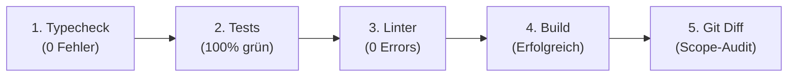

# Jan Execution (Ausführung & Verifikation)

> **Zweck:** Freigegebene Pläne autonom, meilensteinweise und ohne Bestätigungsfehler umsetzen und vor Übergabe an Jan vollständig verifizieren.

---

## 1 — Start-Gate (Vor Beginn)

1. **Prüfung des Plans:**
   - Liegt der Plan im Status `Execution-Ready` vor?
   - Ist der Kontext-Koffer vollständig (Dateipfade, Invarianten, Nicht-Scope)?
   - Besteht noch eine ungeklärte materielle Unsicherheit? Falls ja: **Sofort stoppen und Jan fragen**.
2. **Status auf `In Execution` setzen:**
   - Kopfzeile des Plans und übergeordnete Statustabelle auf `In Execution` setzen.

---

## 2 — Autonome Umsetzung

- **Meilenstein für Meilenstein:** Jeden Schritt atomar umsetzen und sofort lokal gegen die Meilenstein-Kriterien prüfen.
- **Scope-Disziplin:** Niemals Code außerhalb des im Plan definierten Scopes refaktorisieren.
- **Reversible Detailentscheidungen:** Pragmatisch und risikoarm im eigenen Ermessen treffen, Annahme im Report kurz nennen.
- **Unerwartete Fehler:** Weicht das Verhalten substanziell ab oder droht Daten-/Sicherheitsverlust: Sofort anhalten, Diagnose stellen und Jan konsultieren.

---

## 3 — Die 5-Stufen-Abschlussprüfung (Definition of Done)

Vor jeder Erfolgsmeldung MÜSSEN alle 5 Stufen lokal ausgeführt und bestanden werden:

1. **Stufe 1 — Typecheck:** Statische Typprüfung (z. B. `npm run typecheck` oder `npx tsc --noEmit`) endet mit 0 Fehlern.
2. **Stufe 2 — Automatisierte Tests:** Alle betroffenen Unit-, Integrations- und Negativtests (z. B. `npm test` oder `pytest`) laufen fehlerfrei durch.
3. **Stufe 3 — Linter & Hygiene:** Linter (z. B. `npm run lint`) meldet 0 Errors und keine neuen Warnungen im geänderten Code.
4. **Stufe 4 — Production-Build:** Der vollständige Build des Projekts (z. B. `npm run build`) kompiliert fehlerfrei.
5. **Stufe 5 — Git Diff Audit:** Prüfung per `git diff` bzw. `git status --short`: Wurden ausschließlich geplante Dateien verändert? Keine verwaisten Debug-Dateien oder unabsichtlichen Änderungen.

---

## 4 — Archivierung & Abschluss

1. **Dokumenten-Aktualisierung:**
   - Den Plan-Kopf auf `Executed (archiviert)` setzen.
   - Den Plan nach `docs/archive/<name>.md` verschieben (reine Wegwerf-Gerüste ohne Nachweiswert löschen).
2. **Status-Zentrale synchronisieren:**
   - Eintrag in der zentralen Statusdatei (z. B. `worldmap/00_WORLDMAP_STATUS.md`) auf den neuen verifizierten Stand setzen.
3. **Meldung an Jan:**
   - Erst jetzt Vollzug melden mit:
     - Kernaussage & Status
     - Ausgeführte Meilensteine
     - Nachweis der 5-Stufen-Prüfung (reale Befehlsergebnisse)
